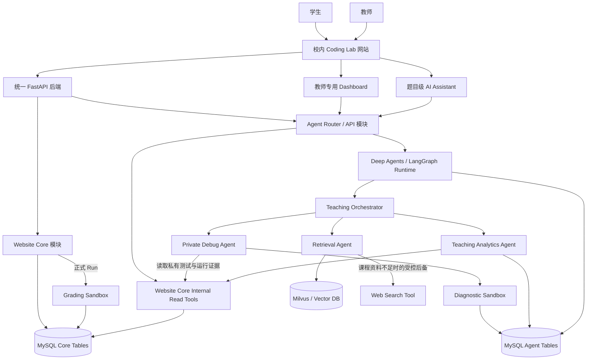
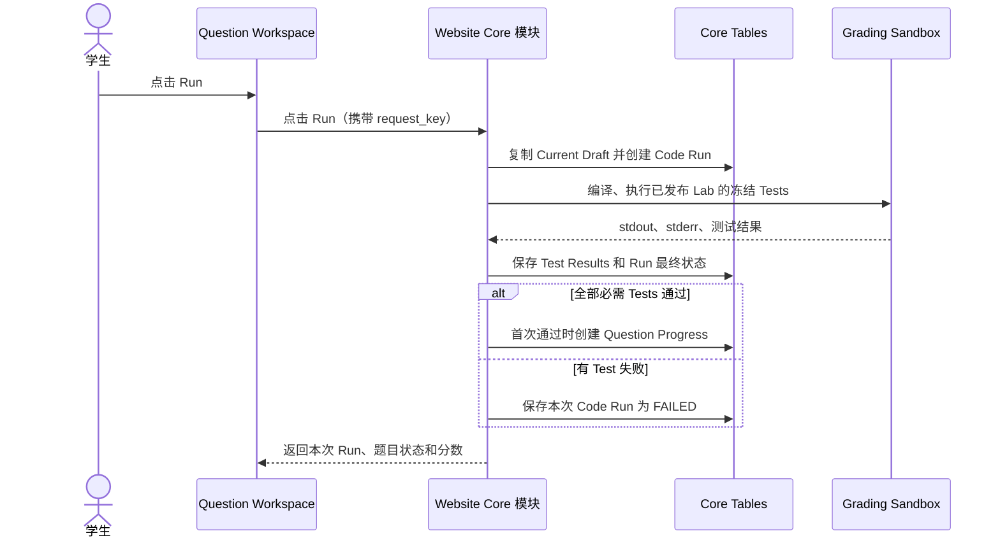
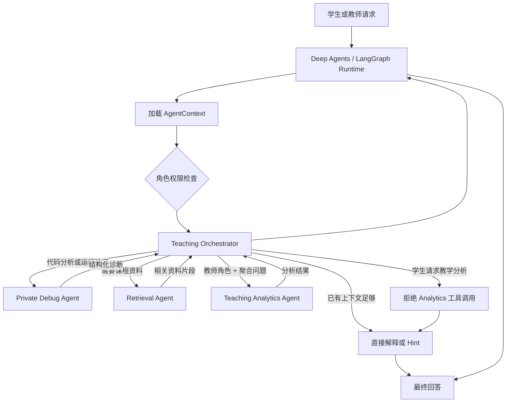
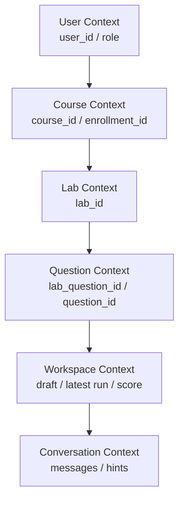
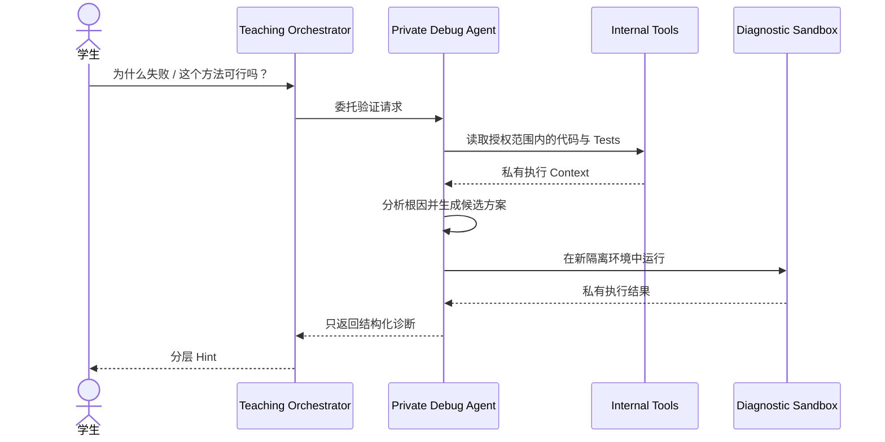
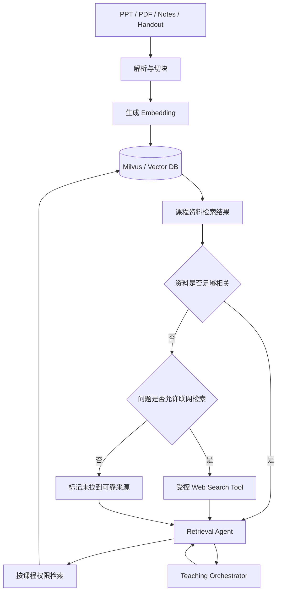
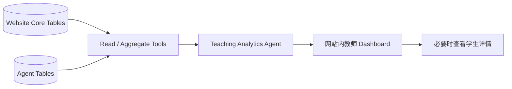
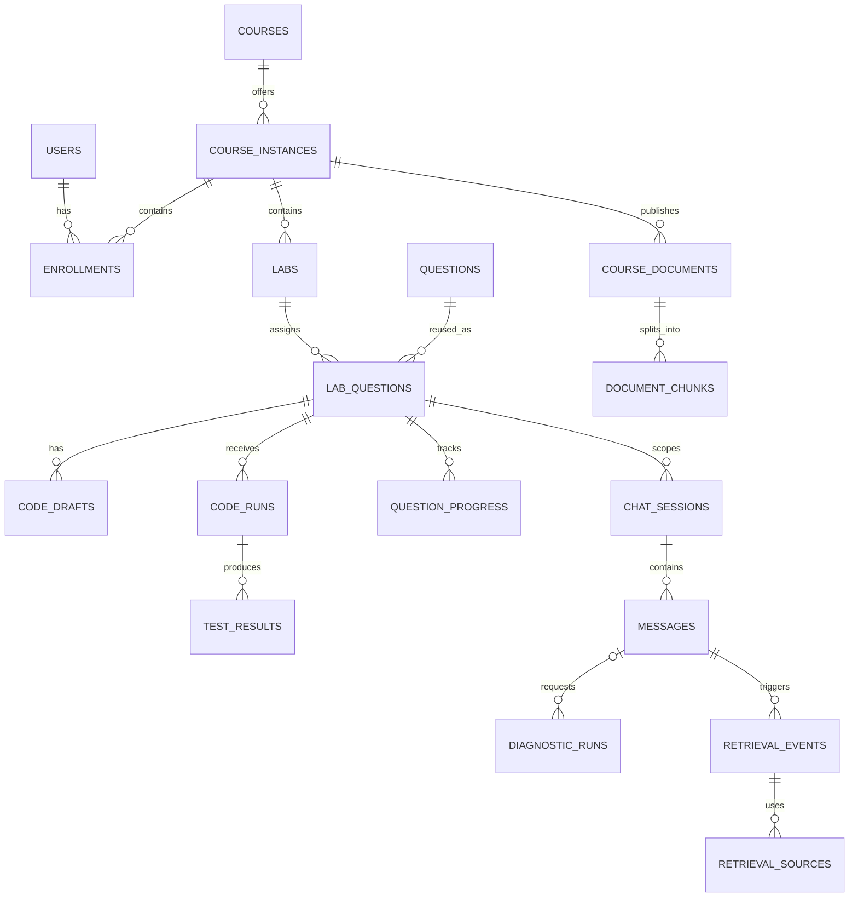
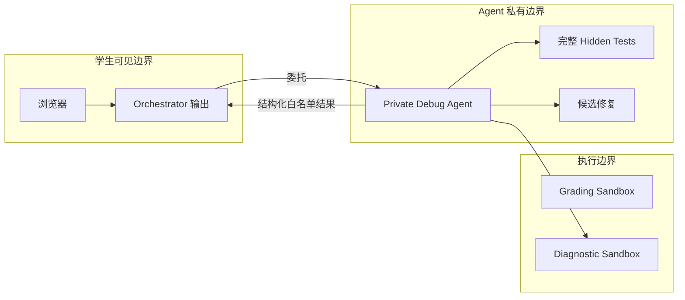

# 校内 Coding Lab 网站与 AI Assistant 架构设计

**状态：** 已确认的架构设计

**日期：** 2026-09-13

**最后更新：** 2026-09-19（与第一版数据库设计同步）

**核心技术：** React + TypeScript、Python + FastAPI、MySQL、LangChain Deep Agents / LangGraph、Milvus（Vector DB）、隔离代码沙箱

---

## 1. 项目定位

本项目是一个学校内部使用的 Coding Lab 与作业提交网站。学生可以进入课程、Lab 和题目页面写代码、点击 Run、查看测试结果并获得分数。

网站内部额外提供一个题目级 AI Assistant。它可以理解学生当前所在题目、正在编辑的代码、正式 Run 结果和聊天历史；必要时检索课程资料，或在独立的 Diagnostic Sandbox 中验证代码相关结论，再给出引导式 Hint。

CodeRunner 是产品参考：本项目模仿其 Coding Lab、运行代码、自动测试和自动评分的工作方式，但不要求接入外部 CodeRunner。

---

## 2. 最重要的边界

系统逻辑上分为两部分，但物理部署上优先做成同一个后端应用里的两个模块。

| 模块 | 主要职责 |
|---|---|
| Website Core | 作业网站本身：课程、题目、Draft、正式 Run、测试、通过状态、分数和 Lab Progress |
| Agent Module | AI 对话、代码分析、诊断运行、RAG、Hint 与教师教学分析 |

关键原则：

> Website Core 是正式 Run、`PASSED`、题目分数和 Lab Progress 的唯一事实来源。Agent Module 只能读取这些事实，不能修改它们。

这意味着 Agent 即使在私有环境中验证出一个正确修复方案，也不能替学生提交代码、标记题目通过或增加分数。

开发初期采用 modular monolith。也就是一个 React 前端、一个 FastAPI 后端、一个 MySQL 数据库；Website Core 和 Agent Module 在同一个后端进程里，通过 router、service layer、repository 和 internal tool interface 解耦。它们不拆成两个互相通过 HTTP 调用的后端服务。

---

## 3. 总体架构



开发初期使用同一个 FastAPI 项目和同一个 MySQL 数据库。Website Core 与 Agent Module 是同一个后端里的逻辑模块，不是两个通过 HTTP 互相调用的服务。模块边界通过代码目录、service layer、repository、internal tools 和数据库访问权限来维持。
教师端不是一个独立产品。教师和学生进入同一个校内 Coding Lab 网站；教师在相同的 Course / Lab / Question / Run 页面基础上，因为角色权限不同，会额外看到教师专用入口和 Dashboard。

---

## 4. Website Core 负责什么

Website Core 是没有 AI 时也能独立工作的作业网站。

```text
登录和权限验证
Course / Lab / Question 页面
题目描述与 Starter Code
代码编辑器和 Current Draft
学生点击 Run
正式 Code Run
Public / Hidden Tests
题目通过状态
题目分数
Lab Progress
教师查看正式作业数据
```

它不依赖 LLM，也不让 LLM 决定成绩。

### 4.1 学生正式 Run

学生没有单独的 Submit 按钮。点击 Run 就会形成一次正式 Attempt。



### 4.2 Run 结果、题目状态和分数必须分开

一个 Code Run 只描述某一次执行：

```text
CodeRun.result_status
= QUEUED | RUNNING | PASSED | FAILED | ERROR | TIMEOUT
```

Question Progress 是否存在，描述是否曾经通过：

```text
没有 QuestionProgress → 尚未通过
存在 QuestionProgress → 已通过
```

题目得分描述已经获得的成绩：

```text
QuestionProgress.awarded_score
```

例如某题满分 10 分：

```text
Run 1 → FAILED
Question Progress：不存在
分数：0 / 10

Run 2 → PASSED
Question Progress：存在
分数：10 / 10

Run 3 → FAILED
最新 Run：FAILED
Question Progress：仍然存在
分数：仍然 10 / 10
```

后续失败 Run 只记录自己的 `result_status`，不能删除已有的 `question_progress` 或扣掉已经得到的分数。

### 4.3 Lab 计分与完成

```text
题目得分
= 正式通过时获得 lab_questions.max_score

Lab 已获分数
= 所有已通过题目的 awarded_score 之和

Lab COMPLETED
= 所有 is_required = true 的题目都 PASSED
```

系统不设置 Run 次数 penalty。学生可以运行多次；只要有一次正式 Run 通过，该题就获得满分。

### 4.4 并发、幂等与内容冻结

每次点击 Run 由前端生成 `request_key`；网络重试复用同一个键，后端以 `enrollment_id + request_key` 幂等返回同一条 Run。最新 Run 按 `created_at + code_run_id` 查询；即使多个 Run 的完成顺序不同，已经创建的 `question_progress` 也不会被后续失败删除。

第一版不建立 Question Version 或 Test Suite Version。Lab 发布后，其题目内容、运行配置和 Tests 全部冻结；需要修改时复制成新的 Question 或新的 Lab，旧 Run 继续引用原 `lab_question_id`。

---

## 5. Agent Module 负责什么

Agent Module 不做正式评分。它负责理解学生的问题，选择合适的能力，再把结果转成教学式回答。

```text
理解当前题目、学生代码与正式 Run
解释题意和编程概念
检索课程 PPT、Lecture Notes 与 Lab Handout
在课程资料不足且问题适合公开检索时，受控搜索可信网络资料
分析编译、运行和测试失败
验证学生提出的方法是否可行
在私有环境中验证候选修复
生成分层 Hint
分析班级共性问题和可能卡住的学生
```

Agent Module 内部使用 Deep Agents / LangGraph 作为运行时和编排层。它不是 Website Core 的依赖，也不是评分引擎，而是负责把一次对话请求组织成可控的多步骤流程。

Deep Agents / LangGraph Runtime 负责：

```text
加载请求级 AgentContext
执行 Teaching Orchestrator
根据意图路由到 Subagents
管理工具调用顺序
控制 Diagnostic Sandbox 调用预算
执行 Hint policy 与 hidden-test 防泄露规则
记录 Chat、Hint、DiagnosticRun 与审计日志
```

可以把 Deep Agents / LangGraph Runtime 理解成 Agent Module 的工作流调度引擎。它本身不是给学生看的页面、不是数据库、也不是评分系统；它负责让一次 AI 请求按照正确的上下文、权限和工具顺序执行。

例如学生问“为什么我的代码 hidden test 没过？”时，请求会先进入 Agent API，再交给 Runtime。Runtime 加载当前学生、课程、Lab、题目、Draft 和最新正式 Run 结果，然后执行 Teaching Orchestrator。Orchestrator 判断需要代码诊断时，会由 Runtime 调用 Private Debug Agent；Debug Agent 在私有边界读取 Tests 和运行证据，必要时调用 Diagnostic Sandbox 验证推断，最后只把结构化诊断交回 Orchestrator。Orchestrator 再生成不泄露 hidden tests 和完整答案的引导式 Hint。

运行时只能调用后端暴露的 allowlisted tools。它不能直接写 `question_progress` 或 `code_runs` 的正式评分字段，也不能绕过 Website Core 创建正式 Code Run。Lab Progress 由 `question_progress` 实时汇总，不单独写表。

---

## 6. 主 Agent 与 Subagents

### 6.1 Teaching Orchestrator

Teaching Orchestrator 是面向学生或教师的主 Agent。它读取当前上下文，判断下一步应该直接回答、检索资料、分析代码，还是做教学分析。

它负责：

```text
理解用户意图
决定是否需要运行代码验证
委托 Subagent
选择 Hint Level
组合多个 Subagent 结果
输出学生或教师可见的最终回答
```

它不直接接收完整 hidden tests 或完整候选答案。

### 6.2 Private Debug Agent

Private Debug Agent 专门处理代码、Tests 和 Sandbox 验证。

它在私有边界内可以读取：

```text
学生当前 Draft 或正式 Run 快照
stdout / stderr
完整 Public Tests
完整 Hidden Tests
Hidden Test 输入与 expected output
实际输出与失败断言
临时候选修复代码
Diagnostic Sandbox 输出
```

它会分析根因、生成候选修复、运行验证，并只向 Orchestrator 返回结构化诊断。

例如：

```json
{
  "verified": true,
  "bug_category": "empty_input_handling",
  "affected_area": "loop_initialization",
  "confidence": "high",
  "allowed_hint_scope": 2
}
```

它不能返回完整 hidden tests、完整修复代码或可还原测试用例的信息。

### 6.3 Retrieval Agent

Retrieval Agent 优先搜索当前课程的资料：

```text
PPT
PDF
Lecture Notes
Lab Handout
Tutorial Notes
```

它只搜索当前学生有权限访问的课程资料，并把相关片段交给 Orchestrator。如果课程 RAG 没有返回足够相关的内容，Retrieval Agent 可以根据工具策略判断是否调用受控的 `search_public_web()`。

联网检索适用于公开的一般编程知识，例如语言官方文档、Library / API 的最新用法和公开的编译器错误说明。课程内部规则、评分要求、hidden tests 和当前作业的完整解法不能通过联网检索推断或获取。课程资料与公开网络来源发生冲突时，以课程资料为准；回答必须明确区分课程资料来源和互联网来源。

联网前必须清理检索词，不能向外部搜索服务发送学生姓名、学号、完整源码、hidden tests、私有运行日志或其他课程内部数据。搜索得到的网页不会自动加入课程知识库或写入 Milvus；只有教师明确选择并发布为课程资料后，才能经过解析、切块和 Embedding 流程进入课程 RAG。

### 6.4 Teaching Analytics Agent

Teaching Analytics Agent 面向教师使用。它读取 Website Core 的正式数据和 Agent 的 Hint / Diagnostic 记录，生成：

```text
Lab completion overview
Question pass rate
Common failures
Official Run statistics
Diagnostic usage statistics
Stuck students
教学干预建议
```

它不重新评分，也不改成绩。
学生端 Agent 不允许调用 Teaching Analytics Agent。即使学生在聊天中请求班级统计、其他学生提交情况、常见错误分布或教学分析，Runtime 也必须在工具路由层拒绝，并返回面向学生的普通解释或学习建议。

### 6.5 Subagent 路由



一个请求可以同时使用多个 Subagent。例如学生问“我的 recursion 为什么失败，PPT 有没有讲这种情况？”时，可以先调用 Private Debug Agent，再调用 Retrieval Agent。

---

## 7. Context 是什么

Context 是每次调用 Agent 时，系统为当前请求临时组装的一份学习状态快照。它不是整个数据库，也不是后端共享全局变量。

### 7.1 分层 Context



每个请求都从认证信息、当前 URL 和 Website Core 数据中解析：

```text
user_id
course_id
enrollment_id
lab_id
lab_question_id
question_id
```

### 7.2 Student-facing AgentContext

面向学生的 Orchestrator 可以读取：

```text
题目描述、Starter Code、Learning Objectives
Current Draft 当前代码
最新正式 Run 摘要
学生可见的测试结果
题目 PASSED 状态和已获分数
本题聊天记录与 Hint 历史
```

完整 Tests 不放进这份公共 Context。只有 Orchestrator 委托 Private Debug Agent 后，Debug Agent 才能用专门的 capability tool 获取它们。

### 7.3 Context、Memory 与 RAG 的区别

| 名称 | 含义 |
|---|---|
| Database State | 网站和 Agent 长期保存的数据 |
| AgentContext | 本次请求需要的临时快照 |
| Agent Memory | 跨题目积累的学习偏好和误区 |
| RAG Result | 本次问题检索到的课程资料片段 |

### 7.4 Agent Memory

Agent Memory 用来保存跨题目的轻量学习画像，让 Assistant 能用更适合该学生的方式提示。它只影响教学回复，不影响正式 Run、`PASSED`、分数或 Lab Progress。

可以保存：

```text
学习偏好，例如更适合先看例子、伪代码或概念解释
抽象误区，例如经常漏空输入、边界条件或 base case
反复出现的调试模式，例如常把输出格式和逻辑错误混在一起
Hint 风格偏好，例如先给问题引导，再给局部代码建议
```

不能保存：

```text
完整学生源码
完整聊天记录
完整 hidden tests
完整候选答案
其他学生信息
可还原具体 hidden test 输入、expected output 或断言的信息
```

Memory 的写入必须经过总结和过滤步骤。Private Debug Agent 可以提供结构化观察，例如 `bug_category`、`affected_area` 和 `confidence`，但最终写入的只能是抽象学习模式。学生端 Orchestrator 可以读取当前学生自己的 Memory 来调整 Hint；教师端只能查看聚合后的学习模式和误区趋势，不能查看单个学生的 Memory 摘要。

---

## 8. Diagnostic Sandbox

Diagnostic Sandbox 是 Agent 的验证环境，不是学生正式提交环境。

### 8.1 什么时候调用

Orchestrator 可以在以下情况委托 Private Debug Agent 调用：

```text
学生问“这个方法可不可行？”
学生问“我这样改会通过吗？”
学生问代码输出会是什么
需要分析编译、运行或测试失败
需要确认某个 API 或语言行为
需要比较两个实现方案
需要确认候选修复是否有效
```

概念解释或现有 Context 足够时，不需要运行 Sandbox。

### 8.2 诊断来源

一个 `DiagnosticRun` 必须保存实际执行的代码快照，并标明一种来源：

```text
CODE_RUN
DRAFT
GENERATED
```

Private Debug Agent 可以在代码副本上临时应用候选修复，但不能写回学生 Draft。

### 8.3 Test Scope

```text
语法、API、输出行为问题
→ 运行最小实验或 Public Tests

当前题目解决方案验证
→ 在私有边界运行完整 Test Suite
```

完整 hidden suite 的通过数量和细节不能作为回答直接告诉学生，否则 Agent 会变成 hidden-test oracle。

### 8.4 诊断流程



### 8.5 诊断运行的限制

每条学生消息都设置预算：

```text
max_diagnostic_runs
max_candidate_revisions
max_total_execution_time
CPU / Memory / Process / Network Limits
```

达到限制后，Agent 停止继续试错，只基于已确认的证据提供保守 Hint。

---

## 9. 两类 Sandbox 的区别

| 属性 | Grading Sandbox | Diagnostic Sandbox |
|---|---|---|
| 触发者 | 学生点击 Run | Private Debug Agent |
| 所属模块 | Website Core | Agent Module |
| 代码来源 | Current Draft 快照 | Run 快照、Draft、候选修复或实验代码 |
| Tests | 已发布 Lab 中冻结的 Tests | 最小用例或私有完整 Test Suite |
| 是否创建正式 Code Run | 是 | 否 |
| 是否影响 PASSED / Score | 是，由 Website Core 更新 | 永远不影响 |
| 是否计入学生 Run 次数 | 是 | 否 |
| 结果存储 | Core Tables | Agent Tables |

两类 Sandbox 可以复用底层容器基础设施，但必须使用不同的凭证、任务记录和回调路径。Diagnostic Sandbox 没有调用成绩更新逻辑的权限。

---

## 10. 课程 RAG 与受控 Web Search



每个文档块应带有：

```text
chunk_id
course_instance_id
document_id
visibility
source location
```

检索顺序固定为：直接 Context、课程 RAG、受控 Web Search。已有题目、代码和正式 Run 证据足够时，Orchestrator 不需要调用 Retrieval Agent；调用 Retrieval Agent 后，必须先查询课程 RAG。只有课程资料没有足够相关证据，且问题属于可公开检索的一般编程知识时，才允许联网。

如果 RAG 和受控联网都没有可靠结果，Agent 应明确说明无法从课程资料或可信公开来源确认，不能把模型猜测表述成课程规则。Grading Sandbox 与 Diagnostic Sandbox 仍然默认禁用网络；Web Search Tool 是 Agent Module 中独立的受控检索能力，不会为学生代码开放网络访问。

当前题目、当前代码和正式 Run 结果属于直接 Context，不需要 RAG。

---

## 11. 教师 Dashboard 与教学分析

教师 Dashboard 是同一个 Coding Lab 网站里的教师权限视图，不是独立系统。教师可以像学生一样进入课程、Lab、题目和 Run 页面查看作业体验，同时额外看到班级级别的 Dashboard。

教师默认先看聚合数据，再在异常情况下查看个别学生。查看个别学生时，教师可以看到该学生的作业代码、Draft / Run 快照、正式 Run 历史、stdout / stderr、测试结果、题目状态、分数和 Lab Progress。这些属于作业网站的正式教学与批改证据。

这个权限不延伸到 Agent Memory。教师可以查看聚合后的 Agent Memory 趋势，例如班级里常见的误区类型和 Hint 偏好分布，但不能查看单个学生的 Agent Memory 摘要。



教师可看到：

```text
Lab Completion
Question Pass Rate
Question Score Distribution
Official Run Count
DiagnosticRun Count
Common Failure Patterns
Hint Usage
Last Activity
Stuck Students
```

Stuck Detection 默认只分析尚未 `PASSED` 的题目。已经通过的题目即使之后出现失败 Run，也不重新标记为 Stuck。

---

## 12. 数据模型与所有权

### 12.1 Website Core Tables

```text
users
courses
course_instances
enrollments
labs
questions
lab_questions
question_tests
code_drafts
code_runs
test_results
question_progress
course_documents
document_chunks
audit_logs
```

关键字段：

```text
lab_questions.is_required
lab_questions.max_score
code_runs.request_key
code_runs.code_snapshot
code_runs.result_status
question_progress.successful_run_id
question_progress.awarded_score
```

第一版没有 `question_versions`、`test_suite_versions` 或 `lab_progress` 表。发布后的 Lab 内容整体冻结；Lab Progress 从 `lab_questions` 与 `question_progress` 实时汇总。

### 12.2 Agent Tables

```text
chat_sessions
messages
diagnostic_runs
agent_memory
retrieval_events
retrieval_sources
```

`chat_sessions` 和 `diagnostic_runs` 都需要关联：

```text
enrollment_id + lab_question_id
```

Hint Level 保存在 Assistant Message 中，不单独建立 Hint Record。`diagnostic_runs` 总是保存实际代码快照；只有来源为 `CODE_RUN` 时才填写 `reference_code_run_id`：

```text
source_type = DRAFT | CODE_RUN | GENERATED
code_snapshot
reference_code_run_id nullable
```

候选修复代码、完整 hidden tests 和完整诊断日志属于 Agent-private 数据，只允许 Private Debug Agent 与授权教师访问，并应有较短的保留期限。

`agent_memory` 按 Enrollment 隔离，保存抽象后的学习模式，建议包含：

```text
enrollment_id
memory_type
summary
evidence_count
confidence
status
```

`agent_memory.summary` 不能包含完整源码、完整答案、hidden tests、其他学生信息或可还原具体测试用例的信息。

### 12.3 数据关系



---

## 13. API 与 Internal Tools

前端通过 HTTP 调用统一 FastAPI 后端。后端内部的 Website Core 模块和 Agent Module 不通过 HTTP 互相调用；Agent 读取 Website Core 数据时，调用的是同进程内的 service / repository / internal tool interface。

### 13.1 Website Core API

```text
GET  /courses
GET  /courses/{course_id}/labs
GET  /labs/{lab_id}/questions
GET  /questions/{lab_question_id}/workspace
PUT  /questions/{lab_question_id}/draft
POST /questions/{lab_question_id}/runs
GET  /questions/{lab_question_id}/runs
GET  /labs/{lab_id}/progress
```

### 13.2 Agent API

```text
POST /questions/{lab_question_id}/assistant/messages
GET  /questions/{lab_question_id}/assistant/messages
GET  /questions/{lab_question_id}/assistant/stream
GET  /teacher/labs/{lab_id}/insights
```

Agent API 接收学生或教师请求后，先构造请求级 AgentContext，再交给 Deep Agents / LangGraph Runtime。Runtime 内部可以调度 Orchestrator、Subagents 和 allowlisted tools，但所有工具仍由同一个后端做权限检查。
`GET /teacher/labs/{lab_id}/insights` 只允许教师角色调用。学生端 Assistant API 不暴露 Teaching Analytics Agent，也不能通过 prompt 或工具路由间接触发它。

### 13.3 Student-facing Internal Read Tools

```text
get_question_context()
get_current_draft()
get_latest_student_run()
inspect_execution(run_id)
get_student_progress()
search_course_material(query)
```

这些 Read Tools 是后端内部的受控只读接口，不是 Website Core 和 Agent Module 之间的 HTTP API。它们可以包装已有的 service / repository 方法，并在返回给 Agent 前完成权限检查和数据过滤。

### 13.4 Private Debug Tools

```text
get_full_test_suite_for_debug(lab_question_id)
validate_candidate_fix(reference_run_id, candidate_patch, extra_cases?)
validate_draft_approach(code_snapshot, candidate_patch?, test_scope)
run_code_experiment(code, runtime, input?, expected_behavior?)
```

Private Debug Tools 只能由 Private Debug Agent 调用。Tool 名称本身不代表权限；后端仍必须检查用户、课程、Lab、题目、enrollment 和 Agent capability。

### 13.5 Controlled Web Search Tool

```text
search_public_web(sanitized_query, source_policy)
```

该工具只允许 Retrieval Agent 在课程 RAG 证据不足且问题适合公开检索时调用。`sanitized_query` 必须移除个人信息、完整学生源码、hidden tests 和课程内部数据；`source_policy` 用于优先选择语言、框架和 Library 的官方文档等可信来源。工具返回网页标题、URL、访问时间和允许引用的内容摘要，最终回答仍由 Teaching Orchestrator 执行 Hint policy 与来源标注。

---

## 14. 权限与安全边界



安全规则：

- 从认证 Session 解析 `user_id`，不能信任前端提交的 user ID。
- 每个请求验证 course、Lab、question 和 enrollment 的从属关系。
- 学生消息、代码注释、源码和 RAG 文档都是不可信输入，不能改变工具权限。
- Orchestrator 不读取完整 hidden tests；只有 Private Debug Agent 可读取。
- 不把完整 tests、候选答案或完整诊断日志放进学生聊天上下文。
- Deep Agents / LangGraph Runtime 只能通过 allowlisted tools 访问系统能力，不能直接访问或修改正式评分表。
- 学生端 Agent 只能调用学生可见工具、Retrieval Agent 和 Private Debug Agent 的受限诊断能力，不能调用 Teaching Analytics Agent。
- Retrieval Agent 必须先搜索课程 RAG，只有课程资料不足且问题适合公开检索时，才能调用 allowlisted Web Search Tool。
- 联网检索词不能包含学生个人信息、完整源码、hidden tests、私有运行日志或课程内部数据。
- 公开网络资料不能覆盖课程资料中的课程规则，也不能用于搜索当前作业的完整答案；网页来源必须与课程资料来源明确区分。
- Web Search 结果不能自动写入 Milvus。只有教师明确发布的课程资料才能进入课程 RAG 索引流程。
- 教师可以查看单个学生的作业代码、正式 Run 历史、测试结果和进度；但不能查看单个学生的 Agent Memory 摘要。
- Agent Service Account 对 Website Core 的正式评分表只有读取权限。
- Diagnostic Sandbox 不拥有写分数或更新 Progress 的凭证。
- Sandbox 默认禁用网络，并限制 CPU、内存、进程、文件系统和执行时间。
- 记录每次私有测试访问和 DiagnosticRun 的审计日志。

---

## 15. 异常处理

| 情况 | 系统行为 |
|---|---|
| Agent 服务不可用 | 网站写代码、Run 和评分仍正常工作 |
| Grading Sandbox 超时 | 本次正式 Attempt 记为 `TIMEOUT`，历史分数不变 |
| Diagnostic Sandbox 超时 | Agent 给保守 Hint，不影响正式状态 |
| Draft 在 Run 后变更 | 明确提示正式 Run 对应旧代码 |
| 候选方案没有验证通过 | 不把它表达为可靠结论 |
| RAG 没有足够相关结果 | 仅在问题适合公开检索且策略允许时调用受控 Web Search，否则说明课程资料中没有找到依据 |
| RAG 服务不可用 | 基于直接 Context 回答；不能把 Web Search 结果表述成课程内部规则 |
| Web Search 不可用或没有可靠结果 | 给出基于已有证据的保守回答，并明确说明无法从可信公开来源确认 |
| 私有 Tool 权限被拒绝 | 不猜测或泄露 hidden tests |
| 多次 Run 乱序结束 | 每条 Run 独立完成；`question_progress` 只做幂等插入，不回退 |

---

## 16. 可观测性

分别记录 Website Core 与 Agent Module 指标：

```text
正式 Run 延迟和状态
Grading Sandbox 失败率
题目通过率
学生通过前平均 Run 次数
Agent 回复延迟
Subagent 路由结果
DiagnosticRun 次数、耗时和超时率
候选方案验证成功率
RAG 检索耗时和文档来源
Web Search 触发原因、耗时、来源 URL 和来源类型
Hint Level 使用情况
私有 Tests 访问审计
```

Chat message、Subagent 调用和 DiagnosticRun 可共享 trace ID，但该 trace 不能被当成正式 Run。

---

## 17. 关键不变量

1. 只有学生点击 Run 才能创建计分的正式 Code Run。
2. 只有 Website Core 可以写入 `question_progress`；Lab Progress 只从正式进度实时汇总。
3. 后续失败 Run 不能撤销之前通过获得的分数。
4. `DiagnosticRun` 永远不能成为 `successful_run_id`，也不进入正式 Run 次数。
5. Teaching Orchestrator 不接收 raw hidden tests 或完整候选答案。
6. 所有 Agent 发起的代码执行都经过 Private Debug Agent。
7. 完整 hidden tests 只在私有 Agent 与沙箱边界内流转。
8. 每个请求都被 `user_id + enrollment_id + lab_question_id` 约束。
9. Teaching Analytics Agent 只读正式数据，不重评分、不改成绩。
10. 学生端 Agent 不能调用 Teaching Analytics Agent。
11. Agent Memory 只能保存抽象学习模式，不能保存 hidden tests、完整源码、完整答案或其他学生信息。
12. 教师可以查看单个学生的作业代码、Run 历史、测试结果和进度。
13. 教师端只能查看聚合后的 Agent Memory 趋势，不能查看单个学生的 Memory 摘要。
14. Agent Module 故障不能阻塞 Website Core 的正式作业功能。
15. Retrieval Agent 必须优先使用课程 RAG；公开网络资料不能覆盖课程规则或参与正式评分。
16. Web Search 查询不能包含个人信息、完整学生源码、hidden tests 或课程内部数据。
17. Web Search 结果不能自动写入 Milvus，必须经教师明确选择和课程资料发布流程才能进入 RAG。
18. Grading Sandbox 与 Diagnostic Sandbox 默认禁用网络；Agent 的 Web Search Tool 不为学生代码提供网络访问。

---

## 18. 范围边界

本项目包含：

```text
Coding Lab 工作流
正式代码运行和自动测试
题目级分数与 Lab 完成
题目级 AI Assistant
私有诊断执行
课程资料 RAG
受控的公开网络资料检索
学生进度与教师教学分析
```

本项目不包含：

```text
完整 LMS / Canvas 替代品
Discussions、Syllabus、Attendance
通用 Gradebook
Agent 控制评分
Agent 替学生提交代码
直接输出完整答案或 hidden tests
```

---

## 19. 最终总结

```text
校内 Coding Lab 网站
├── Website Core
│   ├── Course / Lab / Question
│   ├── 学生视图
│   ├── 教师视图 / Dashboard
│   ├── Draft
│   ├── 正式 Run
│   ├── Grading Sandbox
│   ├── Tests
│   └── PASSED / Score / Progress
│
└── Agent Module
    ├── Deep Agents / LangGraph Runtime
    ├── Teaching Orchestrator
    ├── Private Debug Agent
    │   └── Diagnostic Sandbox
    ├── Retrieval Agent
    │   ├── Milvus / 课程资料
    │   └── 受控 Web Search Tool
    ├── Teaching Analytics Agent
    └── Chat / Hint / Diagnostics / Memory
```

Website Core 决定正式发生了什么；Agent Module 理解发生了什么、验证不确定的代码结论，并将证据转化为教学帮助。
