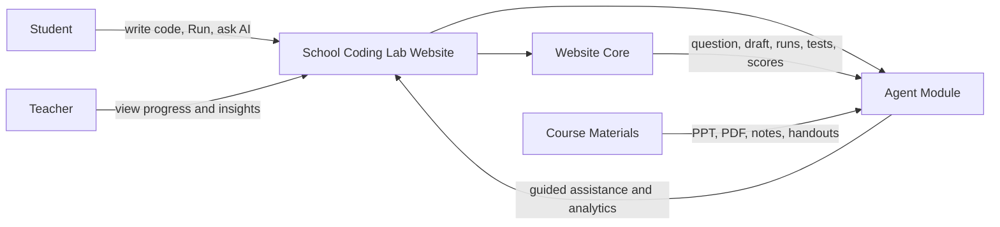
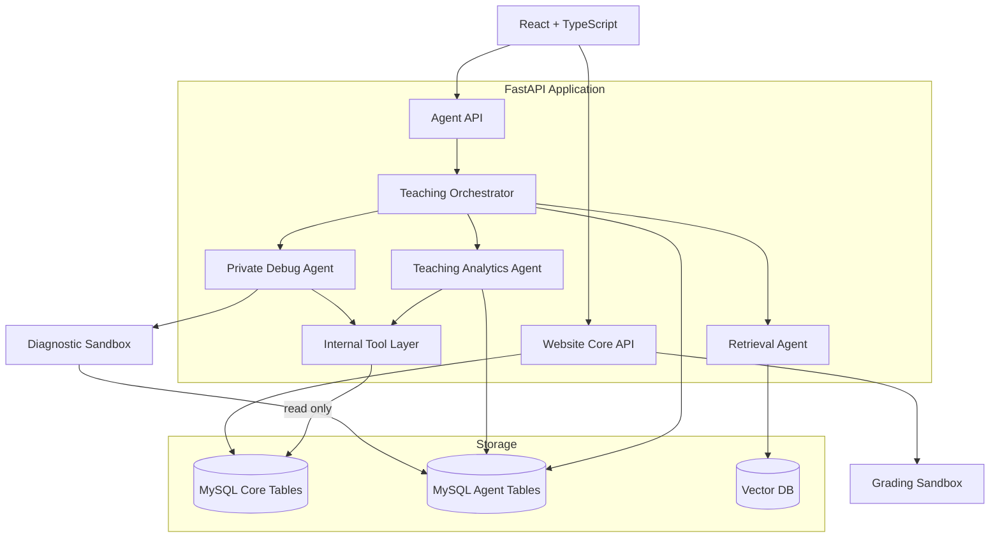
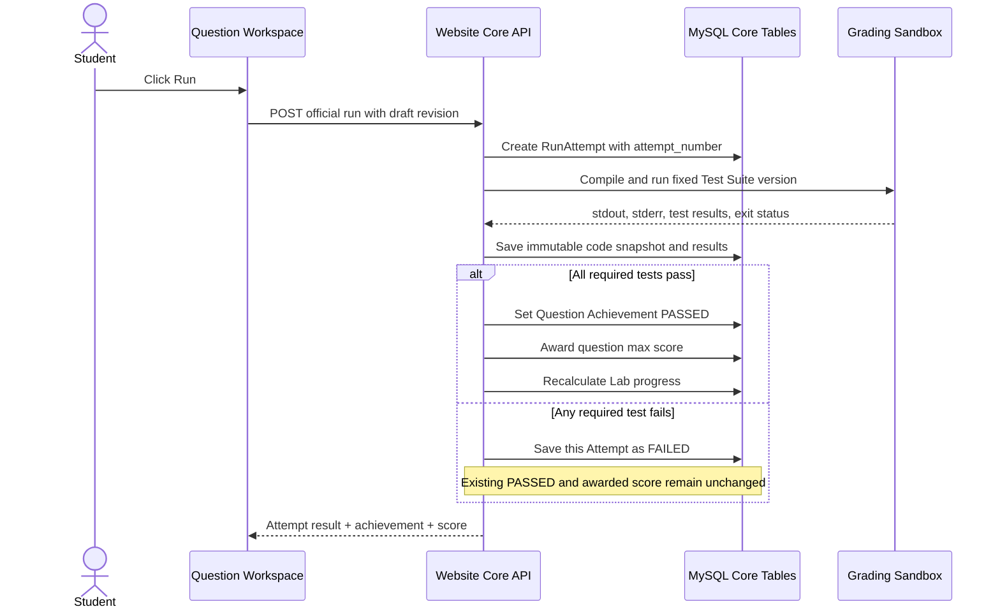
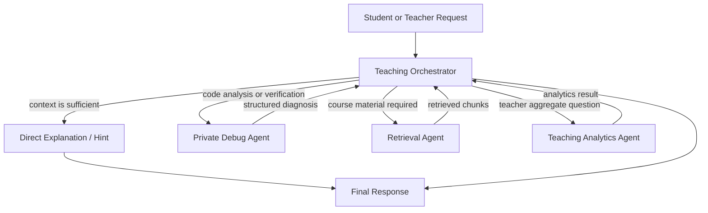
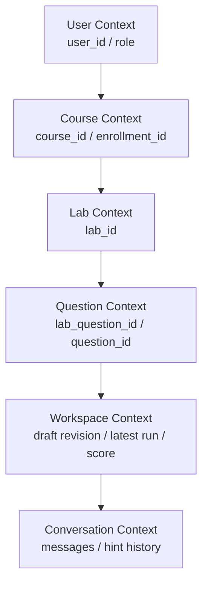
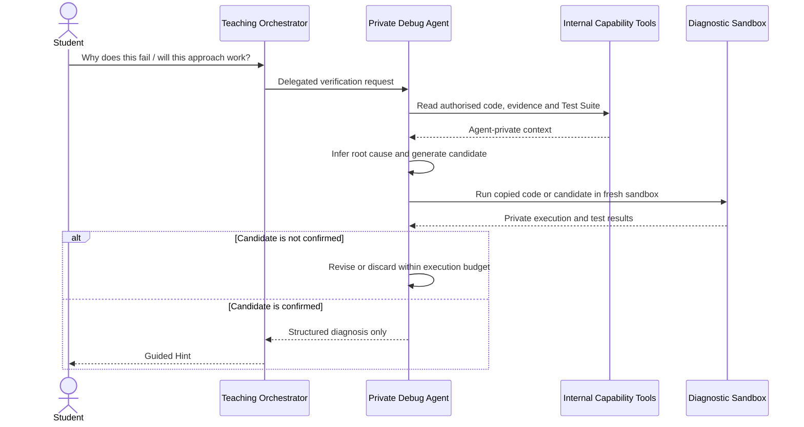
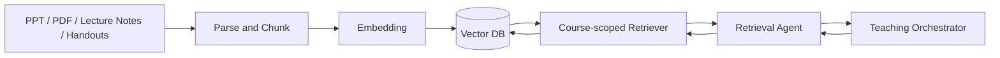
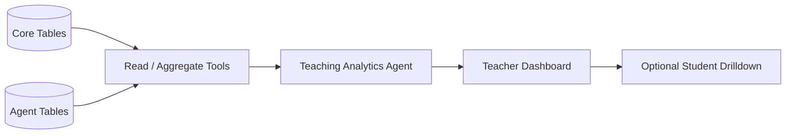
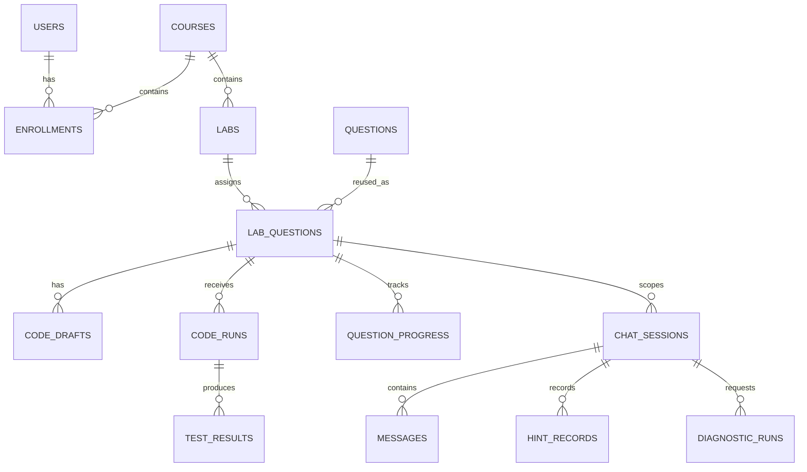
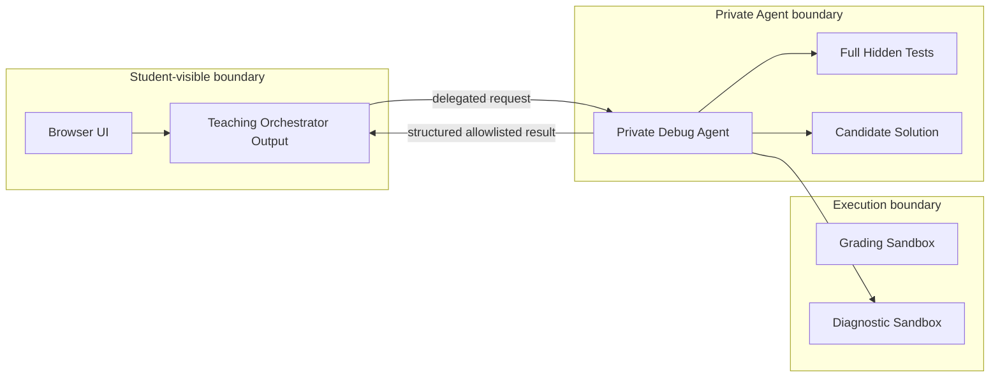

# School Internal Coding Lab Website + AI Assistant

## Architecture Design

**Status:** Approved design captured from project discussion

**Date:** 2026-09-13

**Primary stack:** React + TypeScript, Python + FastAPI, MySQL, LangChain Deep Agents / LangGraph, Vector DB, isolated code sandboxes

---

## 1. Purpose

This system is a school-internal Coding Lab and assignment website with an embedded AI Assistant. The website follows familiar CodeRunner-style workflows, but CodeRunner is a product reference rather than a required external dependency.

The system has two logical parts:

1. **Website Core** manages courses, labs, questions, drafts, official runs, tests, completion and scores.
2. **Agent Module** reads the current learning context, verifies code-related conclusions in a separate diagnostic sandbox, retrieves course material and provides guided assistance.

The architectural boundary is strict:

> Website Core is the only authority allowed to create official attempts and update `PASSED`, scores or Lab progress. Agent Module may read these facts and create diagnostic executions, but may not modify official grading state.

---

## 2. Architecture goals

- Give every student a question-aware AI Assistant inside the coding workspace.
- Preserve the normal non-AI assignment workflow when Agent Module is unavailable.
- Keep official grading deterministic and independent of LLM decisions.
- Let the Agent verify executable claims instead of guessing about code behavior.
- Let a private Debug Agent inspect full public and hidden tests without exposing them to students.
- Retrieve course-specific PPTs, notes and handouts through RAG.
- Give teachers aggregate learning insights before individual-code drilldown.
- Keep official runs and Agent diagnostic runs operationally and semantically separate.

---

## 3. System boundary

### 3.1 Responsibility matrix

| Capability | Website Core | Agent Module |
|---|---:|---:|
| Authentication and enrolment | Owns | Reads authenticated identity |
| Course / Lab / Question | Owns | Reads current context |
| Code editor and Draft | Owns | Reads authorised revision |
| Student Run button | Owns | Does not create official runs |
| Official `RunAttempt` | Owns | Reads |
| Grading Sandbox | Owns | Does not invoke for diagnostics |
| Public and hidden tests | Owns | Private Debug Agent may read |
| `PASSED`, score and Lab progress | Owns and updates | Read-only |
| Student chat and Hint history | Displays | Owns |
| Diagnostic execution | Does not treat as grading | Owns |
| Course-material retrieval | Supplies documents | Owns RAG workflow |
| Teaching analytics | Supplies official data | Produces insights |

### 3.2 System context



---

## 4. Recommended implementation topology

The first implementation should use a **modular monolith**. React, FastAPI and MySQL can serve both logical parts while preserving module and permission boundaries. This reduces deployment work without mixing grading logic with Agent logic.



The modules may later be deployed as separate services. Their interfaces and ownership rules must remain the same.

---

## 5. Website Core architecture

Website Core provides the complete non-AI assignment experience.

### 5.1 Core components

```text
Authentication and RBAC
Course / Lab / Question Management
Question Workspace
Draft Service
Official Run Service
Test Suite Service
Grading Sandbox Adapter
Question Achievement and Score Service
Lab Progress Service
Teacher Read APIs
```

### 5.2 Official Run workflow

Only a student clicking **Run** creates an official attempt.



### 5.3 Run result and achievement are different states

Each official attempt has its own result:

```text
RunAttempt.result_status = QUEUED | RUNNING | PASSED | FAILED | ERROR | TIMEOUT
```

The question has a monotonic achievement state:

```text
QuestionProgress.status = NOT_STARTED | IN_PROGRESS | PASSED
```

Once a qualifying official Run passes:

```text
question_progress.status = PASSED
question_progress.successful_run_id = first qualifying passed attempt
question_progress.awarded_score = lab_questions.max_score
```

A later failed Run changes only the latest Attempt result:

```text
Question Achievement: PASSED
Score: 10 / 10
Latest Run: FAILED
```

It never removes the score. Progress updates must be transactional, idempotent and monotonic. `attempt_number` determines which student click is the latest even when concurrent executions finish out of order.

### 5.4 Lab score and completion

```text
Lab Earned Score
= sum(awarded_score for PASSED required questions)

Lab Full Score
= sum(max_score for required questions)

Lab COMPLETED
= every required question is PASSED
```

There is no Run-count penalty. A deadline marks work as `ON_TIME` or `LATE` and does not remove earned marks. A course may explicitly set `LOCK_AFTER_DEADLINE` if late Runs must be disabled.

### 5.5 Versioning

Every official attempt records `question_version` and `test_suite_version`. Published assignments reference fixed versions. A version change must use an explicit policy:

```text
PRESERVE
REVALIDATE
RESET_WITH_HISTORY_PRESERVED
```

No edit may silently rewrite the basis of an earlier result or delete an earned-score record.

---

## 6. Agent Module architecture

### 6.1 Main Agent: Teaching Orchestrator

Teaching Orchestrator is the student-facing reasoning and routing layer. It:

- receives the authenticated, question-scoped `AgentContext`;
- understands the student's request;
- answers directly when existing context is sufficient;
- decides whether executable verification would improve reliability;
- delegates private code work to Private Debug Agent;
- delegates course-material searches to Retrieval Agent;
- delegates teacher aggregate questions to Teaching Analytics Agent;
- applies the Hint policy and produces the final student-safe response.

Teaching Orchestrator does not receive raw hidden tests or complete candidate solutions.

### 6.2 Subagents

| Subagent | Used when | Inputs | Outputs |
|---|---|---|---|
| Private Debug Agent | Code must be inspected or executed | Student snapshot or Draft, full tests, execution evidence | Structured diagnosis and Hint constraints |
| Retrieval Agent | Course knowledge is needed | Course-scoped query and document permissions | Relevant cited chunks |
| Teaching Analytics Agent | A teacher asks about a class, Lab or student pattern | Aggregated official and Agent data | Metrics, patterns and intervention suggestions |

No separate Grading Agent, Progress Agent or Hint Agent is required. Grading and progress are deterministic Website Core responsibilities; Teaching Orchestrator applies the Hint policy.

### 6.3 Agent routing



Multiple Subagents may be used in one request. A debugging question that also asks what the lecture taught may use Private Debug Agent and Retrieval Agent before Orchestrator composes one response.

---

## 7. Context architecture

### 7.1 Hierarchical context



`user_id` comes from the authenticated session. Navigation identifiers come from the current route and are validated against enrolment and ownership. They are request-scoped values, not process-wide global variables.

### 7.2 Student-facing AgentContext

```text
Identity
Location: course, enrolment, Lab and question
Question description and learning objectives
Current Draft revision
Latest official Run summary
Question Achievement and score
Student-visible Test results
Question-scoped chat and Hint history
```

This context is assembled for each Agent request. Course documents are retrieved only when needed; the entire course corpus is not inserted into every prompt.

### 7.3 Private Debug Context

Private Debug Agent may additionally obtain:

```text
Full public and hidden test source
Hidden inputs and expected outputs
Actual outputs and failed assertions
Immutable official code snapshots
Current Draft revision
Ephemeral candidate fixes
Diagnostic Sandbox results
```

These fields remain inside the private execution boundary. They are not copied into the student-facing prompt, ordinary chat logs or browser responses.

### 7.4 Context, memory and RAG

| Concept | Meaning |
|---|---|
| Database state | Persisted website and Agent records |
| AgentContext | Snapshot needed for the current request |
| Agent memory | Longer-term learning patterns and preferences |
| RAG result | Course-material chunks retrieved for this request |

---

## 8. Private Debug Agent and Diagnostic Sandbox

### 8.1 When the Agent may execute code

Teaching Orchestrator may request verification when a real execution materially improves the answer, including:

- “Will this method work?”
- “Will this change pass?”
- “What will this code output?”
- investigating a compile, runtime or test failure;
- checking a language or API behavior;
- comparing two implementation ideas;
- confirming a candidate repair against the full Test Suite.

Conceptual questions with sufficient evidence do not need Sandbox execution.

### 8.2 Diagnostic sources

A `DiagnosticRun` uses exactly one source:

```text
OFFICIAL_RUN_SNAPSHOT
DRAFT_REVISION
GENERATED_EXPERIMENT
```

Private Debug Agent may apply an ephemeral candidate patch to a copied source. It never writes that patch to the student's Draft.

### 8.3 Test scope

```text
Language, API or output question
→ Minimal generated experiment or public tests

Current-question solution verification
→ Full published Test Suite inside private boundary
```

The Agent must not expose full-suite pass counts or individual hidden-test details as an answer. This prevents Diagnostic Sandbox from becoming a hidden-test oracle.

### 8.4 Candidate verification workflow



### 8.5 Structured return contract

Private Debug Agent returns a field allowlist such as:

```json
{
  "verified": true,
  "bug_category": "empty_input_handling",
  "affected_area": "loop_initialization",
  "confidence": "high",
  "allowed_hint_scope": 2
}
```

It does not return raw hidden tests, complete candidate code, hidden inputs, expected outputs or reconstructable assertions.

### 8.6 Diagnostic execution limits

Each user message has bounded execution:

```text
max_diagnostic_runs
max_candidate_revisions
max_total_execution_time
CPU / memory / process / network limits
```

When a limit is reached, the Agent stops executing and gives a conservative Hint based on confirmed evidence.

---

## 9. Sandbox separation

| Property | Grading Sandbox | Diagnostic Sandbox |
|---|---|---|
| Trigger | Student clicks Run | Private Debug Agent tool call |
| Owner | Website Core | Agent Module |
| Code | Current Draft snapshot | Run snapshot, Draft, candidate or experiment |
| Tests | Fixed published suite | Minimal cases or full private suite |
| Creates official Attempt | Yes | No |
| Changes `PASSED` or score | Through Website Core | Never |
| Appears in official Run count | Yes | No |
| Storage | Core run and test tables | Agent diagnostic tables |

The two paths may share low-level container infrastructure, but must use different credentials, queues, records and completion callbacks. A Diagnostic Sandbox callback must have no route to the score-update service.

---

## 10. RAG architecture



Every chunk carries course, document, version and visibility metadata. Retrieval is filtered by the authenticated user's course access before semantic ranking. Current code, current question and Run results are direct context, not RAG content.

---

## 11. Teacher analytics architecture

Teaching Analytics Agent reads Website Core facts and Agent activity records:

```text
Official Runs and Test Results
Question Achievement and Scores
Lab Progress
Hint History
DiagnosticRun aggregates
Last Activity
```

It produces:

```text
Lab completion overview
Question pass rate
Common failure patterns
Official Run statistics
Diagnostic usage statistics
Stuck students
Teaching intervention suggestions
```



The default experience is aggregate-first. Individual code and Run history appear only when a teacher deliberately drills into an anomaly. Teaching Analytics Agent does not re-grade code or write scores.

---

## 12. Data ownership

### 12.1 Website Core tables

```text
users
enrollments
courses
labs
questions
lab_questions
question_versions
question_tests
test_suite_versions
code_drafts
code_runs
test_results
question_progress
lab_progress
```

Key logical fields include:

```text
lab_questions.is_required
lab_questions.max_score
code_runs.attempt_number
code_runs.idempotency_key
code_runs.result_status
code_runs.question_version
code_runs.test_suite_version
question_progress.status
question_progress.successful_run_id
question_progress.awarded_score
question_progress.passed_question_version
question_progress.passed_test_suite_version
```

### 12.2 Agent tables

```text
chat_sessions
messages
hint_records
diagnostic_runs
diagnostic_experiments
agent_memory
analytics_cache
```

`chat_sessions`, `hint_records` and `diagnostic_runs` are scoped by `enrollment_id + lab_question_id`.

A diagnostic source constraint enforces exactly one of:

```text
reference_run_id
draft_revision_id
generated_experiment_id
```

Candidate code and full diagnostic logs use Agent-private storage with restricted access and a defined retention period.

### 12.3 Ownership diagram



The diagram shows logical relationships. All student-owned rows also include enrolment scope even when it is omitted from the visual for readability.

---

## 13. Internal APIs and Agent tools

### 13.1 Website Core APIs

```text
GET  /courses
GET  /courses/{course_id}/labs
GET  /labs/{lab_id}/questions
GET  /questions/{lab_question_id}/workspace
PUT  /questions/{lab_question_id}/draft
POST /questions/{lab_question_id}/runs
GET  /questions/{lab_question_id}/runs
GET  /labs/{lab_id}/progress
```

### 13.2 Agent APIs

```text
POST /questions/{lab_question_id}/assistant/messages
GET  /questions/{lab_question_id}/assistant/messages
GET  /questions/{lab_question_id}/assistant/stream
GET  /teacher/labs/{lab_id}/insights
```

### 13.3 Internal Agent tools

Student-facing read tools:

```text
get_question_context()
get_current_draft()
get_latest_student_run()
inspect_execution(run_id)
get_student_progress()
search_course_material(query)
```

Private Debug capability tools:

```text
get_full_test_suite_for_debug(lab_question_id, test_suite_version)
validate_candidate_fix(reference_run_id, candidate_patch, extra_cases?)
validate_draft_approach(draft_revision_id, candidate_patch?, test_scope)
run_code_experiment(code, runtime, input?, expected_behavior?)
```

Teacher tools:

```text
get_lab_overview()
get_question_analytics()
get_common_failures()
get_stuck_students()
get_run_statistics()
get_diagnostic_statistics()
get_hint_statistics()
get_student_run_history()
```

Every tool validates authenticated role, course access, enrolment scope, question ownership and Agent capability on the server. Tool names do not grant permission by themselves.

---

## 14. Security and trust boundaries



Security rules:

- Derive `user_id` from the authenticated session, never from trusted client input.
- Validate course, Lab, question and enrolment relationships for every request.
- Treat student messages, source code, comments and retrieved documents as untrusted input.
- Only Private Debug Agent can call full-test tools.
- Keep full tests and candidate solutions out of student-facing prompts and logs.
- Give Agent Service Account read-only access to official grading tables.
- Give Diagnostic Sandbox no credential capable of updating scores.
- Disable network access by default and enforce CPU, memory, process, filesystem and time limits.
- Audit every private-test access and diagnostic execution.

---

## 15. Failure handling

| Failure | Required behavior |
|---|---|
| Agent service unavailable | Coding, official Run and grading continue normally |
| Grading Sandbox timeout | Official Attempt becomes `TIMEOUT`; existing score remains |
| Diagnostic Sandbox timeout | Return a cautious Hint; never affect official state |
| Draft changed after Run | Clearly label Run evidence as stale |
| Candidate fails validation | Do not present it as a confirmed solution |
| RAG unavailable | Answer from direct context or state that course material could not be checked |
| Private tool denied | Do not fall back to exposing or guessing hidden tests |
| Concurrent Runs finish out of order | Use `attempt_number` and monotonic transactional progress updates |

---

## 16. Observability

Record separate metrics for Website Core and Agent Module:

```text
Official Run latency and status
Grading Sandbox failures
Question pass rate and Runs before passing
Agent response latency
Subagent routing decisions
DiagnosticRun count, latency and timeout rate
Candidate validation success rate
RAG retrieval latency and document sources
Hint level usage
Private-test access audit events
```

Trace identifiers should connect a chat message, delegated Subagent call and DiagnosticRun without treating that trace as an official Run.

---

## 17. Key invariants

1. Only a student-triggered official Run can create a score-bearing `RunAttempt`.
2. Only Website Core may update Question Achievement, score and Lab progress.
3. A later failed Attempt never removes an earlier earned score.
4. A `DiagnosticRun` never becomes `successful_run_id` and never enters the official Run count.
5. Teaching Orchestrator never receives raw hidden tests or a complete candidate answer.
6. All Agent-triggered execution passes through Private Debug Agent.
7. Full hidden tests remain inside the private Agent and execution boundary.
8. Every request is scoped by authenticated user, enrolment and `lab_question_id`.
9. Teacher analytics reads grading facts but never re-grades or writes scores.
10. The website remains usable for coding and submission when Agent Module fails.

---

## 18. Scope boundaries

Included:

```text
Coding Lab workflow
Official code execution and automated tests
Question-level scoring and Lab completion
Question-aware AI assistance
Private diagnostic execution
Course-material RAG
Student progress and teacher analytics
```

Excluded:

```text
Complete LMS replacement
Discussions, syllabus and attendance
General-purpose gradebook
Agent-controlled grading
Agent submission on behalf of students
Direct disclosure of complete answers or hidden tests
```

---

## 19. Final architecture summary

```text
School Coding Lab Website
├── Website Core
│   ├── Courses / Labs / Questions
│   ├── Drafts
│   ├── Official Runs
│   ├── Grading Sandbox
│   ├── Tests
│   └── PASSED / Scores / Progress
│
└── Agent Module
    ├── Teaching Orchestrator
    ├── Private Debug Agent
    │   └── Diagnostic Sandbox
    ├── Retrieval Agent
    │   └── Vector DB / Course Materials
    ├── Teaching Analytics Agent
    └── Chat / Hints / Diagnostics / Memory
```

Website Core decides what officially happened. Agent Module understands what happened, verifies uncertain code claims and turns that evidence into teaching assistance.
