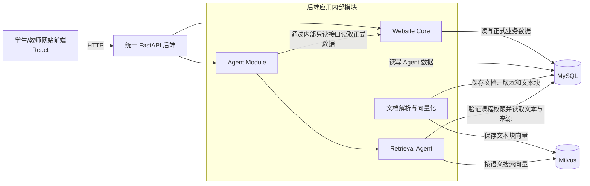

# AI Coding Assistant 数据库设计

**状态：** 设计中

**日期：** 2026-09-18

**数据库：** MySQL + Milvus

---

## 1. 文档目的与设计范围

本文描述校内 AI Coding Assistant 完整目标系统的数据存储设计。系统使用 MySQL 保存结构化业务数据，使用 Milvus 保存课程资料文本块的向量，支持 Retrieval Agent 进行语义检索。

本文主要回答以下问题：

- 系统需要长期保存哪些数据。
- 每类数据由 Website Core 还是 Agent Module 管理。
- MySQL 中需要哪些表，以及表之间如何关联。
- Milvus 中需要哪些 Collection，以及每条向量记录代表什么。
- MySQL 与 Milvus 如何通过稳定 ID 建立联系。
- 正式 Run、评分、Agent 诊断和 RAG 检索分别如何读写数据。
- 如何通过主键、外键、唯一约束、事务、索引和权限保证数据正确。

本文覆盖完整目标系统，包括：

```text
用户与身份
课程与课程实例
Enrollment
Lab 与题目
题目和 Test 版本
学生 Draft
正式 Run 与测试结果
题目分数与 Lab Progress
AI 对话与 Hint
Diagnostic Run
Agent Memory
课程资料与 RAG
教师教学分析所需数据
```

本文暂不提供完整的 MySQL `CREATE TABLE` SQL，也不规定具体的 ORM 实现。建表 SQL 和数据库迁移脚本将在实现阶段根据本设计生成。

## 2. 现有架构与数据边界

系统采用模块化单体架构：学生和教师通过浏览器使用 React 前端，前端通过 HTTP 调用一个 FastAPI 后端。Website Core 与 Agent Module 位于同一个后端应用中，通过 service、repository 和 internal tool interface 协作，不通过 HTTP 相互调用。

系统使用两个数据库产品：

| 数据存储 | 主要职责 |
|---|---|
| MySQL | 保存用户、课程、题目、代码、正式 Run、分数、进度、聊天、诊断记录和课程文档元数据 |
| Milvus | 保存课程资料文本块的 Embedding，并根据语义相似度检索相关文本块 |

MySQL 是系统的主要事实来源。以下数据只能以 MySQL 中的记录为准：

```text
用户身份和课程权限
Enrollment
课程、Lab 和题目
学生代码和正式 Run
测试结果
PASSED 状态
题目分数
Lab Progress
聊天和诊断历史
课程文档及其版本
```

Milvus 不是正式业务数据的事实来源。它只负责回答：“哪些课程资料文本块在语义上最接近当前问题？” Milvus 不保存或决定学生成绩、正式 Run、`PASSED` 状态和课程权限。即使 Milvus 暂时不可用，学生仍然可以进入课程、编写代码、点击 Run 并获得正式评分，只是 Agent 暂时不能进行课程资料的语义检索。

MySQL 和 Milvus 是两个独立数据库，二者之间不能建立数据库级外键。后端通过 `document_version_id` 和 `chunk_id` 维护它们之间的对应关系。

## 3. 数据库整体结构



MySQL 内部的数据分为三个逻辑区域。它们位于同一个 MySQL 数据库中，逻辑分区用于明确数据所有权，不代表需要部署三个数据库。

| 数据区域 | 主要内容 | 主要管理者 |
|---|---|---|
| Website Core 数据 | 用户、课程、Enrollment、Lab、题目、Draft、正式 Run、测试结果、分数和进度 | Website Core |
| Agent 数据 | Chat、Message、Hint、Diagnostic Run、Agent Memory 和分析缓存 | Agent Module |
| RAG 元数据 | 用来描述课程文档和文本块的数据，例如文档名称、版本、来源位置、可见范围和索引状态 | Agent Module 的文档索引功能 |

Milvus 使用一个名为 `course_material_chunks` 的 Collection。Collection 可以暂时理解成 Milvus 中用于保存同一类向量记录的“表”。其中每条记录对应一个课程资料文本块，至少包含：

```text
chunk_id
document_version_id
course_instance_id
embedding
visibility
```

MySQL 中的 `document_chunks` 保存文本块的真实文字、来源位置和状态；Milvus 中的 `course_material_chunks` 保存相同 `chunk_id` 对应的向量，以及检索时需要的少量过滤字段。二者使用相同的 `chunk_id` 建立逻辑联系，但没有跨数据库外键。

RAG 检索的数据流如下：

```text
学生提出问题
→ 后端从 MySQL 验证 Enrollment 和课程权限
→ 将学生的问题转换为查询向量
→ 使用课程实例 ID 和可见性条件搜索 Milvus
→ Milvus 返回相似 chunk_id
→ 后端根据 chunk_id 从 MySQL 读取文本和来源
→ Retrieval Agent 将资料片段交给 Teaching Orchestrator
→ Agent 生成回答
```

在这个设计中，Milvus 返回的是可能相关的资料编号和相似度；MySQL 决定这些资料属于哪门课程、是否仍然有效，以及当前用户是否可以访问。

## 4. 数据库设计原则

### 4.1 MySQL 是业务事实来源

MySQL 保存系统中需要长期保持正确、可以审计的数据，包括课程、Enrollment、代码、正式 Run、分数、Agent 对话和课程文档信息。

Milvus 只负责课程资料的向量检索。Milvus 中的数据可以根据 MySQL 和原始课程资料重新生成，因此 Milvus 不能决定课程权限、题目状态或学生成绩。

### 4.2 按模块划分数据所有权

每张表都必须有明确的主要管理者：

```text
Website Core
→ 管理课程、题目、Draft、正式 Run、测试结果、PASSED、分数和进度

Agent Module
→ 管理聊天、Hint、Diagnostic Run、Agent Memory 和检索记录
```

Agent Module 可以通过受控接口读取 Website Core 数据，但不能直接修改正式评分结果。课程文档的原始内容和发布状态由 Website Core 管理；Agent Module 的文档索引功能只管理解析、切块、向量索引和检索记录。

### 4.3 统一命名与字符集

MySQL 表名和字段名统一使用小写 `snake_case`，表名使用复数形式，例如 `course_instances` 和 `code_runs`。布尔字段使用 `is_` 或 `has_` 前缀，时间字段使用 `_at` 后缀。

MySQL 使用支持完整 Unicode 的 `utf8mb4` 字符集和 InnoDB 存储引擎，以正确保存中英文题目、学生代码、聊天消息并支持事务与外键。

### 4.4 使用主键唯一识别记录

MySQL 业务表使用 `BIGINT UNSIGNED AUTO_INCREMENT` 主键。主键名称明确表示实体，例如：

```text
user_id
course_id
course_instance_id
enrollment_id
lab_id
```

外键必须与被引用主键使用相同的数据类型。请求幂等键和 Trace ID 等由外部请求产生的标识可以使用 UUID 字符串，但不代替表的数字主键。

### 4.5 使用外键表达数据关系

属于关系必须通过外键表示。例如：

```text
course_instances.course_id
→ courses.course_id

enrollments.user_id
→ users.user_id

enrollments.course_instance_id
→ course_instances.course_instance_id
```

不能在一个字段中保存用逗号分隔的多个用户 ID、题目 ID 或课程 ID。

### 4.6 避免不必要的重复数据

同一项事实原则上只保存一次。例如用户邮箱保存在 `users`，其他表通过 `user_id` 找到用户，不重复保存邮箱。

为了历史审计而保存的快照可以例外。例如创建正式 Run 时，系统必须立即固定当时运行的代码快照、来源的 Draft Revision、题目版本和 Test Suite 版本。正式 Run 不能依赖之后仍会变化的 Code Draft，避免后来修改题目或代码时改变旧运行的含义。

### 4.7 已发布版本和已完成运行不可覆盖

题目版本和 Test Suite 版本在发布前可以编辑，发布后不能原地修改。Draft Revision 创建后不可修改。Code Run 创建时，其代码快照、来源 Draft Revision、题目版本和 Test Suite 版本就已经固定。

Code Run 和 Diagnostic Run 在执行过程中可以从 `QUEUED` 更新为 `RUNNING`，再更新为最终状态。到达 `PASSED`、`FAILED`、`ERROR` 或 `TIMEOUT` 等最终状态后，其代码快照、版本、输出和结果不能被覆盖。再次执行必须创建新的 Run。

### 4.8 已获得的成绩不能被后续失败 Run 撤销

`question_progress` 保存题目是否曾经通过及已经获得的分数。

学生某次正式 Run 通过全部必需 Tests 后：

```text
status = PASSED
awarded_score = 该题满分
successful_run_id = 本次成功 Run
```

之后即使最新一次 Run 失败：

```text
最新 Code Run = FAILED
Question Progress = PASSED
awarded_score = 保持原分数
```

因此，单次 Run 的结果和累计题目进度必须使用不同的表。题目或 Tests 发布新版本时，只能通过明确的版本迁移规则决定是否保留、重新验证或重置进度，并保留旧历史。

### 4.9 时间统一使用 UTC

需要记录时间的 MySQL 表统一使用 UTC，并使用清楚的字段名：

```text
created_at
updated_at
started_at
finished_at
passed_at
deleted_at
```

前端根据用户所在时区转换成当地时间显示。

### 4.10 状态字段使用固定取值

状态不能保存任意文本。设计文档需要为每个状态字段列出允许的值，例如：

```text
code_runs.result_status
= QUEUED / RUNNING / PASSED / FAILED / ERROR / TIMEOUT
```

MySQL 通过约束限制非法状态，后端也必须进行相同验证。

### 4.11 谨慎删除正式教学数据

正式 Run、测试结果和成绩属于教学证据，不应因为删除课程页面而直接级联删除。

课程、Lab、题目和文档优先使用状态或归档字段：

```text
DRAFT
PUBLISHED
ARCHIVED
```

聊天、诊断日志、联网检索记录和 Agent Memory 可以按照数据保留规则到期删除。

### 4.12 MySQL 与 Milvus 使用稳定 ID 关联

MySQL 的 `document_chunks.chunk_id` 与 Milvus Collection 中的 `chunk_id` 使用相同值。

两个数据库之间没有外键，所以后端需要在 MySQL 中维护向量索引状态：

```text
PENDING
INDEXED
FAILED
DELETED
```

向量索引状态属于每一条 `document_chunks` 记录。MySQL 保存真实文字和文档状态，Milvus 保存向量。两边不一致时，以 MySQL 为准，并由后台任务重新建立或删除 Milvus 记录。课程资料更新时创建新的 Document Version 和新的 Document Chunk，不覆盖旧版本的 Chunk；旧版本按发布或归档状态保留，供历史记录追溯。

### 4.13 所有数据访问都经过后端权限检查

React 前端、语言模型和学生代码都不能直接连接 MySQL 或 Milvus。

后端每次读取课程相关数据时，都必须根据认证用户检查对应的 `enrollment`、角色和资源从属关系。Milvus 检索必须带课程实例和可见性过滤条件；即使 Milvus 已返回结果，后端仍要根据 MySQL 中当前的文档状态和用户权限再次确认，才可把文本交给 Agent。

教师可以查看被授权课程实例中单个学生的代码、正式 Run、结果和分数。教师端的 Teaching Analytics 只能查看聚合后的 Agent Memory 趋势，不能读取单个学生的 Agent Memory。普通 Teaching Orchestrator 不能直接读取 hidden Tests；只有 Private Debug Agent 可以在受控内部流程中使用它们，并且只能返回经过过滤的诊断结论。

## 5. 核心概念与名词

### 5.1 用户与课程

| 名称 | 数据库名称 | 含义 |
|---|---|---|
| User | `users` | 系统中的一个人。`user_id` 是全局身份，不随课程改变 |
| Course | `courses` | 课程目录中的课程，例如 `COMP101 Introduction to Programming` |
| Course Instance | `course_instances` | 某门课程在具体学期的一次实际开课，例如 `COMP101 / 2026 / Semester 1` |
| Enrollment | `enrollments` | 一个用户参加一个 Course Instance 的记录，并保存其角色 |
| Role | `enrollments.role` | 用户在该课程实例中的身份，例如 `STUDENT`、`TA`、`TEACHER` |

例如，同一个 User 可以通过不同 Enrollment，在 COMPSCI202 中是学生，在 COMPSCI101 中是 TA。

### 5.2 Lab、题目与 Tests

| 名称 | 数据库名称 | 含义 |
|---|---|---|
| Lab | `labs` | 某个 Course Instance 中发布的一节编程练习 |
| Question | `questions` | 可以跨 Lab 或学期复用的题目模板 |
| Question Version | `question_versions` | 某次发布的题目内容版本，包括题目描述和 Starter Code |
| Lab Question | `lab_questions` | 某个题目版本被安排进某个 Lab 的记录，保存顺序、满分和是否必做 |
| Test Suite Version | `test_suite_versions` | 某个 Lab Question 的一整套固定 Tests 版本；正式 Run 记录实际使用的版本 |
| Question Test | `question_tests` | Test Suite Version 中的单个测试，包括公开测试或 hidden test |

`lab_questions` 固定指向一个 `question_version_id`，使学生看到的题目描述和 Starter Code 不会在发布后悄悄改变。`test_suite_versions` 属于具体的 `lab_question_id`，因此同一个 Question 模板在不同课程、学期或 Lab 中可以使用不同的 Tests。

学生看到的是 Lab Question。每名学生的 Draft、Run 和题目进度都同时关联 `enrollment_id` 和 `lab_question_id`：前者表示“哪位学生、在哪次开课中”，后者表示“哪一道具体作业题”。这样同一道题在不同课程或学期中的记录不会相互影响。

### 5.3 学生代码与正式运行

| 名称 | 数据库名称 | 含义 |
|---|---|---|
| Code Draft | `code_drafts` | 学生当前正在编辑、会自动保存且仍可修改的代码工作区 |
| Draft Revision | `draft_revisions` | Draft 在有意义的时间点保存下来的不可变代码版本 |
| Code Run | `code_runs` | 学生点击 Run 后创建的一次正式运行记录，含当时冻结的代码快照 |
| Test Result | `test_results` | 某次 Code Run 对某一个 Test 的执行结果 |
| Question Progress | `question_progress` | 学生是否曾经通过该题，以及已经获得的分数 |
| Lab Progress | `lab_progress` | 学生在整个 Lab 中的完成情况和总分 |

系统不把每次敲键盘都保存成 Revision。`code_drafts` 保存当前最新代码；学生手动保存、请求 Agent 诊断或点击 Run 等有意义的检查点才创建 `draft_revisions`。点击 Run 时，Website Core 复制代码并固定来源 Draft Revision、题目版本和 Test Suite 版本，然后创建 `code_runs`；之后继续编辑 Draft 不会影响这个正式 Run。

`Code Run` 表示“这一次运行发生了什么”，`Question Progress` 表示“这个学生到目前为止已经取得了什么成果”。`question_progress` 对每个 `enrollment_id + lab_question_id` 最多一条记录，`lab_progress` 对每个 `enrollment_id + lab_id` 最多一条记录。

### 5.4 Agent 数据

| 名称 | 数据库名称 | 含义 |
|---|---|---|
| Chat Session | `chat_sessions` | 某个 Enrollment 在某道 Lab Question 中的一段 Agent 对话 |
| Message | `messages` | Chat Session 中的一条学生或 Agent 消息 |
| Hint Record | `hint_records` | Agent 提供 Hint 的级别、类型和原因 |
| Diagnostic Run | `diagnostic_runs` | Agent 为验证代码判断而执行的一次诊断运行，记录使用的不可变输入，不计入正式成绩 |
| Diagnostic Experiment | `diagnostic_experiments` | Agent 创建的最小实验或基于已有代码快照的候选代码副本 |
| Agent Memory | `agent_memory` | 按学生保存、经过过滤的学习偏好、抽象误区和重复调试模式 |
| Retrieval Event | `retrieval_events` | 一次课程 RAG 或受控 Web Search 的调用记录 |
| Retrieval Source | `retrieval_sources` | 一次检索使用的文档块或公开网页来源 |

Diagnostic Run 和正式 Code Run 必须分开。每个 Diagnostic Run 必须且只能选择一种不可变输入：某个 Draft Revision、某个正式 Code Run 的代码快照，或某个 Diagnostic Experiment。Diagnostic Run 不能更新 `PASSED`、分数或 Lab Progress。

Agent Memory 不能保存完整学生代码、完整聊天记录、hidden Tests 或直接答案；教师只能在 Teaching Analytics 中查看聚合趋势，不能查看单个学生的 Memory。

### 5.5 课程资料与 RAG

| 名称 | 存储对象或位置 | 含义 |
|---|---|---|
| Course Document | `course_documents`（MySQL） | 教师在某个 Course Instance 上传或发布的一份 PPT、PDF、讲义或 Lab Handout 的数据库记录 |
| Original File | 文件存储 | 实际的 PPT、PDF 或其他原始文件；MySQL 只保存其存储位置和状态 |
| Document Version | `document_versions`（MySQL） | 课程文档某次发布的版本 |
| Document Chunk | `document_chunks`（MySQL） | 文档解析后得到的一小段真实文字 |
| Embedding | Milvus 向量字段 | Embedding 模型根据文本含义生成的一组数字，不是一张 MySQL 表 |
| Collection | `course_material_chunks`（Milvus） | Milvus 中保存课程资料文本块向量的集合 |
| RAG Result | 不单独作为业务实体 | 当前问题从 Milvus 检索到的相关文本块 |
| Web Search Result | `retrieval_sources`（MySQL） | 受控联网搜索得到的公开资料来源，不自动进入课程知识库 |

三类存储的分工是：

```text
文件存储
→ 保存实际 PPT、PDF 文件

MySQL
→ 保存文件位置、文档信息和文本块的真实文字

Milvus
→ 保存每个文本块对应的向量
```

MySQL 和 Milvus 使用相同的 `chunk_id` 联系：

```text
MySQL.document_chunks.chunk_id
↔ Milvus.course_material_chunks.chunk_id
```

公开网页只有经过教师明确选择并作为课程资料发布后，才能成为 Course Document，并进入 Milvus 的课程 RAG Collection。

## 6. MySQL：用户与课程

> 本节将在后续设计中补充以下表及其关系。

```text
users
courses
course_instances
enrollments
```

## 7. MySQL：Lab 与题目

> 本节将在后续设计中补充以下表及其关系。

```text
labs
questions
question_versions
lab_questions
question_tests
test_suite_versions
```

## 8. MySQL：学生代码与正式运行

> 本节将在后续设计中补充以下表及其关系。

```text
code_drafts
draft_revisions
code_runs
test_results
```

## 9. MySQL：评分与学习进度

> 本节将在后续设计中补充 `question_progress`、`lab_progress`，并说明“一次通过永久得分，后续失败不撤销分数”的实现方式。

## 10. MySQL：AI Assistant 数据

> 本节将在后续设计中补充以下表及其关系。

```text
chat_sessions
messages
hint_records
diagnostic_runs
diagnostic_experiments
agent_memory
```

## 11. MySQL：课程资料元数据

> 本节将在后续设计中补充 `course_documents`、`document_versions`、`document_chunks`，以及它们对 Vector Database 记录的引用方式。

## 12. Vector Database 设计

> 本节将在后续设计中补充 Embedding、向量记录、Metadata、课程权限过滤，以及 Vector Database 的使用边界。

## 13. MySQL 与 Vector Database 的联系

> 本节将在后续设计中补充两种数据库如何通过 `course_id`、`document_id`、`document_version_id` 与 `chunk_id` 关联，以及文档更新和删除时如何保持一致。

## 14. 完整 ER Diagram

> 本节将在后续设计中使用 Mermaid 展示 MySQL 表之间的关系，并附上图中符号的中文说明。

## 15. 关键业务数据流

> 本节将在后续设计中补充以下数据流。

```text
学生保存 Draft
学生点击 Run
正式评分与 PASSED
Agent 诊断运行
RAG 检索
教师查看 Dashboard
```

## 16. 数据完整性与业务约束

> 本节将在后续设计中补充唯一约束、外键、检查约束、评分不回退，以及 Diagnostic Run 不影响正式评分等规则。

## 17. 索引与常见查询

> 本节将在后续设计中补充学生课程列表、题目工作区、Run 历史和教师 Dashboard 等查询需要的索引。

## 18. 事务、并发与幂等

> 本节将在后续设计中补充重复点击 Run、多次运行乱序完成和重复请求的处理方式。

## 19. 权限、隐私与数据访问

> 本节将在后续设计中补充学生、教师、TA、Website Core、Agent Module 与 Private Debug Agent 的数据访问边界。

## 20. 数据保留、审计与删除

> 本节将在后续设计中补充代码运行历史、聊天记录、诊断日志、Agent Memory 和课程文档的保留与删除规则。

## 21. 版本与数据迁移

> 本节将在后续设计中补充题目、Tests 和课程资料更新后，旧运行与旧成绩的处理规则。

## 22. 表清单与模块所有权

> 本节将在后续设计中汇总每张表属于 Website Core 还是 Agent Module，以及哪些模块可以读写。

## 23. 尚待确认的问题

> 本节用于集中记录设计过程中尚未确定的事项，避免问题散落在其他章节。
