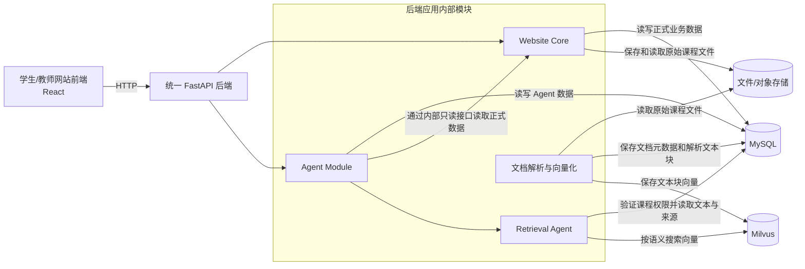
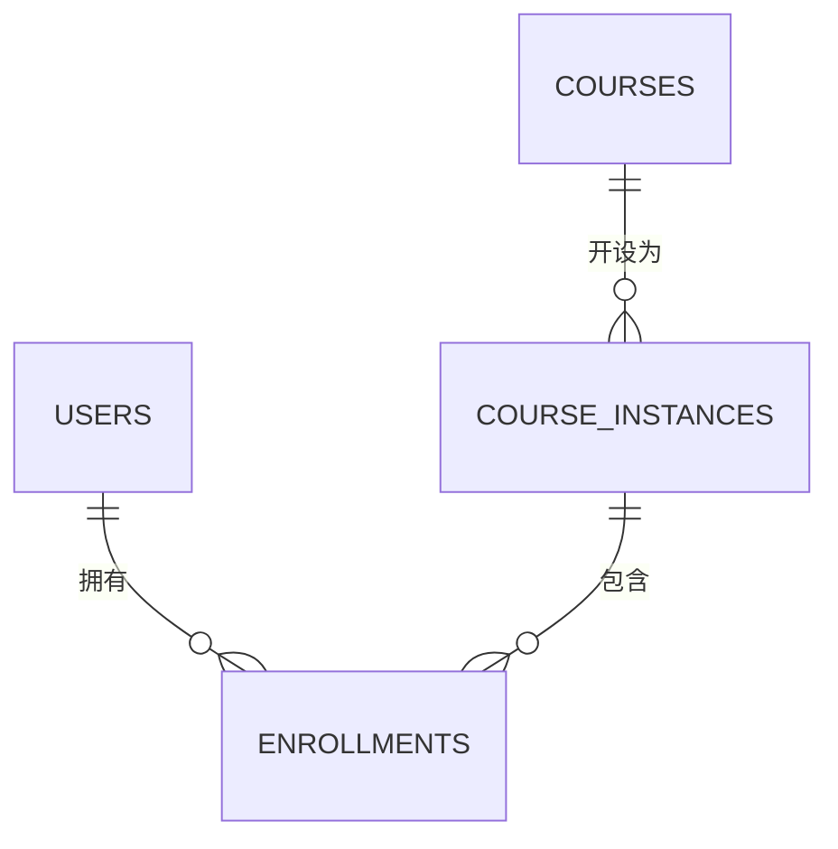
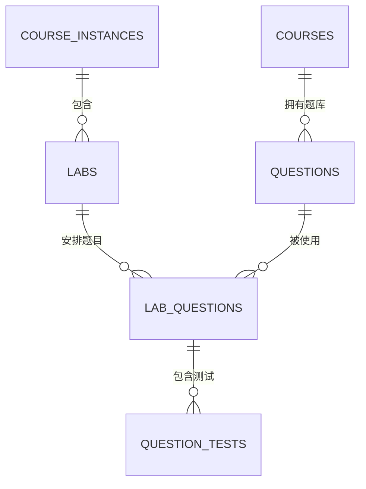
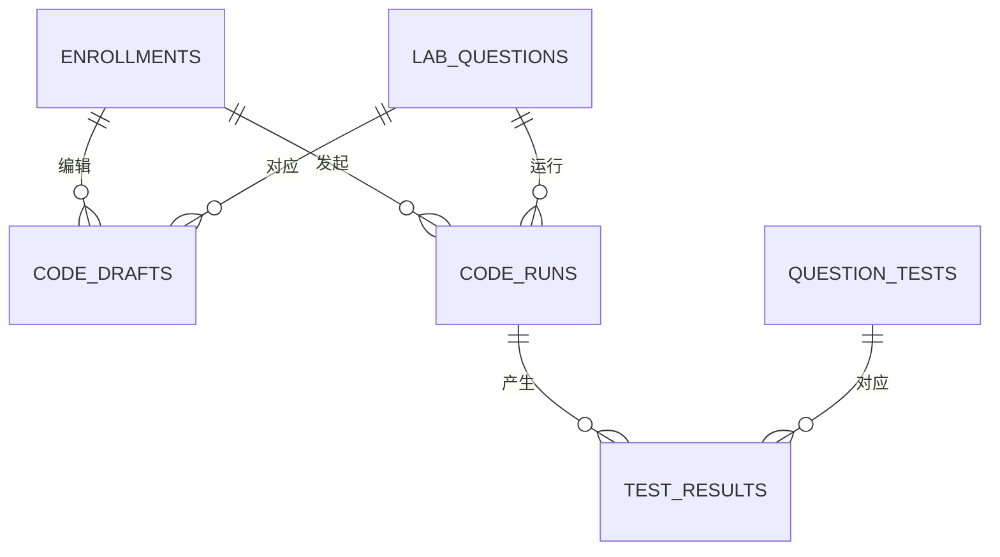
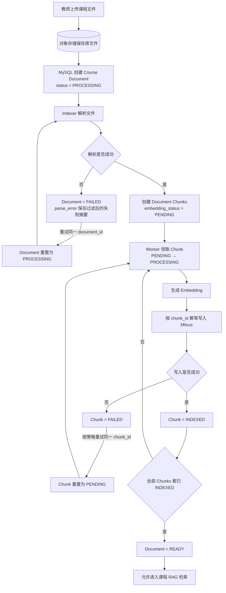
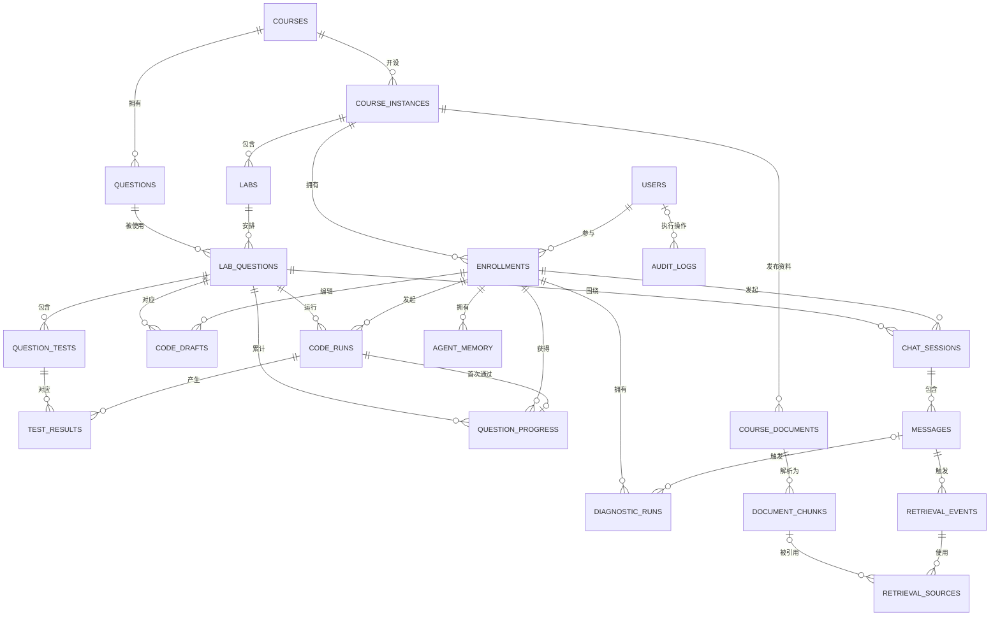
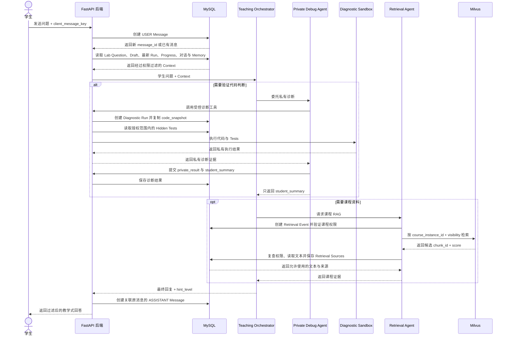

# AI Coding Assistant 数据库设计

**状态：** 第一版设计完成（待实现前政策确认）

**日期：** 2026-09-18

**最后更新：** 2026-09-20

**数据库：** MySQL + Milvus

---

## 1. 文档目的与设计范围

本文描述校内 AI Coding Assistant 第一版可实现的数据存储设计。系统使用 MySQL 保存结构化业务数据，使用 Milvus 保存课程资料文本块的向量，支持 Retrieval Agent 进行语义检索。第一版优先采用容易理解和实现的表结构；只有出现明确业务需求后，才增加题目版本、测试版本等复杂模型。

本文主要回答以下问题：

- 系统需要长期保存哪些数据。
- 每类数据由 Website Core 还是 Agent Module 管理。
- MySQL 中需要哪些表，以及表之间如何关联。
- Milvus 中需要哪些 Collection，以及每条向量记录代表什么。
- MySQL 与 Milvus 如何通过稳定 ID 建立联系。
- 正式 Run、评分、Agent 诊断和 RAG 检索分别如何读写数据。
- 如何通过主键、外键、唯一约束、事务、索引和权限保证数据正确。

本文覆盖第一版核心系统，包括：

```text
用户与身份
课程与课程实例
Enrollment
Lab 与题目
题目与 Tests
学生 Draft
正式 Run 与测试结果
题目分数与 Lab Progress
AI 对话与 Hint
Diagnostic Run
Agent Memory
课程资料与 RAG
教师教学分析所需数据
```

本文暂不提供完整的 MySQL `CREATE TABLE` SQL，也不规定具体的 ORM 实现。建表 SQL 和数据库迁移脚本将在实现阶段根据本设计生成。

## 2. 现有架构与数据边界

系统采用模块化单体架构：学生和教师通过浏览器使用 React 前端，前端通过 HTTP 调用一个 FastAPI 后端。Website Core 与 Agent Module 位于同一个后端应用中，通过 service、repository 和 internal tool interface 协作，不通过 HTTP 相互调用。

系统使用两个数据库产品：

| 数据存储 | 主要职责 |
|---|---|
| MySQL | 保存结构化业务数据、课程文档元数据和解析后的文本块；不保存原始课程文件 |
| Milvus | 保存课程资料文本块的 Embedding，并根据语义相似度检索相关文本块 |

MySQL 是系统的主要事实来源。以下数据只能以 MySQL 中的记录为准：

```text
用户身份和课程权限
Enrollment
课程、Lab 和题目
学生代码和正式 Run
测试结果
PASSED 状态
题目分数
Lab Progress
聊天和诊断历史
课程文档元数据和解析文本块
```

Milvus 不是正式业务数据的事实来源。它只负责回答：“哪些课程资料文本块在语义上最接近当前问题？” Milvus 不保存或决定学生成绩、正式 Run、`PASSED` 状态和课程权限。即使 Milvus 暂时不可用，学生仍然可以进入课程、编写代码、点击 Run 并获得正式评分，只是 Agent 暂时不能进行课程资料的语义检索。

MySQL 和 Milvus 是两个独立数据库，二者之间不能建立数据库级外键。后端通过 `document_id` 和 `chunk_id` 维护它们之间的对应关系。

## 3. 数据库整体结构



MySQL 内部的数据分为三个逻辑区域。它们位于同一个 MySQL 数据库中，逻辑分区用于明确数据所有权，不代表需要部署三个数据库。

| 数据区域 | 主要内容 | 主要管理者 |
|---|---|---|
| Website Core 数据 | 用户、课程、Enrollment、Lab、题目、Draft、正式 Run、测试结果、分数和进度 | Website Core |
| Agent 数据 | Chat、Message（含提示级别）、Diagnostic Run、Agent Memory 和检索记录 | Agent Module |
| RAG 元数据 | 用来描述课程文档和文本块的数据，例如文档名称、来源位置、可见范围和索引状态 | Agent Module 的文档索引功能 |

Milvus 使用一个名为 `course_material_chunks` 的 Collection。Collection 可以暂时理解成 Milvus 中用于保存同一类向量记录的“表”。其中每条记录对应一个课程资料文本块，至少包含：

```text
chunk_id
document_id
course_instance_id
embedding
visibility
```

MySQL 中的 `document_chunks` 保存文本块的真实文字、来源位置和状态；Milvus 中的 `course_material_chunks` 保存相同 `chunk_id` 对应的向量，以及检索时需要的少量过滤字段。二者使用相同的 `chunk_id` 建立逻辑联系，但没有跨数据库外键。

RAG 检索的数据流如下：

```text
学生提出问题
→ 后端从 MySQL 验证 Enrollment 和课程权限
→ 将学生的问题转换为查询向量
→ 使用课程实例 ID 和可见性条件搜索 Milvus
→ Milvus 返回相似 chunk_id
→ 后端根据 chunk_id 从 MySQL 读取文本和来源
→ Retrieval Agent 将资料片段交给 Teaching Orchestrator
→ Agent 生成回答
```

在这个设计中，Milvus 返回的是可能相关的资料编号和相似度；MySQL 决定这些资料属于哪门课程、是否仍然有效，以及当前用户是否可以访问。

## 4. 数据库设计原则

### 4.1 MySQL 是业务事实来源

MySQL 保存系统中需要长期保持正确、可以审计的数据，包括课程、Enrollment、代码、正式 Run、分数、Agent 对话和课程文档信息。

Milvus 只负责课程资料的向量检索。Milvus 中的数据可以根据 MySQL 和原始课程资料重新生成，因此 Milvus 不能决定课程权限、题目状态或学生成绩。

### 4.2 按模块划分数据所有权

每张表都必须有明确的主要管理者：

```text
Website Core
→ 管理课程、题目、Draft、正式 Run、测试结果、PASSED、分数和进度

Agent Module
→ 管理聊天、Hint、Diagnostic Run、Agent Memory 和检索记录
```

Agent Module 可以通过受控接口读取 Website Core 数据，但不能直接修改正式评分结果。课程文档的原始内容和发布状态由 Website Core 管理；Agent Module 的文档索引功能只管理解析、切块、向量索引和检索记录。

### 4.3 统一命名与字符集

MySQL 表名和字段名统一使用小写 `snake_case`。普通实体表使用复数形式，例如 `course_instances` 和 `code_runs`；`question_progress`、`agent_memory` 这类不可数的汇总概念保留单数名称。布尔字段使用 `is_` 或 `has_` 前缀，时间字段使用 `_at` 后缀。

MySQL 使用支持完整 Unicode 的 `utf8mb4` 字符集和 InnoDB 存储引擎，以正确保存中英文题目、学生代码、聊天消息并支持事务与外键。

### 4.4 使用主键唯一识别记录

MySQL 业务表使用 `BIGINT UNSIGNED AUTO_INCREMENT` 主键。主键名称明确表示实体，例如：

```text
user_id
course_id
course_instance_id
enrollment_id
lab_id
```

外键必须与被引用主键使用相同的数据类型。请求幂等键和 Trace ID 等由外部请求产生的标识可以使用 UUID 字符串，但不代替表的数字主键。

### 4.5 使用外键表达数据关系

属于关系必须通过外键表示。例如：

```text
course_instances.course_id
→ courses.course_id

enrollments.user_id
→ users.user_id

enrollments.course_instance_id
→ course_instances.course_instance_id
```

不能在一个字段中保存用逗号分隔的多个用户 ID、题目 ID 或课程 ID。

### 4.6 避免不必要的重复数据

同一项事实原则上只保存一次。例如用户邮箱保存在 `users`，其他表通过 `user_id` 找到用户，不重复保存邮箱。

为了历史审计而保存的快照可以例外。例如创建正式 Run 时，系统必须把当前 Draft 复制到 `code_runs.code_snapshot`。正式 Run 不能依赖之后仍会变化的 Code Draft，避免学生继续编辑后改变旧运行的含义。

### 4.7 已发布 Lab 和已完成运行不可覆盖

Lab 发布前，教师可以修改题目安排、运行配置和 Tests。Lab 发布后，这些内容全部冻结；需要修改时复制成新的 Question 或新的 Lab，而不是覆盖旧数据。Code Run 创建时直接保存代码快照，因此不需要单独的 Draft 版本表。

Code Run 和 Diagnostic Run 在执行过程中可以从 `QUEUED` 更新为 `RUNNING`，再更新为最终状态。到达 `PASSED`、`FAILED`、`ERROR` 或 `TIMEOUT` 等最终状态后，其代码快照、输出和结果不能被覆盖。再次执行必须创建新的 Run。

### 4.8 已获得的成绩不能被后续失败 Run 撤销

`question_progress` 保存题目是否曾经通过及已经获得的分数。

学生某次正式 Run 通过全部必需 Tests 后：

```text
创建 question_progress
awarded_score = 该题满分
successful_run_id = 本次成功 Run
```

之后即使最新一次 Run 失败：

```text
最新 Code Run = FAILED
question_progress = 仍然存在
awarded_score = 保持原分数
```

因此，单次 Run 的结果和累计题目进度必须使用不同的表。第一版不修改已经发布的题目和 Tests；教师需要调整内容时创建新的 Question 或 Lab，旧 Run 和旧成绩继续关联原来的 `lab_question_id`。

### 4.9 时间统一使用 UTC

需要记录时间的 MySQL 表统一使用 UTC，并使用清楚的字段名：

```text
created_at
updated_at
started_at
finished_at
passed_at
deleted_at
```

前端根据用户所在时区转换成当地时间显示。

### 4.10 状态字段使用固定取值

状态不能保存任意文本。设计文档需要为每个状态字段列出允许的值，例如：

```text
code_runs.result_status
= QUEUED / RUNNING / PASSED / FAILED / ERROR / TIMEOUT
```

MySQL 通过约束限制非法状态，后端也必须进行相同验证。

### 4.11 谨慎删除正式教学数据

正式 Run、测试结果和成绩属于教学证据，不应因为删除课程页面而直接级联删除。

课程、Lab、题目和文档优先使用状态或归档字段。不同实体使用适合自己的固定状态，例如：

```text
Lab = DRAFT / PUBLISHED / ARCHIVED
Question = ACTIVE / ARCHIVED
```

聊天、诊断日志、联网检索记录和 Agent Memory 可以按照数据保留规则到期删除。

### 4.12 MySQL 与 Milvus 使用稳定 ID 关联

MySQL 的 `document_chunks.chunk_id` 与 Milvus Collection 中的 `chunk_id` 使用相同值。

两个数据库之间没有外键，所以后端需要在 MySQL 中维护向量索引状态：

```text
PENDING
PROCESSING
INDEXED
FAILED
DELETED
```

向量索引状态属于每一条 `document_chunks` 记录。MySQL 保存真实文字和文档状态，Milvus 保存向量。两边不一致时，以 MySQL 为准，并由后台任务重新建立或删除 Milvus 记录。课程资料更新时上传新的 Course Document 并生成新的 Chunks；旧 Document 归档后继续供历史来源记录追溯。

### 4.13 所有数据访问都经过后端权限检查

React 前端、语言模型和学生代码都不能直接连接 MySQL 或 Milvus。

后端每次读取课程相关数据时，都必须根据认证用户检查对应的 `enrollment`、角色和资源从属关系。Milvus 检索必须带课程实例和可见性过滤条件；即使 Milvus 已返回结果，后端仍要根据 MySQL 中当前的文档状态和用户权限再次确认，才可把文本交给 Agent。

教师可以查看被授权课程实例中单个学生的代码、正式 Run、结果和分数。教师端的 Teaching Analytics 只能查看聚合后的 Agent Memory 趋势，不能读取单个学生的 Agent Memory。普通 Teaching Orchestrator 不能直接读取 hidden Tests；只有 Private Debug Agent 可以在受控内部流程中使用它们，并且只能返回经过过滤的诊断结论。

## 5. 核心概念与名词

### 5.1 用户与课程

| 名称 | 数据库名称 | 含义 |
|---|---|---|
| User | `users` | 系统中的一个人。`user_id` 是全局身份，不随课程改变 |
| Course | `courses` | 课程目录中的课程，例如 `COMP101 Introduction to Programming` |
| Course Instance | `course_instances` | 某门课程在具体学期的一次实际开课，例如 `COMP101 / 2026 / Semester 1` |
| Enrollment | `enrollments` | 一个用户参加一个 Course Instance 的记录，并保存其角色 |
| Role | `enrollments.role` | 用户在该课程实例中的身份，例如 `STUDENT`、`TA`、`TEACHER` |
| System Role | `users.system_role` | 用户的全站管理身份，例如 `USER`、`ADMIN`；不表示其在具体课程中的身份 |

例如，同一个 User 可以通过不同 Enrollment，在 COMPSCI202 中是学生，在 COMPSCI101 中是 TA。

### 5.2 Lab、题目与 Tests

| 名称 | 数据库名称 | 含义 |
|---|---|---|
| Lab | `labs` | 某个 Course Instance 中发布的一节编程练习 |
| Question | `questions` | 题库中的一道题，直接保存标题、题目正文、Starter Code 和编程语言 |
| Lab Question | `lab_questions` | 某道题被安排进某个 Lab 的记录，保存顺序、满分、是否必做和运行限制 |
| Question Test | `question_tests` | 某道 Lab Question 的单个 Public 或 Hidden Test |

第一版不额外建立题目版本表或测试套件版本表。Lab 发布前可以编辑；发布后题目内容和 Tests 冻结。需要修改已发布内容时复制成新的 Question 或新的 Lab，旧记录继续保留。

学生看到的是 Lab Question。每名学生的 Draft、Run 和题目进度都同时关联 `enrollment_id` 和 `lab_question_id`：前者表示“哪位学生、在哪次开课中”，后者表示“哪一道具体作业题”。这样同一道题在不同课程或学期中的记录不会相互影响。

### 5.3 学生代码与正式运行

| 名称 | 数据库名称 | 含义 |
|---|---|---|
| Code Draft | `code_drafts` | 学生当前正在编辑、会自动保存且仍可修改的代码工作区 |
| Code Run | `code_runs` | 学生点击 Run 后创建的一次正式运行记录，含当时冻结的代码快照 |
| Test Result | `test_results` | 某次 Code Run 对某一个 Test 的执行结果 |
| Question Progress | `question_progress` | 学生是否曾经通过该题，以及已经获得的分数 |
| Lab Progress | 实时计算，不单独建表 | 根据 `lab_questions` 和 `question_progress` 汇总整个 Lab 的完成情况和总分 |

`code_drafts` 只保存当前最新代码。学生点击 Run 时，Website Core 直接把当前代码复制到 `code_runs.code_snapshot`；之后继续编辑 Draft 不会影响已经创建的正式 Run。第一版不额外建立 Draft 版本表。

`Code Run` 表示“这一次运行发生了什么”，`Question Progress` 表示“这个学生是否曾经通过”。`question_progress` 对每个 `enrollment_id + lab_question_id` 最多一条记录；Lab Progress 直接根据这些记录汇总。

### 5.4 Agent 数据

| 名称 | 数据库名称 | 含义 |
|---|---|---|
| Chat Session | `chat_sessions` | 某个 Enrollment 在某道 Lab Question 中的一段 Agent 对话 |
| Message | `messages` | Chat Session 中的一条学生或 Agent 消息 |
| Diagnostic Run | `diagnostic_runs` | Agent 为验证代码判断而执行的一次诊断运行，记录使用的不可变输入，不计入正式成绩 |
| Agent Memory | `agent_memory` | 按学生保存、经过过滤的学习偏好、抽象误区和重复调试模式 |
| Retrieval Event | `retrieval_events` | 一次课程 RAG 或受控 Web Search 的调用记录 |
| Retrieval Source | `retrieval_sources` | 一次检索使用的文档块或公开网页来源 |

Diagnostic Run 和正式 Code Run 必须分开。诊断当前 Draft 时，Diagnostic Run 自己复制并保存当时的代码快照；也可以复制某个正式 Code Run 的代码快照，或使用 Agent 临时生成的候选代码。Diagnostic Run 不能更新 `PASSED`、分数或 Lab Progress。

Agent Memory 不能保存完整学生代码、完整聊天记录、hidden Tests 或直接答案；教师只能在 Teaching Analytics 中查看聚合趋势，不能查看单个学生的 Memory。

### 5.5 课程资料与 RAG

| 名称 | 存储对象或位置 | 含义 |
|---|---|---|
| Course Document | `course_documents`（MySQL） | 教师在某个 Course Instance 上传的一份 PPT、PDF、讲义或 Lab Handout 记录；替换文件时创建新记录 |
| Original File | 文件存储 | 实际的 PPT、PDF 或其他原始文件；MySQL 只保存其存储位置和状态 |
| Document Chunk | `document_chunks`（MySQL） | 文档解析后得到的一小段真实文字 |
| Embedding | Milvus 向量字段 | Embedding 模型根据文本含义生成的一组数字，不是一张 MySQL 表 |
| Collection | `course_material_chunks`（Milvus） | Milvus 中保存课程资料文本块向量的集合 |
| RAG Result | 不单独作为业务实体 | 当前问题从 Milvus 检索到的相关文本块 |
| Web Search Result | `retrieval_sources`（MySQL） | 受控联网搜索得到的公开资料来源，不自动进入课程知识库 |

三类存储的分工是：

```text
文件存储
→ 保存实际 PPT、PDF 文件

MySQL
→ 保存文件位置、文档信息和文本块的真实文字

Milvus
→ 保存每个文本块对应的向量
```

MySQL 和 Milvus 使用相同的 `chunk_id` 联系：

```text
MySQL.document_chunks.chunk_id
↔ Milvus.course_material_chunks.chunk_id
```

公开网页只有经过教师明确选择并作为课程资料发布后，才能成为 Course Document，并进入 Milvus 的课程 RAG Collection。

## 6. MySQL：用户与课程

本区域使用四张核心表：`users` 保存全局用户身份，`courses` 保存可重复开设的课程目录，`course_instances` 保存某门课程在具体学期的一次实际开课，`enrollments` 保存用户参加某次开课的关系及课程内角色。

这四个概念必须分开。例如 Alice 是一个 `User`，COMPSCI101 是一个 `Course`，COMPSCI101 在 2026 Semester 1 的开课是一个 `Course Instance`，Alice 以学生身份参加该次开课则是一条 `Enrollment`。

下面的 Mermaid ER 图只展示业务关系，不展示 `created_by_user_id` 等审计字段。




```text
COURSES ||--o{ COURSE_INSTANCES
→ 每个 Course Instance 必须属于正好一个 Course
→ 一个 Course 可以暂时没有 Course Instance，也可以有多个 Course Instance

USERS ||--o{ ENROLLMENTS
→ 每个 Enrollment 必须属于正好一个 User
→ 一个 User 可以暂时没有 Enrollment，也可以有多条 Enrollment

COURSE_INSTANCES ||--o{ ENROLLMENTS
→ 每个 Enrollment 必须属于正好一个 Course Instance
→ 一个 Course Instance 可以暂时没有 Enrollment，也可以有多条 Enrollment
```

图中最重要的部分是：`User` 和 `Course Instance` 都通过 `Enrollment` 建立联系。`Enrollment` 才是表示“哪个用户，以什么角色，参加哪次开课”的中间记录。

四张表的业务关系如下：

| 左边 | 关系 | 右边 | 例子 |
|---|---|---|---|
| `courses` | 一门课程可以有多次具体开课 | `course_instances` | COMPSCI101 可以分别在 2026 S1 和 2026 S2 开课 |
| `users` | 一个用户可以有多条选课或任课记录 | `enrollments` | Alice 可以在不同课程或学期中拥有不同身份 |
| `course_instances` | 一次具体开课可以有多条人员记录 | `enrollments` | COMPSCI101 / 2026 / S1 可以包含多名学生、TA 和教师 |

用户参加课程的实际业务路径是：

```text
User
→ Enrollment
→ Course Instance
→ Course

Alice
→ 以 STUDENT 身份参加
→ COMPSCI101 / 2026 / S1
→ COMPSCI101
```

`users` 与 `course_instances` 之间没有“用户直接参加开课”的业务关系。用户必须通过 `enrollments` 参加某次开课。`course_instances.created_by_user_id` 虽然在数据库中指向 `users`，但它只是记录“谁创建了这条开课记录”的审计信息，不表示该用户是这门课的学生、TA 或教师。

### 6.1 `users`

`users` 中每一行表示系统中的一个人。用户身份是全局的，但学生、TA 或教师等课程角色不保存在这里，而保存在 `enrollments.role` 中。同一个用户因此可以在一门课程中是学生，在另一门课程中是 TA。

当前项目是不能接入学校 SSO 的个人项目，因此当前版本使用本地邮箱和密码登录。学校学号或工号只能作为可选的课程资料，不能被当成已经通过学校认证的身份。

| 字段 | 建议类型 | 是否可空 | 含义 |
|---|---|---:|---|
| `user_id` | `BIGINT UNSIGNED AUTO_INCREMENT` | 否 | 主键。系统内部稳定的用户编号，由数据库生成；邮箱或姓名变化时它不改变 |
| `email` | `VARCHAR(320)` | 否 | 本地登录账号；写入前必须由后端规范化，并在系统中保持唯一 |
| `password_hash` | `VARCHAR(255)` | 否 | 本地登录密码经过安全密码哈希算法处理后的结果；绝不能保存明文密码 |
| `display_name` | `VARCHAR(255)` | 否 | 页面上显示的姓名；允许重名，也允许之后修改 |
| `institution_user_id` | `VARCHAR(128)` | 是 | 可选的学号或工号，用于课程名单展示和查找；由项目内手动录入，不代表已经通过学校认证 |
| `status` | `VARCHAR(16)` | 否 | 账号状态，只允许 `ACTIVE` 或 `DISABLED` |
| `system_role` | `VARCHAR(16) DEFAULT 'USER'` | 否 | 全站级角色，只允许 `USER` 或 `ADMIN`；它与具体课程中的角色不同 |
| `created_at` | `DATETIME(6)` | 否 | 用户记录创建时间，使用 UTC |
| `updated_at` | `DATETIME(6)` | 否 | 用户姓名、邮箱或状态等最后修改时间，使用 UTC |
| `last_login_at` | `DATETIME(6)` | 是 | 最近一次成功登录时间；从未登录时为空 |

字段之间的区别如下：

```text
user_id
→ 本系统内部生成、供外键使用的稳定 ID

email + password_hash
→ 用于本项目自己的本地登录；登录成功后，后端把 Session 与 user_id 绑定

institution_user_id
→ 可选的学校编号，只是课程管理资料，不是登录凭证，也不是可信的 SSO 身份

display_name
→ 可变化的展示信息，不能替代稳定 ID

system_role
→ 决定是否拥有创建 Course、创建 Course Instance 等全站管理权限

enrollments.role
→ 决定该用户在某次具体开课中是 STUDENT、TA 还是 TEACHER
```

主要约束：

```text
PRIMARY KEY (user_id)
UNIQUE (email)
UNIQUE (institution_user_id)
CHECK (status IN ('ACTIVE', 'DISABLED'))
CHECK (system_role IN ('USER', 'ADMIN'))
```

`institution_user_id` 允许为空。MySQL 唯一索引允许存在多行 `NULL`，但一旦填写了非空编号，同一个学号或工号不能分配给多个用户。如果当前版本完全不需要显示或导入学号，可以先不创建这个字段，以后再通过数据库迁移添加。

邮箱写入前必须由后端去除首尾空格并统一大小写，再执行唯一性检查。密码使用专用密码哈希算法生成 `password_hash`；不能自行加密密码、不能保存可逆密文，也不能在日志、聊天或审计记录中保存密码。登录成功后，Session 或访问令牌只携带或关联内部 `user_id`，后续业务仍通过 `user_id` 和 `enrollment_id` 查找权限。

### 6.2 `courses`

`courses` 表示课程目录中的课程模板，例如 COMPSCI101。它不代表某个具体学期，也不直接包含学生名单、Lab、Run 或成绩。

| 字段 | 建议类型 | 是否可空 | 含义 |
|---|---|---:|---|
| `course_id` | `BIGINT UNSIGNED AUTO_INCREMENT` | 否 | 主键。课程在本系统中的稳定内部编号 |
| `course_code` | `VARCHAR(64)` | 否 | 学校课程代码，例如 `COMPSCI101` |
| `course_name` | `VARCHAR(255)` | 否 | 课程正式名称，例如 `Principles of Programming` |
| `description` | `TEXT` | 是 | 课程简介；刚创建时可以为空 |
| `department` | `VARCHAR(255)` | 是 | 所属院系或教学单位；当前先保存文本，以后需要独立管理院系时再拆表 |
| `status` | `VARCHAR(16)` | 否 | 目录状态，只允许 `ACTIVE` 或 `ARCHIVED` |
| `created_by_user_id` | `BIGINT UNSIGNED` | 否 | 创建该 Course 的管理员用户 ID，只用于审计 |
| `created_at` | `DATETIME(6)` | 否 | 课程目录记录创建时间，使用 UTC |
| `updated_at` | `DATETIME(6)` | 否 | 课程名称、介绍或状态最后修改时间，使用 UTC |

状态含义：

```text
ACTIVE
→ 课程仍在使用，可以创建新的 Course Instance

ARCHIVED
→ 课程目录已经停用，不能再创建新开课，但历史开课、Run 和成绩继续保留
```

主要约束：

```text
PRIMARY KEY (course_id)
FOREIGN KEY (created_by_user_id) REFERENCES users(user_id) ON DELETE RESTRICT
UNIQUE (course_code)
CHECK (status IN ('ACTIVE', 'ARCHIVED'))
```

课程代码写入前应由后端统一格式，例如去除首尾空格并转换成大写，避免同时出现 `compsci101` 和 `COMPSCI101`。如果学校允许同一个课程代码在不同目录体系中重复使用，则需要在唯一约束中加入目录或教学单位 ID；当前校内单目录设计先假设 `course_code` 全局唯一。

### 6.3 `course_instances`

`course_instances` 表示一门课程在某个学期的一次实际开课。Lab、课程资料、Enrollment 和教学统计都属于具体 Course Instance，而不是直接属于抽象的 Course。

| 字段 | 建议类型 | 是否可空 | 含义 |
|---|---|---:|---|
| `course_instance_id` | `BIGINT UNSIGNED AUTO_INCREMENT` | 否 | 主键。一次具体开课的内部编号 |
| `course_id` | `BIGINT UNSIGNED` | 否 | 外键，指向 `courses.course_id`，表示本次开课属于哪门课程 |
| `academic_year` | `SMALLINT UNSIGNED` | 否 | 开课年份，例如 `2026` |
| `term_code` | `VARCHAR(32)` | 否 | 学校统一的学期代码，例如 `S1`、`S2` 或 `SUMMER` |
| `section_code` | `VARCHAR(64) DEFAULT 'DEFAULT'` | 否 | 同一课程同一学期内的班级、校区或授课组代码；没有分班时使用默认值 `DEFAULT` |
| `display_name` | `VARCHAR(255)` | 是 | 本次开课的自定义显示名称；为空时前端可以用课程代码、年份和学期自动生成 |
| `starts_at` | `DATETIME(6)` | 是 | 本次开课开始时间，使用 UTC；排课尚未确定时可以为空 |
| `ends_at` | `DATETIME(6)` | 是 | 本次开课结束时间，使用 UTC；尚未确定时可以为空 |
| `status` | `VARCHAR(16)` | 否 | 开课状态，只允许 `DRAFT`、`ACTIVE`、`COMPLETED` 或 `ARCHIVED` |
| `created_by_user_id` | `BIGINT UNSIGNED` | 否 | 外键，指向创建本次开课记录的 `users.user_id`，用于审计；不等同于课程教师名单 |
| `created_at` | `DATETIME(6)` | 否 | 本次开课记录创建时间，使用 UTC |
| `updated_at` | `DATETIME(6)` | 否 | 日期、名称或状态最后修改时间，使用 UTC |

状态含义：

```text
DRAFT
→ 教师正在配置课程、Lab 和资料，学生尚不能正常访问

ACTIVE
→ 课程正在进行，具有 ACTIVE Enrollment 的用户可以按角色访问

COMPLETED
→ 教学已经结束，但教师可能仍需查看和处理教学记录

ARCHIVED
→ 进入长期历史存档，通常只提供只读访问
```

主要约束：

```text
PRIMARY KEY (course_instance_id)
FOREIGN KEY (course_id) REFERENCES courses(course_id) ON DELETE RESTRICT
FOREIGN KEY (created_by_user_id) REFERENCES users(user_id) ON DELETE RESTRICT
UNIQUE (course_id, academic_year, term_code, section_code)
CHECK (section_code <> '')
CHECK (academic_year BETWEEN 2000 AND 9999)
CHECK (ends_at IS NULL OR (starts_at IS NOT NULL AND ends_at > starts_at))
CHECK (status IN ('DRAFT', 'ACTIVE', 'COMPLETED', 'ARCHIVED'))
```

`section_code` 使用非空的 `DEFAULT`，而不是 `NULL`。原因是 MySQL 的唯一索引允许存在多行 `NULL`；如果它可以为空，唯一约束可能无法阻止同一课程、年份和学期被重复创建。

时间约束允许开始时间和结束时间都为空，也允许只有开始时间；但是一旦填写结束时间，就必须同时存在更早的开始时间，不能出现“只有结束时间”或“结束时间早于开始时间”的记录。

`created_by_user_id` 只记录谁创建了数据库记录，是技术上的审计关联，不是用户参与课程的业务关联。某个用户是否参加这次开课、是否是教师，必须查看 `enrollments`；只有对应 Enrollment 的 `role = 'TEACHER'`，该用户才是这次开课的教师。因此创建者之后被禁用，也不会改变教师名单或删除该 Course Instance。

### 6.4 `enrollments`

`enrollments` 连接用户与具体 Course Instance，并保存该用户在这次开课中的角色和参与状态。后续的 Draft、正式 Run、进度和聊天应关联 `enrollment_id`，而不是只关联 `user_id`，避免不同学期的数据混淆。

| 字段 | 建议类型 | 是否可空 | 含义 |
|---|---|---:|---|
| `enrollment_id` | `BIGINT UNSIGNED AUTO_INCREMENT` | 否 | 主键。某个用户参加某次开课这段关系的内部编号 |
| `course_instance_id` | `BIGINT UNSIGNED` | 否 | 外键，指向 `course_instances.course_instance_id` |
| `user_id` | `BIGINT UNSIGNED` | 否 | 外键，指向 `users.user_id` |
| `role` | `VARCHAR(16)` | 否 | 用户在本次开课中的角色，只允许 `STUDENT`、`TA` 或 `TEACHER` |
| `status` | `VARCHAR(16)` | 否 | 参与状态，只允许 `INVITED`、`ACTIVE`、`DROPPED` 或 `COMPLETED` |
| `enrolled_at` | `DATETIME(6)` | 是 | 用户正式加入并获得课程访问权限的时间；仍处于邀请状态时可以为空 |
| `ended_at` | `DATETIME(6)` | 是 | 用户退课或完成课程的时间；仍在参与时为空 |
| `created_at` | `DATETIME(6)` | 否 | Enrollment 记录创建时间，可能早于正式加入时间，使用 UTC |
| `updated_at` | `DATETIME(6)` | 否 | 角色或参与状态最后修改时间，使用 UTC |

角色含义：

```text
STUDENT
→ 完成自己的 Lab、创建正式 Run、查看自己的结果和分数

TA
→ 查看被授权范围内的学生作业和教学数据；默认不能修改正式成绩

TEACHER
→ 管理本次开课、Lab、题目和资料，并查看教师 Dashboard
```

参与状态含义：

```text
INVITED
→ 已经导入或邀请，但尚未正式激活

ACTIVE
→ 当前正常参与课程，可以按角色访问课程资源

DROPPED
→ 已退课或退出教学团队，不能继续产生新的课程活动，但历史记录保留

COMPLETED
→ 已完成本次课程，是否仍可只读访问由课程策略决定
```

主要约束：

```text
PRIMARY KEY (enrollment_id)
FOREIGN KEY (course_instance_id) REFERENCES course_instances(course_instance_id) ON DELETE RESTRICT
FOREIGN KEY (user_id) REFERENCES users(user_id) ON DELETE RESTRICT
UNIQUE (course_instance_id, user_id)
CHECK (role IN ('STUDENT', 'TA', 'TEACHER'))
CHECK (status IN ('INVITED', 'ACTIVE', 'DROPPED', 'COMPLETED'))
CHECK (ended_at IS NULL OR (enrolled_at IS NOT NULL AND ended_at >= enrolled_at))
CHECK (
    (status = 'INVITED' AND enrolled_at IS NULL AND ended_at IS NULL)
    OR (status = 'ACTIVE' AND enrolled_at IS NOT NULL AND ended_at IS NULL)
    OR (status IN ('DROPPED', 'COMPLETED')
        AND enrolled_at IS NOT NULL
        AND ended_at IS NOT NULL)
)
```

最后一个检查约束保证状态和时间不会互相矛盾：邀请中的用户还没有正式加入；活跃用户已经加入但尚未结束；退课或完成课程的用户必须同时拥有加入时间和结束时间。

当前设计规定一个用户在同一个 Course Instance 中只有一条 Enrollment 和一个主角色。如果以后确认同一用户需要同时拥有多个角色，应新增 `enrollment_roles` 关联表，而不是在 `role` 中保存逗号分隔的多个值。

`course_instances.status` 与 `enrollments.status` 含义不同。例如课程整体仍然是 `ACTIVE`，其中一个学生的 Enrollment 可以已经变成 `DROPPED`。

### 6.5 索引与常见查询

除主键和唯一约束自动产生的索引外，建议增加：

```text
course_instances (course_id, status)
course_instances (status, starts_at, ends_at)
enrollments (user_id, status)
enrollments (course_instance_id, role, status)
```

这些索引分别支持：

```text
查询某门课程的历次开课
查询当前正在进行的开课
查询某个用户当前参加的课程
查询某次开课中的学生、TA 或教师名单
```

索引应根据真实查询计划继续调整，不应仅因为某个字段可能被搜索就给每一列单独加索引。

### 6.6 权限与生命周期规则

1. 用户使用规范化邮箱和密码登录；后端验证 `password_hash` 后创建与 `user_id` 绑定的 Session。后续请求必须从可信 Session 解析 `user_id`，不能相信前端提交的 `user_id`、`role` 或 `enrollment_id`。
2. 访问 Course Instance、Lab、Question、Run 或 Assistant 前，后端必须检查当前用户拥有对应的 Enrollment，并根据 `role`、`enrollments.status` 和 `course_instances.status` 判断权限。
3. 普通课程访问要求 Enrollment 为 `ACTIVE`。`COMPLETED` 用户是否可以只读访问由课程策略决定；`INVITED` 和 `DROPPED` 默认不能访问正式作业功能。
4. 只有同时满足 `users.status = 'ACTIVE'` 和 `users.system_role = 'ADMIN'` 的用户可以创建、归档 Course 和 Course Instance。公开注册接口创建的账号必须固定为 `system_role = 'USER'`，不能接受前端提交的管理员角色。
5. 已经关联 Draft、Run、成绩或聊天记录的 User、Course Instance 和 Enrollment 不做物理删除，只修改 `status` 并保留审计历史。
6. 上述外键使用 `ON DELETE RESTRICT`，不能级联删除正式教学数据。归档课程目录也不能删除其 Course Instances；应修改状态，而不是物理删除。
7. 后续学生业务表优先引用 `enrollment_id`。写入时仍需验证该 Enrollment 的 `course_instance_id` 与 Lab 所属的 Course Instance 一致。
8. `created_at` 和 `updated_at` 由后端或数据库统一维护；所有时间以 UTC 保存，展示时再转换为用户时区。
9. `created_by_user_id` 只用于审计，不能作为课程访问授权依据。即使某人创建了 Course Instance，也只有拥有对应 `ACTIVE` Enrollment 的用户才能按课程角色访问它。
10. 文档中的 `CHECK` 约束要求使用会实际执行检查约束的 MySQL 版本；后端仍需做同样的输入验证，不能只依赖数据库报错。

### 6.7 管理员创建与授权流程

系统级管理员和课程角色是两套不同的权限：

```text
users.system_role = ADMIN
→ 可以创建和归档 Course、Course Instance
→ 可以为 Course Instance 添加最初的教师 Enrollment

enrollments.role = TEACHER
→ 可以管理被分配课程中的 Lab、Question、Tests 和课程资料
→ 可以查看该课程的教师 Dashboard

enrollments.role = STUDENT / TA
→ 只拥有对应课程范围内的学生或助教权限
```

`ADMIN` 不会自动成为所有课程的教师，也不会因为全站管理身份而自动读取所有学生代码、聊天或 Agent Memory。管理员如果还需要执行某门课的教师工作，应为自己创建该 Course Instance 的 `TEACHER` Enrollment。

创建 Course Instance 的建议事务如下：

```text
从可信 Session 取得当前 user_id
→ 查询 users，确认 status = ACTIVE 且 system_role = ADMIN
→ 创建 Course Instance，并把当前 user_id 写入 created_by_user_id
→ 为指定教师创建 ACTIVE + TEACHER Enrollment
→ 提交事务
```

指定教师可以是管理员本人，也可以是另一个已经注册的用户。Course Instance 可以先以 `DRAFT` 状态存在，但在发布任何 Lab 前必须至少有一个 `ACTIVE + TEACHER` Enrollment。

第一个管理员不能通过公开注册页面产生，否则任何人都可以把自己注册为管理员。个人项目使用一次性的后端管理命令创建，例如：

```text
create-admin --email admin@example.com
```

该命令在终端中安全读取密码、生成 `password_hash`，然后创建 `system_role = 'ADMIN'` 的用户。密码不能写进数据库迁移、Git 仓库、命令行参数或日志。之后新增或撤销管理员必须由现有 Active Admin 执行，并记录审计事件；系统不能撤销最后一个 Active Admin，避免失去全部管理入口。

一次典型的数据关联如下：

| 表 | 示例记录 | 表达的事实 |
|---|---|---|
| `users` | `user_id = 1842` | Alice 是系统中的一个用户 |
| `courses` | `course_id = 15` | COMPSCI101 是课程目录中的一门课程 |
| `course_instances` | `course_instance_id = 87, course_id = 15` | COMPSCI101 在 2026 S1 有一次具体开课 |
| `enrollments` | `user_id = 1842, course_instance_id = 87, role = STUDENT` | Alice 以学生身份参加这次开课 |

在这个例子里，表示 Alice 与这次开课关系的是 `enrollments`，不是 `users` 和 `course_instances` 之间的直接连接。

## 7. MySQL：Lab 与题目

第一版只使用四张表，不额外建立题目版本表或测试套件版本表：

| 表 | 代表什么 |
|---|---|
| `labs` | 某次具体开课中的一组编程练习 |
| `questions` | 题库中的一道题，直接保存题目正文和 Starter Code |
| `lab_questions` | 把一道题安排进某个 Lab，并保存顺序、分数和运行配置 |
| `question_tests` | 某道 Lab Question 的一个 Public 或 Hidden Test |



这里的 `PUBLISHED` 表示教师把 Lab 发布给学生，不表示学生点击了 Run。学生每点击一次 Run，会在第 8 节的 `code_runs` 中创建一条新记录，不会改变 Lab 的状态。

第一版采用一条统一规则：

> Lab 发布前可以修改；Lab 发布后，题目内容、运行配置和 Tests 全部冻结。需要修改时复制成新的 Question 或新的 Lab，不覆盖旧数据。

这条规则牺牲了“在原 Lab 上切换新版本”的能力，但显著减少表、外键和迁移逻辑，并保证历史 Run 仍然能够解释。

### 7.1 `labs`

`labs` 中每一行表示某个 Course Instance 中的一节编程练习，例如“Lab 03 — Loops”。

| 字段 | 建议类型 | 是否可空 | 含义 |
|---|---|---:|---|
| `lab_id` | `BIGINT UNSIGNED AUTO_INCREMENT` | 否 | 主键 |
| `course_instance_id` | `BIGINT UNSIGNED` | 否 | 外键，指向所属的具体开课 |
| `title` | `VARCHAR(255)` | 否 | Lab 标题 |
| `description` | `TEXT` | 是 | Lab 说明 |
| `display_order` | `INT UNSIGNED` | 否 | 在课程页面中的顺序，从 `1` 开始 |
| `status` | `VARCHAR(16)` | 否 | `DRAFT`、`PUBLISHED` 或 `ARCHIVED` |
| `published_at` | `DATETIME(6)` | 是 | 发布时间；草稿时为空 |
| `created_by_user_id` | `BIGINT UNSIGNED` | 否 | 创建者，仅用于审计 |
| `created_at` | `DATETIME(6)` | 否 | 创建时间，UTC |
| `updated_at` | `DATETIME(6)` | 否 | 最后修改时间，UTC |

主要约束：

```text
PRIMARY KEY (lab_id)
FOREIGN KEY (course_instance_id)
    REFERENCES course_instances(course_instance_id) ON DELETE RESTRICT
FOREIGN KEY (created_by_user_id)
    REFERENCES users(user_id) ON DELETE RESTRICT
CHECK (display_order >= 1)
CHECK (status IN ('DRAFT', 'PUBLISHED', 'ARCHIVED'))
CHECK (
    (status = 'DRAFT' AND published_at IS NULL)
    OR (status IN ('PUBLISHED', 'ARCHIVED') AND published_at IS NOT NULL)
)
```

生命周期只允许：

```text
DRAFT → PUBLISHED → ARCHIVED
```

- `DRAFT`：教师可以编辑，学生不可见。
- `PUBLISHED`：学生可以查看和 Run；Lab 及其 Questions、配置和 Tests 不再修改。
- `ARCHIVED`：只保留历史数据，不允许创建新的正式 Run。

已归档 Lab 需要保留原 `display_order`，所以第一版不建立 `UNIQUE (course_instance_id, display_order)`。创建或调整未归档 Lab 的顺序时，后端在事务中锁定 Course Instance 并检查顺序不重复。

### 7.2 `questions`

`questions` 是课程题库中的题目，直接保存学生看到的内容，不再拆分另一张题目版本表。

| 字段 | 建议类型 | 是否可空 | 含义 |
|---|---|---:|---|
| `question_id` | `BIGINT UNSIGNED AUTO_INCREMENT` | 否 | 主键 |
| `course_id` | `BIGINT UNSIGNED` | 否 | 外键，表示属于哪门课程的题库 |
| `question_key` | `VARCHAR(128)` | 否 | 课程内稳定代码，例如 `sum-two-numbers` |
| `title` | `VARCHAR(255)` | 否 | 学生看到的标题 |
| `problem_statement` | `LONGTEXT` | 否 | 题目正文，可保存 Markdown |
| `starter_code` | `LONGTEXT` | 是 | 学生首次打开题目时使用的起始代码 |
| `programming_language` | `VARCHAR(32)` | 否 | 例如 `PYTHON` |
| `learning_objectives` | `JSON` | 是 | 可选的学习目标数组 |
| `status` | `VARCHAR(16)` | 否 | `ACTIVE` 或 `ARCHIVED` |
| `created_by_user_id` | `BIGINT UNSIGNED` | 否 | 创建者，仅用于审计 |
| `created_at` | `DATETIME(6)` | 否 | 创建时间，UTC |
| `updated_at` | `DATETIME(6)` | 否 | 最后修改时间，UTC |

主要约束：

```text
PRIMARY KEY (question_id)
FOREIGN KEY (course_id) REFERENCES courses(course_id) ON DELETE RESTRICT
FOREIGN KEY (created_by_user_id) REFERENCES users(user_id) ON DELETE RESTRICT
UNIQUE (course_id, question_key)
CHECK (question_key <> '')
CHECK (title <> '')
CHECK (problem_statement <> '')
CHECK (programming_language <> '')
CHECK (status IN ('ACTIVE', 'ARCHIVED'))
```

题目在尚未被任何 `PUBLISHED` Lab 使用时可以编辑。一旦某个已发布 Lab 引用了它，题目正文、Starter Code、语言和学习目标全部冻结。

如果教师需要修改已经冻结的题目，第一版的处理方式是：

```text
复制旧 Question
→ 创建新的 question_id 和 question_key
→ 修改新 Question
→ 放进新的或尚未发布的 Lab
```

`ARCHIVED` Question 不能再加入新的 Lab，但已经引用它的已发布 Lab 和历史 Run 仍然可以读取。

### 7.3 `lab_questions`

`lab_questions` 表示“某个 Lab 中安排了哪一道题”。它同时保存这次安排特有的分数和运行限制。

| 字段 | 建议类型 | 是否可空 | 含义 |
|---|---|---:|---|
| `lab_question_id` | `BIGINT UNSIGNED AUTO_INCREMENT` | 否 | 主键 |
| `lab_id` | `BIGINT UNSIGNED` | 否 | 外键，指向所属 Lab |
| `question_id` | `BIGINT UNSIGNED` | 否 | 外键，指向题库中的 Question |
| `display_order` | `INT UNSIGNED` | 否 | 在该 Lab 中的题目顺序 |
| `is_required` | `BOOLEAN` | 否 | 是否为完成 Lab 所必需 |
| `max_score` | `DECIMAL(8,2)` | 否 | 通过后可获得的满分 |
| `runtime_key` | `VARCHAR(64)` | 否 | 运行环境，例如 `PYTHON_3_12` |
| `time_limit_ms` | `INT UNSIGNED` | 否 | 每个测试的默认时间限制 |
| `memory_limit_mb` | `INT UNSIGNED` | 否 | 内存限制 |
| `created_at` | `DATETIME(6)` | 否 | 创建时间，UTC |
| `updated_at` | `DATETIME(6)` | 否 | 最后修改时间，UTC |

主要约束：

```text
PRIMARY KEY (lab_question_id)
FOREIGN KEY (lab_id) REFERENCES labs(lab_id) ON DELETE RESTRICT
FOREIGN KEY (question_id) REFERENCES questions(question_id) ON DELETE RESTRICT
UNIQUE (lab_id, display_order)
UNIQUE (lab_id, question_id)
CHECK (display_order >= 1)
CHECK (is_required IN (0, 1))
CHECK (max_score >= 0)
CHECK (runtime_key <> '')
CHECK (time_limit_ms > 0)
CHECK (memory_limit_mb > 0)
```

后端还必须验证：

1. Question 为 `ACTIVE`。
2. Question 的 `course_id` 与 Lab 所属 Course Instance 的 `course_id` 相同。
3. 只有 `DRAFT` Lab 可以增删或修改 Lab Question。
4. 发布 Lab 时，每道 Lab Question 至少有一个必需 Test。

第一版只保存 `runtime_key`，由后端将它映射到实际的沙箱运行环境，不在每道题上保存底层镜像信息。

### 7.4 `question_tests`

`question_tests` 中每一行表示某道 Lab Question 的一个测试。Test 直接属于 `lab_question_id`，不再经过测试套件版本表。

| 字段 | 建议类型 | 是否可空 | 含义 |
|---|---|---:|---|
| `question_test_id` | `BIGINT UNSIGNED AUTO_INCREMENT` | 否 | 主键 |
| `lab_question_id` | `BIGINT UNSIGNED` | 否 | 外键，指向被测试的 Lab Question |
| `test_name` | `VARCHAR(255)` | 否 | 教师和日志使用的名称 |
| `test_type` | `VARCHAR(32)` | 否 | `STDIN_STDOUT` 或 `UNIT_TEST` |
| `visibility` | `VARCHAR(16)` | 否 | `PUBLIC` 或 `HIDDEN` |
| `is_required` | `BOOLEAN` | 否 | 是否必须通过 |
| `display_order` | `INT UNSIGNED` | 否 | 测试顺序 |
| `input_data` | `LONGTEXT` | 是 | 标准输入输出测试的输入 |
| `expected_output` | `LONGTEXT` | 是 | 标准输入输出测试的期望输出 |
| `comparison_mode` | `VARCHAR(32)` | 是 | `EXACT` 或 `TRIM_TRAILING_WHITESPACE` |
| `test_code` | `LONGTEXT` | 是 | 单元测试代码 |
| `timeout_override_ms` | `INT UNSIGNED` | 是 | 可选的单测试超时 |
| `created_at` | `DATETIME(6)` | 否 | 创建时间，UTC |
| `updated_at` | `DATETIME(6)` | 否 | 最后修改时间，UTC |

主要约束：

```text
PRIMARY KEY (question_test_id)
FOREIGN KEY (lab_question_id)
    REFERENCES lab_questions(lab_question_id) ON DELETE RESTRICT
UNIQUE (lab_question_id, display_order)
CHECK (test_name <> '')
CHECK (test_type IN ('STDIN_STDOUT', 'UNIT_TEST'))
CHECK (visibility IN ('PUBLIC', 'HIDDEN'))
CHECK (is_required IN (0, 1))
CHECK (display_order >= 1)
CHECK (timeout_override_ms IS NULL OR timeout_override_ms > 0)
CHECK (
    (test_type = 'STDIN_STDOUT'
        AND expected_output IS NOT NULL
        AND comparison_mode IN ('EXACT', 'TRIM_TRAILING_WHITESPACE')
        AND test_code IS NULL)
    OR (test_type = 'UNIT_TEST'
        AND test_code IS NOT NULL
        AND test_code <> ''
        AND input_data IS NULL
        AND expected_output IS NULL
        AND comparison_mode IS NULL)
)
```

Test 只有在所属 Lab 为 `DRAFT` 时可以增删改。Lab 发布后，Public 和 Hidden Tests 都冻结。

学生运行代码后：

- `PUBLIC` Test 可以显示测试名称、允许公开的输入、期望输出、实际输出、标准错误和报错信息。
- `HIDDEN` Test 只返回过滤后的结果，例如“某个隐藏测试未通过”，不能暴露输入、期望输出、测试代码、原始输出或完整异常。
- 宿主机路径、凭据和沙箱内部细节即使来自 Public Test 也必须过滤。

测试定义保存在 `question_tests`；每次执行产生的实际结果保存在第 8 节的 `test_results`。

### 7.5 发布、权限与索引

发布 Lab 时，Website Core 在一个事务中完成：

```text
锁定 Lab、Course Instance、Lab Questions 和 Question Tests
→ 验证教师权限和课程归属
→ 验证至少有一道题
→ 验证至少有一道 is_required = true 的题目
→ 验证 Question 均为 ACTIVE
→ 验证每道题至少有一个必需 Test
→ 验证顺序、分数、Runtime 和资源限制
→ 将 Lab 更新为 PUBLISHED 并写入 published_at
```

发布完成后，`labs`、`questions` 中被学生看到的内容、`lab_questions` 和 `question_tests` 都不得修改。状态可以按规则变成 `ARCHIVED`，但不能通过改回草稿绕过冻结规则。

建议索引：

```text
labs (course_instance_id, status, display_order)
questions (course_id, status)
lab_questions (question_id)
question_tests (lab_question_id, visibility, display_order)
```

权限规则：

1. 学生只能读取自己有权访问的 `PUBLISHED` Lab。
2. 学生不能直接查询 `question_tests` 表；API 根据 `visibility` 返回允许的信息。
3. 教师只能管理自己具有 `ACTIVE + TEACHER` Enrollment 的 Course Instance。
4. 教师只能把同一 Course 题库中的 Question 加入 Lab。
5. Agent Module 只能读取允许的数据，不能修改 Lab、Question 或 Tests。
6. Hidden Test 的读取和执行必须记录审计日志。

## 8. MySQL：学生代码与正式运行

第一版只使用三张表：

| 表 | 代表什么 |
|---|---|
| `code_drafts` | 学生当前正在编辑的最新代码 |
| `code_runs` | 学生每次点击 Run 时创建的一次正式运行，直接保存代码快照 |
| `test_results` | 一次 Run 对一个 Question Test 的结果 |

不额外建立 Draft 版本表。需要运行或诊断时，直接把当时的代码复制成不可变快照。这样仍能保留历史证据，但少一张表和一层引用。



### 8.1 `code_drafts`

每名学生在每道 Lab Question 中最多有一个当前 Draft。自动保存会覆盖这一行，所以它不是历史记录。

| 字段 | 建议类型 | 是否可空 | 含义 |
|---|---|---:|---|
| `code_draft_id` | `BIGINT UNSIGNED AUTO_INCREMENT` | 否 | 主键 |
| `enrollment_id` | `BIGINT UNSIGNED` | 否 | 外键，表示哪名学生及哪次开课 |
| `lab_question_id` | `BIGINT UNSIGNED` | 否 | 外键，表示哪道 Lab Question |
| `current_code` | `LONGTEXT` | 否 | 当前代码 |
| `lock_version` | `INT UNSIGNED` | 否 | 乐观锁版本号，防止旧页面覆盖新代码 |
| `created_at` | `DATETIME(6)` | 否 | 创建时间，UTC |
| `updated_at` | `DATETIME(6)` | 否 | 最后保存时间，UTC |

主要约束：

```text
PRIMARY KEY (code_draft_id)
FOREIGN KEY (enrollment_id)
    REFERENCES enrollments(enrollment_id) ON DELETE RESTRICT
FOREIGN KEY (lab_question_id)
    REFERENCES lab_questions(lab_question_id) ON DELETE RESTRICT
UNIQUE (enrollment_id, lab_question_id)
```

第一次打开题目时，用 `questions.starter_code` 初始化 Draft。保存时客户端提交最后看到的 `lock_version`；后端只在版本仍匹配时更新代码并将版本号加一，否则返回冲突，避免多个标签页互相覆盖。

### 8.2 `code_runs`

`code_runs` 中每一行表示学生点击一次 Run。创建时直接把 `code_drafts.current_code` 复制到 `code_snapshot`；之后继续编辑 Draft 不会影响已经创建的 Run。

| 字段 | 建议类型 | 是否可空 | 含义 |
|---|---|---:|---|
| `code_run_id` | `BIGINT UNSIGNED AUTO_INCREMENT` | 否 | 主键 |
| `enrollment_id` | `BIGINT UNSIGNED` | 否 | 发起 Run 的学生及开课关系 |
| `lab_question_id` | `BIGINT UNSIGNED` | 否 | 被运行的 Lab Question |
| `request_key` | `VARCHAR(64)` | 否 | 前端为一次点击生成的随机键；网络重试继续使用同一个值 |
| `code_snapshot` | `LONGTEXT` | 否 | 点击 Run 时复制的代码快照 |
| `result_status` | `VARCHAR(16)` | 否 | `QUEUED`、`RUNNING`、`PASSED`、`FAILED`、`ERROR` 或 `TIMEOUT` |
| `error_message` | `TEXT` | 是 | 编译、启动或沙箱层面的学生可见错误，写入前需过滤 |
| `created_at` | `DATETIME(6)` | 否 | 点击 Run 的时间，UTC |
| `started_at` | `DATETIME(6)` | 是 | Worker 开始执行时间 |
| `finished_at` | `DATETIME(6)` | 是 | 最终完成时间 |

主要约束：

```text
PRIMARY KEY (code_run_id)
FOREIGN KEY (enrollment_id)
    REFERENCES enrollments(enrollment_id) ON DELETE RESTRICT
FOREIGN KEY (lab_question_id)
    REFERENCES lab_questions(lab_question_id) ON DELETE RESTRICT
UNIQUE (enrollment_id, request_key)
CHECK (
    result_status IN (
        'QUEUED', 'RUNNING', 'PASSED',
        'FAILED', 'ERROR', 'TIMEOUT'
    )
)
CHECK (
    (result_status = 'QUEUED'
        AND started_at IS NULL
        AND finished_at IS NULL)
    OR (result_status = 'RUNNING'
        AND started_at IS NOT NULL
        AND finished_at IS NULL)
    OR (result_status IN ('PASSED', 'FAILED', 'ERROR', 'TIMEOUT')
        AND started_at IS NOT NULL
        AND finished_at IS NOT NULL)
)
```

状态流转：

```text
QUEUED → RUNNING → PASSED
                 → FAILED
                 → ERROR
                 → TIMEOUT
```

Run 到达最终状态后，`code_snapshot`、状态、错误和 Test Results 都不可覆盖。学生再次点击 Run 必须创建新记录。

### 8.3 `test_results`

`test_results` 中每一行表示某次 Run 对一个 Question Test 的执行结果。

| 字段 | 建议类型 | 是否可空 | 含义 |
|---|---|---:|---|
| `test_result_id` | `BIGINT UNSIGNED AUTO_INCREMENT` | 否 | 主键 |
| `code_run_id` | `BIGINT UNSIGNED` | 否 | 外键，指向所属 Run |
| `question_test_id` | `BIGINT UNSIGNED` | 否 | 外键，指向执行的 Test |
| `result_status` | `VARCHAR(16)` | 否 | `PENDING`、`RUNNING`、`PASSED`、`FAILED`、`ERROR`、`TIMEOUT` 或 `SKIPPED` |
| `exit_code` | `INT` | 是 | 程序或测试进程退出码 |
| `stdout_text` | `LONGTEXT` | 是 | 捕获的标准输出；对输入输出测试而言就是实际输出 |
| `stderr_text` | `LONGTEXT` | 是 | 捕获的标准错误 |
| `error_message` | `TEXT` | 是 | 异常或断言失败信息 |
| `duration_ms` | `INT UNSIGNED` | 是 | 执行时间 |
| `created_at` | `DATETIME(6)` | 否 | 创建时间，UTC |
| `finished_at` | `DATETIME(6)` | 是 | 完成时间 |

主要约束：

```text
PRIMARY KEY (test_result_id)
FOREIGN KEY (code_run_id)
    REFERENCES code_runs(code_run_id) ON DELETE RESTRICT
FOREIGN KEY (question_test_id)
    REFERENCES question_tests(question_test_id) ON DELETE RESTRICT
UNIQUE (code_run_id, question_test_id)
CHECK (
    result_status IN (
        'PENDING', 'RUNNING', 'PASSED', 'FAILED',
        'ERROR', 'TIMEOUT', 'SKIPPED'
    )
)
CHECK (duration_ms IS NULL OR duration_ms >= 0)
```

因为发布后的 Lab 和 Tests 不可修改，所以第一版不需要在 `test_results` 中重复保存测试版本编号。后端创建 Run 时仍要验证选出的 `question_test_id` 属于同一个 `lab_question_id`。

### 8.4 保存、Run 和 Worker 流程

保存 Draft：

```text
验证当前用户与 Enrollment
→ 验证 Lab Question 属于该 Enrollment 的 Course Instance
→ 使用 lock_version 更新 current_code
```

创建正式 Run：

```text
验证用户、ACTIVE Enrollment 和 PUBLISHED Lab
→ 检查 enrollment_id + request_key；若已存在则返回原 Run
→ 锁定 Code Draft 和 Lab Question
→ 复制 current_code 到新的 Code Run.code_snapshot
→ 为该 Lab Question 的每个 Test 创建 PENDING Test Result
→ 提交事务
→ Worker 才可以开始执行
```

Worker 执行：

```text
将 Run 更新为 RUNNING
→ 按顺序执行 Tests
→ 更新对应 Test Results
→ 根据所有必需 Tests 计算最终结果
→ 使用第 9 节事务同时写入 Run 最终状态和累计进度
```

如果代码在测试开始前就编译或启动失败，Run 变为 `ERROR`，`error_message` 保存过滤后的学生可见错误，尚未执行的 Test Results 标记为 `SKIPPED`。

### 8.5 可见性、权限与索引

Public Test 的结果可以向学生返回：

```text
test_name
允许公开的 input_data 和 expected_output
stdout_text
stderr_text
error_message
```

Hidden Test 只返回过滤后的状态或简短反馈，不能返回测试 ID、测试名称、输入、期望输出、测试代码、原始 stdout/stderr 或完整异常。

权限规则：

1. 学生只能读取和更新自己的 Draft，只能读取自己的 Runs 和 Results。
2. 创建 Run 时必须验证 Enrollment、Lab 和 Lab Question 属于同一 Course Instance。
3. 只有 Grading Worker 可以把 Run 从 `QUEUED` 推进到执行及最终状态。
4. Agent Module 不能创建正式 Run、修改结果或发放成绩。
5. `code_runs` 和 `test_results` 到达最终状态后不物理删除、不覆盖。
6. Agent 诊断当前代码时，由 Diagnostic Run 自己保存当时的代码快照，不再依赖额外的 Draft 版本表。

建议索引：

```text
code_runs (enrollment_id, lab_question_id, created_at)
code_runs (result_status, created_at)
test_results (code_run_id, result_status)
```

## 9. MySQL：评分与学习进度

第一版只新增一张 `question_progress` 表。它记录“某名学生已经通过某道 Lab Question”这一事实；尚未通过的尝试直接从 `code_runs` 查询。整个 Lab 的进度由这些记录实时汇总，不再建立容易失去同步的 `lab_progress` 表。

### 9.1 `question_progress`

`question_progress` 只在学生第一次通过题目时创建。没有记录表示尚未通过；有记录就表示已经通过并获得对应分数。

| 字段 | 建议类型 | 是否可空 | 含义 |
|---|---|---:|---|
| `question_progress_id` | `BIGINT UNSIGNED AUTO_INCREMENT` | 否 | 主键 |
| `enrollment_id` | `BIGINT UNSIGNED` | 否 | 哪名学生以及哪次开课 |
| `lab_question_id` | `BIGINT UNSIGNED` | 否 | 已通过的 Lab Question |
| `successful_run_id` | `BIGINT UNSIGNED` | 否 | 第一次被系统确认通过的正式 Run |
| `awarded_score` | `DECIMAL(8,2)` | 否 | 通过时获得的分数，取自 `lab_questions.max_score` |
| `passed_at` | `DATETIME(6)` | 否 | 第一次通过时间，UTC |

主要约束：

```text
PRIMARY KEY (question_progress_id)
FOREIGN KEY (enrollment_id)
    REFERENCES enrollments(enrollment_id) ON DELETE RESTRICT
FOREIGN KEY (lab_question_id)
    REFERENCES lab_questions(lab_question_id) ON DELETE RESTRICT
FOREIGN KEY (successful_run_id)
    REFERENCES code_runs(code_run_id) ON DELETE RESTRICT
UNIQUE (enrollment_id, lab_question_id)
UNIQUE (successful_run_id)
CHECK (awarded_score >= 0)
```

唯一约束保证一名学生对一道 Lab Question 最多只有一条通过记录。后端写入前还必须验证：

1. `successful_run_id` 的状态为 `PASSED`。
2. 该 Run 的 `enrollment_id` 和 `lab_question_id` 与 Progress 完全相同。
3. Enrollment 属于学生角色，并且与 Lab 所属 Course Instance 一致。
4. `awarded_score` 等于该 Lab Question 已冻结的 `max_score`。

### 9.2 一次通过后不回退

Worker 完成一次 Run 时，在同一个事务中处理最终状态和进度：

```text
锁定 Code Run 和对应 Lab Question
→ 如果 Run 已经是最终状态，则直接返回已有结果
→ 根据必需 Test Results 决定最终状态
→ 写入 Run 最终状态和 finished_at
→ 如果结果为 PASSED，按 enrollment_id + lab_question_id 幂等插入 question_progress
→ 如果已有通过记录，则保持原记录不变
→ 提交事务
```

插入时的 `passed_at` 使用同一次事务写入的 `code_runs.finished_at`。之后的新 Run 即使是 `FAILED`、`ERROR` 或 `TIMEOUT`，也只记录这一次运行的结果，不删除、不降分、不覆盖已有的 `question_progress`。Diagnostic Run 永远不能写入本表。

### 9.3 Lab Progress 实时计算

第一版不保存独立的 `lab_progress`。读取 Lab 页面时，后端连接 `lab_questions` 与 `question_progress`，计算：

```text
passed_question_count = 已有通过记录的题目数量
earned_score = awarded_score 总和
max_score = Lab Questions 的 max_score 总和
is_completed = 所有 is_required = true 的题目都已有通过记录
```

这种做法只有一份评分事实，不会出现 Question Progress 已更新但 Lab Progress 忘记同步的问题。如果以后真实数据量证明实时汇总过慢，再增加缓存表，而不是提前增加。

除唯一约束自动生成的索引外，建议增加：

```text
question_progress (lab_question_id, passed_at)
```

学生只能读取自己的 Progress；教师只能读取其有权管理的 Course Instance。只有 Website Core 的正式评分事务可以写入，Agent Module 和 Diagnostic Run 均为只读。

## 10. MySQL：AI Assistant 数据

第一版使用六张 Agent 表：

| 表 | 作用 |
|---|---|
| `chat_sessions` | 一名学生围绕一道 Lab Question 的一段对话 |
| `messages` | 对话中的学生消息和 Agent 回复；Hint 信息也放在这里 |
| `diagnostic_runs` | Private Debug Agent 发起的非计分诊断执行 |
| `agent_memory` | 经过过滤的学习偏好和抽象误区 |
| `retrieval_events` | 一次课程 RAG 或受控 Web Search |
| `retrieval_sources` | 本次检索实际使用的文档块或网页来源 |

第一版不单独建立 `hint_records`、诊断实验版本表或分析缓存表。Hint 级别保存在 Agent 回复消息中；诊断运行直接保存当时的代码快照。

### 10.1 `chat_sessions` 与 `messages`

`chat_sessions` 的主要字段：

| 字段 | 建议类型 | 是否可空 | 含义 |
|---|---|---:|---|
| `chat_session_id` | `BIGINT UNSIGNED AUTO_INCREMENT` | 否 | 主键 |
| `enrollment_id` | `BIGINT UNSIGNED` | 否 | 当前学生和开课关系 |
| `lab_question_id` | `BIGINT UNSIGNED` | 否 | 对话所围绕的题目 |
| `status` | `VARCHAR(16)` | 否 | `ACTIVE` 或 `ARCHIVED` |
| `created_at` | `DATETIME(6)` | 否 | 创建时间 |
| `updated_at` | `DATETIME(6)` | 否 | 最后活动时间 |

`messages` 的主要字段：

| 字段 | 建议类型 | 是否可空 | 含义 |
|---|---|---:|---|
| `message_id` | `BIGINT UNSIGNED AUTO_INCREMENT` | 否 | 主键 |
| `chat_session_id` | `BIGINT UNSIGNED` | 否 | 所属对话 |
| `role` | `VARCHAR(16)` | 否 | `USER`、`ASSISTANT` 或 `SYSTEM` |
| `in_reply_to_message_id` | `BIGINT UNSIGNED` | 是 | Assistant 回复所对应的学生消息 |
| `content` | `LONGTEXT` | 否 | 消息正文 |
| `hint_level` | `TINYINT UNSIGNED` | 是 | Agent 回复的 Hint 层级；普通消息为空 |
| `client_message_key` | `VARCHAR(64)` | 是 | 学生端消息幂等键 |
| `model_key` | `VARCHAR(128)` | 是 | 生成 Agent 回复时使用的模型配置标识 |
| `created_at` | `DATETIME(6)` | 否 | 创建时间 |

主要约束：

```text
PRIMARY KEY (chat_sessions.chat_session_id)
PRIMARY KEY (messages.message_id)
FOREIGN KEY (chat_sessions.enrollment_id)
    REFERENCES enrollments(enrollment_id) ON DELETE RESTRICT
FOREIGN KEY (chat_sessions.lab_question_id)
    REFERENCES lab_questions(lab_question_id) ON DELETE RESTRICT
FOREIGN KEY (messages.chat_session_id)
    REFERENCES chat_sessions(chat_session_id) ON DELETE RESTRICT
FOREIGN KEY (messages.in_reply_to_message_id)
    REFERENCES messages(message_id) ON DELETE RESTRICT
UNIQUE (chat_session_id, client_message_key)
UNIQUE (in_reply_to_message_id)
CHECK (chat_sessions.status IN ('ACTIVE', 'ARCHIVED'))
CHECK (messages.role IN ('USER', 'ASSISTANT', 'SYSTEM'))
CHECK (
    (role = 'USER' AND client_message_key IS NOT NULL
        AND in_reply_to_message_id IS NULL)
    OR (role = 'ASSISTANT' AND client_message_key IS NULL
        AND in_reply_to_message_id IS NOT NULL)
    OR (role = 'SYSTEM' AND client_message_key IS NULL
        AND in_reply_to_message_id IS NULL)
)
CHECK (content <> '')
CHECK (hint_level IS NULL OR (
    role = 'ASSISTANT' AND hint_level BETWEEN 0 AND 3
))
```

同一个 Chat Session 可以有多条 Assistant 消息，但每条学生消息最多对应一条最终 Assistant 回复。学生消息必须带 `client_message_key`；网络重试命中唯一约束时返回已存在的学生消息。如果对应回复尚不存在，后端以同一个 `message_id` 恢复处理；并发恢复最终由 `UNIQUE (in_reply_to_message_id)` 阻止重复回复。后端还要验证被回复消息的角色为 `USER`，且与回复属于同一个 Chat Session。

消息写入后不修改正文。需要更正时创建新消息，避免对话历史与诊断证据被悄悄改写。

### 10.2 `diagnostic_runs`

Diagnostic Run 是 Agent 的私有验证记录，不是正式 Run，也永远不能产生分数。

| 字段 | 建议类型 | 是否可空 | 含义 |
|---|---|---:|---|
| `diagnostic_run_id` | `BIGINT UNSIGNED AUTO_INCREMENT` | 否 | 主键 |
| `enrollment_id` | `BIGINT UNSIGNED` | 否 | 被帮助的学生 |
| `lab_question_id` | `BIGINT UNSIGNED` | 否 | 当前题目 |
| `requested_by_message_id` | `BIGINT UNSIGNED` | 是 | 触发诊断的消息 |
| `source_type` | `VARCHAR(16)` | 否 | `DRAFT`、`CODE_RUN` 或 `GENERATED` |
| `reference_code_run_id` | `BIGINT UNSIGNED` | 是 | 来源为正式 Run 时的引用 |
| `code_snapshot` | `LONGTEXT` | 是 | 本次诊断实际使用的代码副本；执行前必填，到期可清除 |
| `status` | `VARCHAR(16)` | 否 | `QUEUED`、`RUNNING`、`SUCCEEDED`、`FAILED` 或 `TIMEOUT` |
| `private_result` | `JSON` | 是 | 私有诊断证据，可能包含 Hidden Test 信息 |
| `student_summary` | `JSON` | 是 | 过滤后可交给 Orchestrator 的诊断结论 |
| `created_at` | `DATETIME(6)` | 否 | 创建时间 |
| `started_at` | `DATETIME(6)` | 是 | 开始时间 |
| `finished_at` | `DATETIME(6)` | 是 | 完成时间 |

主要约束：

```text
PRIMARY KEY (diagnostic_run_id)
FOREIGN KEY (enrollment_id)
    REFERENCES enrollments(enrollment_id) ON DELETE RESTRICT
FOREIGN KEY (lab_question_id)
    REFERENCES lab_questions(lab_question_id) ON DELETE RESTRICT
FOREIGN KEY (requested_by_message_id)
    REFERENCES messages(message_id) ON DELETE SET NULL
FOREIGN KEY (reference_code_run_id)
    REFERENCES code_runs(code_run_id) ON DELETE RESTRICT
CHECK (source_type IN ('DRAFT', 'CODE_RUN', 'GENERATED'))
CHECK (status IN ('QUEUED', 'RUNNING', 'SUCCEEDED', 'FAILED', 'TIMEOUT'))
CHECK (code_snapshot IS NOT NULL OR status IN ('SUCCEEDED', 'FAILED', 'TIMEOUT'))
CHECK (
    (status = 'QUEUED' AND started_at IS NULL AND finished_at IS NULL)
    OR (status = 'RUNNING' AND started_at IS NOT NULL AND finished_at IS NULL)
    OR (status IN ('SUCCEEDED', 'FAILED', 'TIMEOUT')
        AND started_at IS NOT NULL AND finished_at IS NOT NULL)
)
CHECK (
    (source_type = 'CODE_RUN' AND reference_code_run_id IS NOT NULL)
    OR (source_type IN ('DRAFT', 'GENERATED')
        AND reference_code_run_id IS NULL)
)
```

Private Debug Agent 可以读取 `private_result`；Teaching Orchestrator 和学生端只能读取 `student_summary`。具有当前课程权限的教师可通过专用、受审计接口查看私有诊断记录。诊断用代码、候选修改和 Hidden Test 结果不能写回 `code_drafts`、`code_runs` 或 `question_progress`。

后端还必须验证触发消息、引用的正式 Run、Enrollment 和 Lab Question 属于同一学生与课程范围。创建和执行诊断时 `code_snapshot` 必须非空；Diagnostic Run 到达最终状态后，业务接口不能覆盖代码快照和结果，只有保留策略任务可以将 `code_snapshot` 与 `private_result` 清空。

### 10.3 `agent_memory`

`agent_memory` 保存跨对话使用的轻量学习画像。第一版按 Enrollment 隔离，不跨课程自动共享。

| 字段 | 建议类型 | 是否可空 | 含义 |
|---|---|---:|---|
| `memory_id` | `BIGINT UNSIGNED AUTO_INCREMENT` | 否 | 主键 |
| `enrollment_id` | `BIGINT UNSIGNED` | 否 | 所属学生与开课 |
| `memory_type` | `VARCHAR(32)` | 否 | 例如 `LEARNING_PREFERENCE`、`MISCONCEPTION`、`DEBUG_PATTERN` |
| `summary` | `TEXT` | 否 | 过滤后的抽象总结 |
| `evidence_count` | `INT UNSIGNED` | 否 | 支持该总结的独立证据数量 |
| `confidence` | `DECIMAL(4,3)` | 否 | `0` 到 `1` |
| `status` | `VARCHAR(16)` | 否 | `ACTIVE` 或 `ARCHIVED` |
| `created_at` | `DATETIME(6)` | 否 | 创建时间 |
| `updated_at` | `DATETIME(6)` | 否 | 最后更新时间 |

```text
PRIMARY KEY (memory_id)
FOREIGN KEY (enrollment_id)
    REFERENCES enrollments(enrollment_id) ON DELETE RESTRICT
CHECK (evidence_count >= 1)
CHECK (confidence BETWEEN 0 AND 1)
CHECK (status IN ('ACTIVE', 'ARCHIVED'))
```

Memory 只能保存抽象学习模式，不能保存完整源码、完整聊天、Hidden Tests、具体答案或其他学生的信息。教师只能读取聚合趋势，不能读取单个学生的 Memory 内容。

### 10.4 `retrieval_events` 与 `retrieval_sources`

`retrieval_events` 记录为什么发生检索，`retrieval_sources` 记录实际用了哪些来源。

`retrieval_events` 主要字段：

| 字段 | 建议类型 | 是否可空 | 含义 |
|---|---|---:|---|
| `retrieval_event_id` | `BIGINT UNSIGNED AUTO_INCREMENT` | 否 | 主键 |
| `message_id` | `BIGINT UNSIGNED` | 否 | 触发检索的学生消息 |
| `course_instance_id` | `BIGINT UNSIGNED` | 否 | 检索范围 |
| `retrieval_type` | `VARCHAR(16)` | 否 | `COURSE_RAG` 或 `WEB` |
| `query_text` | `TEXT` | 否 | 实际检索词；只保存完成最小化和过滤后的内容 |
| `status` | `VARCHAR(16)` | 否 | `SUCCEEDED`、`NO_RESULT` 或 `FAILED` |
| `created_at` | `DATETIME(6)` | 否 | 创建时间 |

`retrieval_sources` 主要字段：

| 字段 | 建议类型 | 是否可空 | 含义 |
|---|---|---:|---|
| `retrieval_source_id` | `BIGINT UNSIGNED AUTO_INCREMENT` | 否 | 主键 |
| `retrieval_event_id` | `BIGINT UNSIGNED` | 否 | 所属检索事件 |
| `source_type` | `VARCHAR(24)` | 否 | `DOCUMENT_CHUNK` 或 `WEB_PAGE` |
| `chunk_id` | `BIGINT UNSIGNED` | 是 | 课程资料文本块 |
| `url` | `VARCHAR(2048)` | 是 | 公开网页地址 |
| `title` | `VARCHAR(512)` | 否 | 来源标题 |
| `excerpt` | `TEXT` | 是 | 回答实际使用的短摘要 |
| `rank` | `INT UNSIGNED` | 否 | 本次结果顺序 |
| `similarity_score` | `DECIMAL(8,6)` | 是 | 课程向量检索相似度 |
| `created_at` | `DATETIME(6)` | 否 | 创建时间 |

主要约束：

```text
PRIMARY KEY (retrieval_events.retrieval_event_id)
PRIMARY KEY (retrieval_sources.retrieval_source_id)
FOREIGN KEY (retrieval_events.message_id)
    REFERENCES messages(message_id) ON DELETE RESTRICT
FOREIGN KEY (retrieval_events.course_instance_id)
    REFERENCES course_instances(course_instance_id) ON DELETE RESTRICT
FOREIGN KEY (retrieval_sources.retrieval_event_id)
    REFERENCES retrieval_events(retrieval_event_id) ON DELETE RESTRICT
FOREIGN KEY (retrieval_sources.chunk_id)
    REFERENCES document_chunks(chunk_id) ON DELETE RESTRICT
UNIQUE (retrieval_event_id, rank)
CHECK (retrieval_type IN ('COURSE_RAG', 'WEB'))
CHECK (status IN ('SUCCEEDED', 'NO_RESULT', 'FAILED'))
CHECK (source_type IN ('DOCUMENT_CHUNK', 'WEB_PAGE'))
CHECK (rank >= 1)
CHECK (similarity_score IS NULL OR similarity_score BETWEEN -1 AND 1)
CHECK (
    (source_type = 'DOCUMENT_CHUNK'
        AND chunk_id IS NOT NULL AND url IS NULL)
    OR (source_type = 'WEB_PAGE'
        AND chunk_id IS NULL AND url IS NOT NULL)
)
```

约束规则：

1. `DOCUMENT_CHUNK` 必须有 `chunk_id` 且 `url` 为空。
2. `WEB_PAGE` 必须有 `url` 且 `chunk_id` 为空。
3. Web Search 的 `query_text` 必须先移除姓名、学号、完整源码、Hidden Tests 和课程内部数据。
4. `excerpt` 只保存回答实际引用的短摘要，不保存整张网页。
5. Web 来源不能自动进入课程知识库或 Milvus。
6. 后端必须验证 Message 所属 Chat Session、Enrollment 与 `course_instance_id` 属于同一课程范围，并且触发消息的角色为 `USER`。

## 11. MySQL：课程资料

第一版使用两张表：

| 表 | 作用 |
|---|---|
| `course_documents` | 一次上传的课程文件及其状态 |
| `document_chunks` | 从该文件解析出的文本块 |

不建立独立的 Document Version 表。替换文件时上传一条新的 `course_documents`，旧记录改为 `ARCHIVED`。原始 PDF、PPT 等文件存储在文件/对象存储中，MySQL 只保存存储键和元数据。

### 11.1 `course_documents`

| 字段 | 建议类型 | 是否可空 | 含义 |
|---|---|---:|---|
| `document_id` | `BIGINT UNSIGNED AUTO_INCREMENT` | 否 | 主键 |
| `course_instance_id` | `BIGINT UNSIGNED` | 否 | 所属开课 |
| `title` | `VARCHAR(255)` | 否 | 显示名称 |
| `storage_key` | `VARCHAR(512)` | 否 | 对象存储中的稳定键，不保存临时下载 URL |
| `original_filename` | `VARCHAR(255)` | 否 | 上传时文件名 |
| `mime_type` | `VARCHAR(128)` | 否 | 文件类型 |
| `file_size_bytes` | `BIGINT UNSIGNED` | 否 | 文件大小 |
| `checksum_sha256` | `CHAR(64)` | 否 | 文件校验值 |
| `visibility` | `VARCHAR(16)` | 否 | `STUDENT` 或 `STAFF` |
| `status` | `VARCHAR(16)` | 否 | `PROCESSING`、`READY`、`FAILED` 或 `ARCHIVED` |
| `parse_error` | `TEXT` | 是 | 解析失败摘要 |
| `created_by_user_id` | `BIGINT UNSIGNED` | 否 | 上传者 |
| `created_at` | `DATETIME(6)` | 否 | 上传时间 |
| `updated_at` | `DATETIME(6)` | 否 | 最后状态更新时间 |

主要约束：

```text
PRIMARY KEY (document_id)
FOREIGN KEY (course_instance_id)
    REFERENCES course_instances(course_instance_id) ON DELETE RESTRICT
FOREIGN KEY (created_by_user_id)
    REFERENCES users(user_id) ON DELETE RESTRICT
UNIQUE (course_instance_id, checksum_sha256)
CHECK (file_size_bytes > 0)
CHECK (visibility IN ('STUDENT', 'STAFF'))
CHECK (status IN ('PROCESSING', 'READY', 'FAILED', 'ARCHIVED'))
```

上传接口限制文件类型和大小，并从认证用户确定课程权限。`storage_key` 不能由前端任意指定；下载时由后端检查权限后生成短期签名 URL。同一课程重复上传相同校验值的文件时返回已有记录；解析失败则重试原记录，不用复制一条相同 Document。

### 11.2 `document_chunks`

| 字段 | 建议类型 | 是否可空 | 含义 |
|---|---|---:|---|
| `chunk_id` | `BIGINT UNSIGNED AUTO_INCREMENT` | 否 | 主键，同时作为 Milvus 记录 ID |
| `document_id` | `BIGINT UNSIGNED` | 否 | 所属文件 |
| `chunk_index` | `INT UNSIGNED` | 否 | 文件内顺序，从 `0` 开始 |
| `content_text` | `LONGTEXT` | 否 | 解析后的真实文字 |
| `source_page` | `INT UNSIGNED` | 是 | PDF/PPT 页码或幻灯片编号 |
| `source_label` | `VARCHAR(255)` | 是 | 章节、标题或其他来源说明 |
| `token_count` | `INT UNSIGNED` | 否 | 近似 Token 数量 |
| `embedding_status` | `VARCHAR(16)` | 否 | `PENDING`、`PROCESSING`、`INDEXED`、`FAILED` 或 `DELETED` |
| `created_at` | `DATETIME(6)` | 否 | 创建时间 |
| `updated_at` | `DATETIME(6)` | 否 | 索引状态最后更新时间 |

主要约束：

```text
PRIMARY KEY (chunk_id)
FOREIGN KEY (document_id)
    REFERENCES course_documents(document_id) ON DELETE RESTRICT
UNIQUE (document_id, chunk_index)
CHECK (content_text <> '')
CHECK (token_count > 0)
CHECK (source_page IS NULL OR source_page >= 1)
CHECK (
    embedding_status IN (
        'PENDING', 'PROCESSING', 'INDEXED', 'FAILED', 'DELETED'
    )
)
```

MySQL 中的 `content_text` 是真实文本来源。Milvus 丢失后可以根据 `document_chunks` 重新生成向量。

### 11.3 Chunk 切分规则

Chunk 采用“文档结构优先、长度限制兜底”的切分方式，不直接对整份文档按固定字符数切割。

```text
解析 PDF / PPT
→ 按原始顺序识别页面或幻灯片、章节、标题、段落、列表、代码块和表格
→ 先以这些结构边界形成候选块
→ 合并同一小节中过短且语义连续的相邻文本
→ 对仍然过长的文本按段落、句子和标点递归细分
→ 写入稳定的 chunk_index、source_page 和 source_label
```

具体规则：

1. PDF 优先按照章节、标题、段落和页面切分；PPT 优先按照幻灯片、文本框和标题层级切分。为了保证引用位置清楚，默认不跨页面或幻灯片合并。
2. 标题应与其后的正文一起进入 Chunk，避免检索结果只有内容而没有主题。
3. 代码优先保持完整示例，并按类、函数或方法边界拆分；不从普通字符位置截断代码。
4. 列表尽量整体保留；表格按行组拆分，并在每个 Chunk 中保留表头。
5. 普通文本可以保留少量相邻上下文，但不能跨章节、文档或可见性边界产生重叠。
6. 如果文档缺少可靠结构且包含连续长文本，可以使用语义相似度寻找话题变化位置；语义切分只作为 fallback，不替代教师已经给出的章节和页面结构。

生成 Embedding 时可以把 Document 标题和 `source_label` 作为检索上下文与 `content_text` 一起输入，但 MySQL 中的 `content_text` 仍只保存解析后的真实正文。相同文件、相同解析配置应产生相同的 Chunk 顺序，便于失败任务按原 `document_id + chunk_index` 幂等重试。

Document 处于 `PROCESSING` 或 `FAILED` 时可以重新解析并重建尚未发布的 Chunks；一旦变为 `READY`，Chunks 不再原地改写。需要改变已发布文件内容或切分结果时创建新的 Course Document，避免历史 Retrieval Source 指向被改写的文本。

## 12. Milvus：课程资料向量

Milvus 只使用一个 Collection：`course_material_chunks`。每条记录对应一个 MySQL Document Chunk。

```text
chunk_id              Int64，Primary Key
document_id           Int64
course_instance_id    Int64
visibility            VarChar
embedding             FloatVector
```

规则：

1. `chunk_id` 与 `document_chunks.chunk_id` 完全相同。
2. Collection 不保存成绩、Enrollment、聊天、原始文件或正式业务状态。
3. 检索必须同时过滤 `course_instance_id` 和当前用户允许的 `visibility`。
4. 使用余弦相似度检索；返回 `chunk_id + score`，真实文字和来源再从 MySQL 读取。
5. Collection 中不重复保存 `content_text`，避免两份正文不一致。
6. 一个 Collection 只能使用固定维度的 Embedding。更换 Embedding 模型或维度时重建 Collection，不在同一 Collection 中混用。

第一版不按课程创建独立 Collection，也不预先做 Milvus Partition。先使用 Metadata Filter；只有实际规模和查询性能证明需要时再分区。

## 13. MySQL 与 Milvus 的同步

### 13.1 文档进入知识库

```text
教师上传文件到对象存储
→ MySQL 创建 course_documents，status = PROCESSING
→ 解析文件并写入 document_chunks，embedding_status = PENDING
→ 为每个 Chunk 生成 Embedding
→ 使用 chunk_id 写入 Milvus
→ MySQL 将成功记录更新为 INDEXED
→ 全部完成后 Document 更新为 READY
```

下图主路径展示一份文件从上传到允许检索的完整生命周期；分支展示解析或向量写入失败后的原记录重试：



解析失败时重试同一个 `document_id`；单个向量任务失败时重试同一个 `chunk_id`。两种情况都不创建新的业务记录。只有所有 Chunks 都达到 `INDEXED` 后，Document 才能变为 `READY` 并参与检索。

Indexer 必须按 `chunk_id` 幂等写入 Milvus。任务重试时覆盖同一个向量记录，不能生成新的业务 ID。

### 13.2 检索

```text
验证用户与 Course Instance 权限
→ 将问题转换为查询向量
→ 以 course_instance_id + visibility 搜索 Milvus
→ 获取候选 chunk_id
→ 回到 MySQL 验证 Document 为 READY、Chunk 为 INDEXED
→ 读取 content_text 和来源
→ 记录 retrieval_event 与 retrieval_sources
```

Milvus 返回结果后必须再次检查 MySQL。向量记录存在不代表文档仍然有效或用户仍有权限。

### 13.3 替换、归档与修复

替换文件时创建新的 `course_documents` 和 Chunks；新文件达到 `READY` 后再归档旧文件。归档文档时先让 MySQL 状态失效，再异步删除 Milvus 记录，因此删除任务延迟也不会造成越权检索。修改文档可见性时，同时更新 Milvus Metadata；同步完成前仍以 MySQL 的权限复查为准。

后台修复任务定期检查：

```text
MySQL = INDEXED，但 Milvus 缺失 → 重新生成并写入
MySQL = PENDING / FAILED      → 按重试策略处理
MySQL = PROCESSING 且超时     → 释放为 PENDING 后重试
MySQL = DELETED              → 删除 Milvus 记录
Milvus 有孤立 chunk_id       → 删除孤立向量
```

任何不一致都以 MySQL 为准。

## 14. 完整关系图

下图只展示主要关系，不重复字段和所有索引：



`retrieval_sources.chunk_id`、`diagnostic_runs.requested_by_message_id`、`diagnostic_runs.reference_code_run_id` 和 `audit_logs.actor_user_id` 都允许为空，因此图中的相应关系代表“可能引用”。

## 15. 关键业务数据流

### 15.1 学生保存与正式 Run

```text
打开题目
→ 没有 Draft 时用 starter_code 初始化
→ 自动保存使用 lock_version 防止覆盖
→ 点击 Run，request_key 防止网络重试重复创建
→ 复制 current_code 到 code_runs.code_snapshot
→ 创建 PENDING Test Results
→ Worker 在 Grading Sandbox 执行
→ 最终状态与 question_progress 在同一事务提交
```

### 15.2 Agent 对话与诊断

```text
学生发送消息
→ client_message_key 防止重复
→ 后端加载题目、Draft、最新 Run、Progress 和可见聊天
→ Orchestrator 决定直接回答、检索或请求诊断
→ Diagnostic Run 保存自己的代码快照
→ Private Debug Agent 读取私有结果
→ Orchestrator 只收到过滤后的 student_summary
→ 回复写入 messages
```

以学生提问“为什么我的代码在隐藏测试中失败？”为例，完整时序如下：



Diagnostic Run 不进入正式 Run 历史，也不能更新分数。

### 15.3 课程 RAG

```text
教师上传课程文件
→ 对象存储保存原文件
→ MySQL 保存文件记录和文本块
→ Milvus 保存 Chunk 向量
→ Agent 查询时先验证课程权限
→ Milvus 返回候选 chunk_id
→ MySQL 再确认状态和可见性
→ 回答记录实际使用的来源
```

## 16. 数据完整性与业务约束

数据库直接保证：

- 主键唯一、外键引用存在。
- 同一 Enrollment 对一道题只有一个 Draft 和一个通过记录。
- 同一次 Run 对同一个 Test 只有一条结果。
- 同一 Lab 中题目顺序和题目本身不重复。
- 状态、分数、顺序和资源限制使用合法值。
- 网络重试不会重复创建同一个正式 Run 或学生消息。

后端事务保证无法由单表约束表达的规则：

- Enrollment、Lab、Question 和 Course Instance 属于同一课程范围。
- 已发布 Lab 的 Question、配置和 Tests 不再修改。
- Test Result 对应的 Test 属于当前 Run 的 Lab Question。
- `successful_run_id` 属于同一 Enrollment 和 Lab Question，且状态为 `PASSED`。
- Hidden Test 和私有诊断数据不进入学生响应。
- Diagnostic Run、Agent 和 Milvus 都不能修改正式成绩。

不要使用数据库 Trigger 隐式更新成绩或调用外部任务。关键状态变化由 Website Core 的显式事务完成，便于测试和审计。

## 17. 索引与查询原则

前面各表列出的唯一约束会自动生成索引，不再重复创建。额外索引围绕真实查询设计：

```text
chat_sessions (enrollment_id, lab_question_id, updated_at)
messages (chat_session_id, created_at)
diagnostic_runs (enrollment_id, lab_question_id, created_at)
agent_memory (enrollment_id, status)
retrieval_events (course_instance_id, created_at)
course_documents (course_instance_id, status, created_at)
document_chunks (embedding_status, updated_at)
audit_logs (course_instance_id, created_at)
audit_logs (actor_user_id, created_at)
```

常见页面应避免逐行查询：

- Lab 页面一次加载 Lab Questions、题目和当前学生 Progress。
- Run 详情一次加载 Test Results，再按 Public/Hidden 规则过滤。
- Chat 页面按 `chat_session_id + created_at` 分页。
- 教师 Dashboard 使用聚合查询；只有真实查询变慢后才增加缓存表。
- 大表分页使用稳定主键或时间加主键，不使用深页码 Offset。

索引最终以真实数据量和 `EXPLAIN` 结果调整，不因为某列“可能被搜索”就盲目增加。

## 18. 事务、并发与幂等

必须使用事务的流程：

| 流程 | 同一事务中的操作 |
|---|---|
| 发布 Lab | 验证题目与 Tests，然后冻结 Lab |
| 创建 Run | 校验 `request_key`、复制代码、创建 Run 与 Test Results |
| 完成 Run | 写最终状态；通过时幂等插入 Question Progress |
| 登记文档 | 对象存储上传成功后写 Document 初始状态；解析和向量化在事务提交后开始 |

并发规则：

1. Draft 使用 `lock_version` 乐观锁。
2. Run 和学生消息使用客户端幂等键与唯一约束。
3. Worker 使用条件更新领取任务：只有 `QUEUED` 才能更新为 `RUNNING`。
4. 已完成 Run、Test Result、Message 和 Question Progress 不允许覆盖。
5. 多个通过 Run 同时完成时，`UNIQUE (enrollment_id, lab_question_id)` 保证只产生一条 Progress。
6. 事务发生死锁时，后端只重试可安全重放的完整事务，并限制重试次数。
7. 外部工作只能在数据库事务提交后开始。第一版由 Worker 条件更新领取 `QUEUED` Run，以及把 `PENDING` Chunk 更新为 `PROCESSING` 后处理；需要更高吞吐量时再增加消息队列或 Outbox。

如果对象上传成功但 Document 登记失败，后台清理任务根据未被 `course_documents.storage_key` 引用的对象键删除孤立文件。

## 19. 权限、隐私与数据访问

| 数据 | 学生 | TA | 教师 | Agent |
|---|---|---|---|---|
| 自己的 Draft、Run、Progress | 读写/读取 | 按课程授权只读 | 按课程授权只读 | 只读必要字段 |
| 其他学生正式作业 | 不可访问 | 按课程授权只读 | 按课程授权只读 | 默认不可读取 |
| Public Test 定义与结果 | 通过 API 读取允许字段 | 可读 | 可读 | Orchestrator 可读允许字段 |
| Hidden Test | 不可读取 | 默认不可读取 | 可管理 | 仅 Private Debug Agent 可读 |
| 私有 Diagnostic Result | 不可读取 | 默认不可读取 | 通过受审计接口读取 | 仅 Private Debug Agent 可读 |
| Chat | 仅自己的 | 默认不可读取 | 按明确教学政策 | 当前学生自己的 |
| Agent Memory | 不提供原始记录接口，仅用于自己的个性化回复 | 不可读取 | 只能看聚合趋势 | 当前学生自己的 |
| 课程文档 | 按可见性 | 按课程角色 | 可管理 | Retrieval Agent 按权限读取 |
| 正式成绩 | 只读自己的 | 只读 | 只读；人工改分需未来单独设计 | 不可写 |

所有权限从认证 Session 解析 `user_id`，再检查 `users.status`、Enrollment、Course Instance 状态、角色和资源从属关系。不能相信前端提交的 `user_id`、角色或课程 ID。

Sandbox 默认禁用网络，并限制 CPU、内存、进程数、文件系统、运行时间和输出大小。密码、访问令牌、对象存储签名 URL、完整 Hidden Tests 和私有诊断结果不得进入普通日志或学生聊天。

## 20. 审计、保留与删除

### 20.1 `audit_logs`

需要审计但不适合散落在业务表中的敏感操作写入 `audit_logs`：

| 字段 | 建议类型 | 是否可空 | 含义 |
|---|---|---:|---|
| `audit_log_id` | `BIGINT UNSIGNED AUTO_INCREMENT` | 否 | 主键 |
| `actor_user_id` | `BIGINT UNSIGNED` | 是 | 操作者；系统任务可为空 |
| `course_instance_id` | `BIGINT UNSIGNED` | 是 | 相关开课 |
| `action` | `VARCHAR(64)` | 否 | 动作，例如 `LAB_PUBLISHED` |
| `resource_type` | `VARCHAR(64)` | 否 | 资源类型 |
| `resource_id` | `VARCHAR(128)` | 否 | 资源主键的字符串表示 |
| `request_id` | `VARCHAR(64)` | 是 | 串联一次后端请求 |
| `metadata_json` | `JSON` | 是 | 经过过滤的必要上下文 |
| `created_at` | `DATETIME(6)` | 否 | 发生时间 |

主要约束：

```text
PRIMARY KEY (audit_log_id)
FOREIGN KEY (actor_user_id)
    REFERENCES users(user_id) ON DELETE RESTRICT
FOREIGN KEY (course_instance_id)
    REFERENCES course_instances(course_instance_id) ON DELETE RESTRICT
CHECK (action <> '')
CHECK (resource_type <> '')
CHECK (resource_id <> '')
```

至少记录：

- Hidden Test 的读取、修改和执行。
- 教师查看单个学生代码或运行详情。
- Lab 发布和归档。
- 文档上传、归档和可见性修改。
- Private Debug Agent 的私有能力调用。
- 管理员授权和账号禁用。

`resource_type + resource_id` 是多态资源标识，不建立通用外键。`metadata_json` 只保存必要上下文，不能保存密码、令牌、完整源码、Hidden Test 内容或完整私有输出。Audit Log 只追加，不允许普通业务接口修改或删除。

### 20.2 保留策略

| 数据 | 第一版策略 |
|---|---|
| 用户、Enrollment、Lab、Question | 归档，不因页面删除而物理删除 |
| Code Run、Test Result、Question Progress | 作为正式教学证据保留到课程规定期限 |
| Current Draft | 课程结束后按规定期限删除；正式 Run 已有独立代码快照 |
| Chat 与 Messages | 使用可配置期限，删除前遵循学校政策 |
| Diagnostic Run 私有结果 | 使用较短期限；到期优先删除 `code_snapshot` 和 `private_result` |
| Agent Memory | 课程结束或用户请求后归档/删除，不能影响正式记录 |
| Retrieval Event 与 Web 摘要 | 使用较短期限，不永久保存完整网页 |
| 课程文件与 Chunks | 随课程资料保留策略归档；对象存储和 MySQL 同步处理 |
| Audit Log | 按安全与合规政策保留，期限通常长于普通 Agent 日志 |

具体天数属于学校政策配置，不硬编码在表结构中。删除任务必须先根据主键确定精确范围，分批执行，并记录删除数量和失败原因。删除 Chat 时先删除其 Retrieval Sources 与 Events，再按“Assistant 回复在前、学生消息在后”的顺序删除 Messages，最后删除 Chat Session；`requested_by_message_id` 会自动置空，不影响保留中的 Diagnostic Run。

## 21. 内容变更与数据库迁移

### 21.1 已发布教学内容

第一版不原地修改已发布 Lab：

```text
需要修改题目正文 → 复制 Question
需要修改 Tests 或运行配置 → 复制 Lab 或 Lab Question 到新 Lab
需要替换课程文件 → 上传新的 Course Document，READY 后归档旧文件
```

旧 Run、Progress、聊天和检索来源继续引用旧记录，不做批量重写。

### 21.2 数据库 Schema 迁移

Schema 变更使用版本化迁移脚本，并遵循：

1. 先新增可空字段或新表。
2. 部署能同时兼容新旧结构的后端。
3. 分批回填历史数据并验证数量。
4. 再增加非空、唯一或外键约束。
5. 最后删除已经确认无调用方的旧字段。
6. 大表变更先在接近生产规模的数据上验证锁表时间。

迁移脚本不能顺便修改业务成绩。需要修复正式数据时使用单独、可审计、可回滚的修复流程。

## 22. 表清单与模块所有权

| 表或 Collection | 主要写入者 | 用途 |
|---|---|---|
| `users` | Website Core | 登录身份 |
| `courses`、`course_instances`、`enrollments` | Website Core | 课程与权限 |
| `labs`、`questions`、`lab_questions`、`question_tests` | Website Core | 作业内容与测试 |
| `code_drafts`、`code_runs`、`test_results` | Website Core / Grading Worker | 学生代码与正式运行 |
| `question_progress` | Website Core 评分事务 | 永久通过与得分 |
| `chat_sessions`、`messages` | Agent Module | 对话 |
| `diagnostic_runs` | Private Debug Agent / Diagnostic Worker | 非计分诊断 |
| `agent_memory` | Agent Module 的过滤写入流程 | 抽象学习画像 |
| `retrieval_events`、`retrieval_sources` | Retrieval Agent | 检索证据 |
| `course_documents` | Website Core | 上传文件与发布状态 |
| `document_chunks` | Indexer | 解析文本与向量索引状态 |
| `audit_logs` | 后端安全审计组件 | 敏感操作审计 |
| Milvus `course_material_chunks` | Indexer | 文档块向量 |

除 Grading Worker、Diagnostic Worker 和 Indexer 的受限状态更新外，所有写操作都经过统一后端服务。语言模型本身不能直接连接 MySQL、Milvus 或对象存储。

## 23. 实现前仍需确认

以下问题不影响当前表关系，但实现前需要产品或学校政策决定：

1. Chat、Diagnostic Run、Agent Memory、Web 检索记录和代码快照各保留多久。
2. 教师是否需要人工改分；如果需要，应另设计 Grade Adjustment，不直接修改 `question_progress`。
3. TA 是否允许查看单个学生代码、管理 Public Tests 或调用私有诊断。
4. 支持哪些编程语言，以及 `UNIT_TEST` 的代码格式和 Runner 接口。
5. 是否在第一版启用受控 Web Search。
6. Course 级共享题库由哪些教师管理；当前仅以 Course Instance 的 Teacher Enrollment 授权。
7. 允许上传的课程文件类型、大小上限和对象存储实现。
8. 达到什么数据量后才为 Lab Progress 或教师 Dashboard 增加缓存。

除这些政策选择外，第一版核心表关系、评分不回退、Hidden Test 边界、RAG 数据来源和主要事务已经确定。
