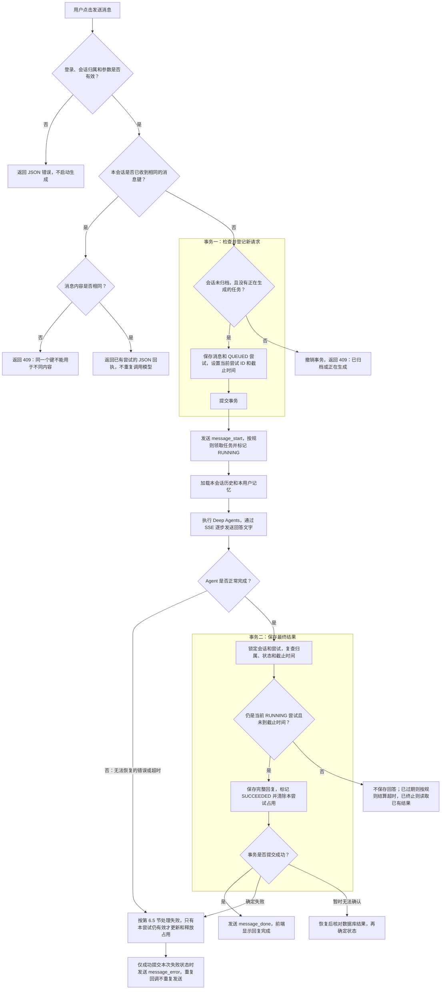

# AI 聊天 Demo API 设计

**日期：** 2026-09-20

**状态：** 第一版接口草案，尚未实现

**API 前缀：** `/api/v1`


## 1. 范围与阅读说明

本文定义 React 前端调用 FastAPI 后端的 11 个接口，覆盖账号、会话、流式聊天和 Profile Memory。

- 所有 AI 对话实际经过 Deep Agents 执行。
- 本次不预置课程、Lab、题目或 Enrollment。会话和记忆直接按 `user_id` 归属。
- 用户只能访问自己的数据。用户身份由后端从登录状态解析，不接受前端指定数据所属用户。
- 第一版即支持流式回复。Profile Memory 只提供查看，更新由 Agent 的后端内部能力完成。
- 本文不覆盖完整 Coding Lab 的评分、沙箱、RAG、文件上传等接口。

`GET` 表示读取，`POST` 表示提交数据或执行操作，`PATCH` 表示局部修改。`{session_id}`、`{message_id}` 是路径参数，调用时替换为实际 ID。

`v1` 表示接口契约版本。内部优化不要求升级版本；删除字段、改变参数含义或不兼容地修改 SSE 事件等变化，需要考虑新版本。

## 2. 公共约定

### 2.1 登录方式：已确认

本 Demo 已确认采用**同站点部署 + 服务端 Session + Cookie**。页面位于 `/`，接口位于 `/api/v1`；设计已确认，不代表已经实现。内部设计见[实现设计文档](2026-09-20-ai-chat-demo-implementation-design-zh.md)。

- 登录成功后，后端设置名为 `chat_session` 的登录 Cookie；它与业务上的聊天会话不是同一概念。
- Cookie 使用 `HttpOnly`、`SameSite=Lax`、`Path=/`；HTTPS 部署时设置 `Secure`。本地 HTTP 开发单独配置。
- Cookie 中使用不可预测的登录凭据，服务端维护有效期和撤销状态；不在其中直接信任用户提交的身份。
- 登录凭据的哈希、所属用户、到期时间和撤销状态持久化到 MySQL。登录后固定 7 天有效，第一版不自动续期；后端重启不清除有效登录。退出只撤销当前登录凭据，不影响其他设备。
- 浏览器后续请求携带 Cookie。退出登录时服务端撤销凭据，同时清除 Cookie。
- 浏览器的写请求校验受信任的 `Origin`；缺少或不匹配时拒绝。JSON 写请求要求 `application/json`，不把 SameSite 当成唯一的跨站请求防护。
- 若改为跨站部署或 Bearer Token，应统一调整认证、跨域和退出策略，而不是混用两种未定义的方式。

### 2.2 数据格式

- 普通请求、响应使用 JSON；首次接受的消息生成和重试请求使用 SSE 响应。
- 所有 ID 在 API 中表示为字符串，避免 JavaScript 对大型整数的精度问题；这不改变 MySQL 数字主键的设计。
- 时间使用 UTC ISO 8601，例如 `2026-09-20T08:30:00Z`。
- 普通成功响应直接返回资源对象；分页响应使用 `items` 和游标字段。
- 客户端不能提交 `user_id`、角色、模型凭据或完整历史来替代后端的身份与上下文加载。
- 长度和分页上限是本草案建议值，实现时需前后端一致。

### 2.3 统一错误格式

```json
{
  "error": {
    "code": "SESSION_NOT_FOUND",
    "message": "会话不存在或不可访问",
    "request_id": "req_example"
  }
}
```

| HTTP 状态码 | 用途与典型错误码 |
|---|---|
| `400` | 参数组合错误或分页游标无效，例如 `INVALID_CURSOR` |
| `401` | 未登录、登录过期、账号不可用或凭据错误 |
| `403` | 写请求来源校验失败，例如 `ORIGIN_NOT_ALLOWED` |
| `404` | 资源不存在或不属于当前用户，不区分两种情况 |
| `409` | 邮箱重复、会话忙碌、已归档、幂等冲突、不能重试 |
| `422` | 字段缺失、长度超限、空消息、非法状态或不允许的字段 |
| `429` | 请求过于频繁 |
| `503` | 在流开始前发现生成服务不可用 |
| `500` | 未预期的服务端错误，返回过滤后的描述 |

SSE 开始后不能再将该响应改成另一个 HTTP 状态码，应发送 `message_error` 事件。数据库不可用或连接断开导致事件无法送达时，客户端通过历史接口恢复状态。

### 2.4 权限和并发

- 除注册和登录外，业务接口要求有效登录；退出接口对已退出状态幂等返回成功。
- 查询指定会话前检查所属用户；重试还要检查消息是否属于该会话。
- 同一会话只允许一个 `QUEUED` 或 `RUNNING` 的生成任务。后端通过原子操作保证，不能只依赖前端禁用按钮。
- 后端用 `active_attempt_id` 记录会话当前允许执行和写入的尝试。成功、失败和超时都必须按第 6.5 节检查并更新它，旧任务不能清除新任务的占用。
- 已归档会话可以由本人读取历史，但不能发送新消息、重试或修改标题。本次不提供恢复归档功能。
- 会话生成期间禁止归档，返回 `409 SESSION_BUSY`；允许修改标题。

### 2.5 限流与容量：已确认的初始配置

| 项目 | 初始限制 |
|---|---|
| 登录 | 同一 IP、同一规范化邮箱分别每分钟最多 10 次请求 |
| 注册 | 同一 IP 每小时最多 10 次请求 |
| 新生成任务（含有意重试） | 每个用户每分钟最多接受 10 次 |
| 每个用户的活动任务 | 跨会话合计最多 2 个 QUEUED 或 RUNNING 任务 |
| 服务执行容量 | 单进程内最多同时执行 4 个任务，等待队列最多 20 个任务 |

请求频率或用户并发超限返回 `429`；服务等待队列满返回 `503`。原有同一会话占用冲突仍返回 `409 SESSION_BUSY`。已登记请求的幂等重发按第 8 节返回原回执，不再次占用生成配额；服务满载也不能阻止查询已有回执。

容量和配额在接受新请求前检查，不能留下被拒绝请求的 USER 消息、尝试或幂等键。单进程内的并发准入需要串行协调，不能多个请求同时通过检查后突破上限；数据库仍负责会话占用和幂等约束。

Demo 的限流计数保存在进程内存中，重启后重置；活动任务从数据库恢复，不能随限流计数一起清零。账号、登录凭据、消息、生成状态和记忆始终持久化。以上限制可通过后端配置调整。

## 3. 11 个接口总览

| 编号 | 方法 | 路径 | 功能 | 成功响应 |
|---|---|---|---|---|
| 1 | POST | `/api/v1/auth/register` | 注册账号 | `201` JSON |
| 2 | POST | `/api/v1/auth/login` | 登录 | `200` JSON + Cookie |
| 3 | POST | `/api/v1/auth/logout` | 退出当前登录 | `204`，无正文 |
| 4 | GET | `/api/v1/users/me` | 当前用户信息 | `200` JSON |
| 5 | POST | `/api/v1/chat/sessions` | 新建会话 | `201` JSON |
| 6 | GET | `/api/v1/chat/sessions` | 本人会话列表 | `200` JSON |
| 7 | PATCH | `/api/v1/chat/sessions/{session_id}` | 重命名、归档 | `200` JSON |
| 8 | GET | `/api/v1/chat/sessions/{session_id}/messages` | 分页读取消息、每条问题的生成状态及会话最新生成状态 | `200` JSON |
| 9 | POST | `/api/v1/chat/sessions/{session_id}/messages` | 发送新消息并流式回复 | `200` SSE；重复请求为 JSON 回执 |
| 10 | POST | `/api/v1/chat/sessions/{session_id}/messages/{message_id}/retry` | 重试失败回复 | `200` SSE；重复请求为 JSON 回执 |
| 11 | GET | `/api/v1/me/memory` | 查看本人记忆摘要 | `200` JSON |

## 4. 账号接口

### 4.1 注册账号

**`POST /api/v1/auth/register`**，不要求登录。

请求字段：

| 字段 | 类型 | 必填 | 约束 |
|---|---|---|---|
| `email` | string | 是 | 合法邮箱，最长 320 字符；后端去除首尾空格并统一大小写 |
| `password` | string | 是 | 建议 8～128 字符；不自动裁剪或改变大小写 |
| `display_name` | string | 是 | 去除首尾空格后 1～100 字符 |

```json
{
  "email": "student@example.com",
  "password": "example-password-only",
  "display_name": "小明"
}
```

成功返回 `201 Created`：

```json
{
  "user_id": "123",
  "email": "student@example.com",
  "display_name": "小明",
  "created_at": "2026-09-20T08:00:00Z"
}
```

注册成功不自动登录，前端引导用户登录。密码在后端进行专用密码哈希处理；不返回或记录密码及其哈希。公开注册不能设置管理员角色。

主要错误：`409 EMAIL_ALREADY_REGISTERED`、`422 VALIDATION_ERROR`。

### 4.2 登录

**`POST /api/v1/auth/login`**，不要求已有登录。

```json
{
  "email": "student@example.com",
  "password": "example-password-only"
}
```

邮箱采用与注册一致的规范化方式。成功返回 `200 OK`，设置登录 Cookie，并返回：

```json
{
  "user": {
    "user_id": "123",
    "email": "student@example.com",
    "display_name": "小明"
  }
}
```

后端验证密码与账号状态，成功后创建或轮换当前登录凭据。不存在的账号、错误密码或不可登录账号统一返回 `401 INVALID_CREDENTIALS`，不提供密码或内部原因。

### 4.3 退出登录

**`POST /api/v1/auth/logout`**，无请求体。

服务端撤销当前登录凭据并清除 Cookie，返回 `204 No Content`。凭据不存在或已失效时也返回 `204`。不删除会话、消息和记忆，不自动退出其他设备。

### 4.4 当前用户

**`GET /api/v1/users/me`**，要求登录，无请求体。

成功返回 `200 OK`：

```json
{
  "user_id": "123",
  "email": "student@example.com",
  "display_name": "小明"
}
```

前端打开或刷新网站时调用。未登录返回 `401 UNAUTHENTICATED`，不返回密码哈希或内部凭据。

## 5. 会话接口

### 5.1 新建会话

**`POST /api/v1/chat/sessions`**，要求登录，请求体为 `{}`。

成功返回 `201 Created`：

```json
{
  "session_id": "1001",
  "title": "新对话",
  "status": "ACTIVE",
  "created_at": "2026-09-20T08:10:00Z",
  "updated_at": "2026-09-20T08:10:00Z",
  "last_activity_at": "2026-09-20T08:10:00Z"
}
```

后端绑定当前 `user_id`，不需要 Enrollment 或题目。每次成功调用创建一个新会话；前端防止按钮连击，网络结果不明时先刷新列表，不盲目重发。

标题初始为“新对话”。收到首条用户消息时，将消息首尾空白移除、换行转为空格，截取前 30 个字符作为默认标题；不调用模型。若用户已经手动改名，不覆盖其标题，后端需记录是否手动命名。

### 5.2 查询会话列表

**`GET /api/v1/chat/sessions`**，要求登录。

| 查询参数 | 类型 | 必填 | 含义 |
|---|---|---|---|
| `limit` | integer | 否 | 本次最多返回多少个会话。不填写时最多返回 20 个，可填写 1～100 |
| `cursor` | string | 否 | 请求下一批会话时，将上次响应中的 `next_cursor` 值填在这里；第一次请求不填写 |

```http
GET /api/v1/chat/sessions?limit=20
```

成功返回 `200 OK`：

```json
{
  "items": [
    {
      "session_id": "1001",
      "title": "Python 的列表是什么",
      "status": "ACTIVE",
      "created_at": "2026-09-20T08:10:00Z",
      "updated_at": "2026-09-20T08:30:00Z",
      "last_activity_at": "2026-09-20T08:30:00Z"
    }
  ],
  "next_cursor": null,
  "has_more": false
}
```

**分页怎么用：把 `cursor` 理解成后端给的“分页书签”。**

假设当前有 5 个会话，顺序为 A、B、C、D、E，每次最多读取 2 个：

| 步骤 | 前端发送的请求 | 后端返回的会话 | 后端同时返回的分页信息 |
|---|---|---|---|
| 第一次加载 | `GET /api/v1/chat/sessions?limit=2` | A、B | `next_cursor="bookmark_1"`，`has_more=true` |
| 用户继续向下滚动 | `GET /api/v1/chat/sessions?limit=2&cursor=bookmark_1` | C、D | `next_cursor="bookmark_2"`，`has_more=true` |
| 用户再次向下滚动 | `GET /api/v1/chat/sessions?limit=2&cursor=bookmark_2` | E | `next_cursor=null`，`has_more=false` |

表中的 A～E 代表会话对象，`bookmark_1`、`bookmark_2` 是便于理解的示例值；实际书签由后端生成。

前端只做一个简单动作：**拿到响应里的 `next_cursor`，在下次请求中把这个值作为 `cursor` 发回去。** 前端不需要拆开这串文字，也不需要自己计算下次从哪个会话开始。后端收到书签后，会根据其中记录的排序位置继续查询。

`next_cursor` 是后端回答“下次用这个书签”；`cursor` 是前端请求“请按这个书签继续”。名称不同，但传递的是同一个值。实际拼接 URL 时使用查询参数编码，保证后端收到的值与返回时一致。

`has_more=false` 表示没有下一批了，此时前端停止加载，也不再传 `cursor=null` 发起请求。`cursor` 和 `limit` 是本 API 约定的参数名，不是编程语句，也不是用户需要手动填写的内容。

仅返回本人的 `ACTIVE` 会话，按 `last_activity_at DESC, session_id DESC` 排序。接受新消息、接受重试或成功保存最终回复时更新活动时间；失败结算、仅查看或改名不提升活动排序。

侧栏是动态列表，不承诺跨分页的冻结快照。生成和新消息可能让会话移到首屏；前端按 ID 去重，在活动结束后刷新首屏。无数据时 `items=[]`。无效游标返回 `400 INVALID_CURSOR`。

### 5.3 修改会话：重命名、归档

**`PATCH /api/v1/chat/sessions/{session_id}`**，要求登录并拥有该会话。

| 请求字段 | 类型 | 必填 | 含义 |
|---|---|---|---|
| `title` | string | 否 | 去除首尾空格后 1～100 字符 |
| `status` | string | 否 | 此接口仅接受 `ARCHIVED`，不提供恢复 |

至少提交一个字段，不能提交 `null` 或 `user_id` 等其他字段。未提交的字段保持不变。两个字段同时提交时必须原子完成，不能部分成功。

重命名：

```json
{
  "title": "Python 基础学习"
}
```

归档：

```json
{
  "status": "ARCHIVED"
}
```

成功返回 `200 OK` 和更新后的会话对象，字段与新建会话响应一致。归档保留历史；重复仅提交 `status=ARCHIVED` 返回当前对象。归档后的标题修改返回 `409 SESSION_ARCHIVED`。

其他错误：`404 SESSION_NOT_FOUND`、`409 SESSION_BUSY`、`422 VALIDATION_ERROR`。

## 6. 消息与生成状态

### 6.1 聊天消息和生成尝试分开理解

**这里的“成功／失败”描述的是本轮 AI 回复有没有正常生成并保存，不表示答案是否正确，也不是代码测试或作业评分结果。**

例如用户发送“请解释 Python 列表”，后端接受并保存这条消息，再安排 Deep Agents 处理。从等待执行，到调用模型、生成回答，再到保存完整回复，这一次处理称为一次“生成尝试”。

| 状态 | 中文含义 | 具体判断 |
|---|---|---|
| `QUEUED` | 等待处理 | 后端已接受消息并登记生成尝试，尚未开始执行 |
| `RUNNING` | 正在处理 | Deep Agents 正在执行，包括调用模型、使用工具、生成回答及等待最终保存 |
| `SUCCEEDED` | 已完成 | Deep Agents 正常完成本轮回答，且后端已将完整回复和成功状态一起提交到数据库 |
| `FAILED` | 未能完成 | 本轮执行因无法恢复的错误或超时终止，或最终回复确定未能保存 |

成功的例子：

```text
用户发送“请解释 Python 列表”
→ 后端接受消息，登记尝试：QUEUED
→ Deep Agents 开始处理，页面逐步显示文字：RUNNING
→ Agent 正常完成回答，后端保存完整回复并提交成功状态：SUCCEEDED
```

失败并重试的例子：

```text
用户发送“请解释 Python 列表”
→ 第一次尝试开始生成，页面显示“Python 列表是一种……”
→ 模型服务报错，后端无法完成本轮回答：FAILED
→ 页面提示“生成失败，请重试”
→ 用户点击重试，针对原问题创建第二次尝试，使用新的 attempt_id
→ 第二次正常完成并保存完整回复：SUCCEEDED
```

常见失败原因包括模型服务不可用、后端与模型的连接中断且无法恢复、Agent 执行超时，以及最终回复保存失败。可恢复的工具错误不自动代表整轮失败；如果 Agent 仍能正常完成并保存回答，本轮可以成功。

需要特别区分：

- **回答内容有误或解释不好**：只要执行正常完成且回复已保存，技术状态仍是 `SUCCEEDED`；答案质量需要另外评价。
- **浏览器断网或关闭页面**：不能直接判定 `FAILED`，后端可能仍在生成或已经保存成功。重新连接后通过历史接口确认状态。
- **个人记忆更新失败**：不撤销已正常完成并保存的聊天回复；记忆页面只展示实际保存成功的内容。
- **数据库暂时不可用**：不能保证立刻写下失败状态。后端恢复后需核对持久化结果并处理遗留尝试；提交结果不明时，不能未经核对就宣告失败或启动重试。

消息记录与生成尝试的关系如下：

- 一次发送产生一条 `USER` 消息。
- 一次成功回复产生一条关联该用户消息的最终 `ASSISTANT` 消息。
- 一次生成尝试使用独立的 `attempt_id`，状态为 `QUEUED / RUNNING / SUCCEEDED / FAILED`。
- 同一用户消息失败后可有多次尝试，但最多保存一条成功的最终 Assistant 回复。
- 最终聊天正文不被重试覆盖。尝试状态属于执行记录，不等同于聊天消息。
- `SUCCEEDED` 和 `FAILED` 是不可回退的最终状态。同一次尝试不能从失败改为成功；用户重试必须创建新的 `attempt_id`。

本草案选择：失败时不把不完整回答保存成最终 Assistant 消息。前端可以临时展示已收到的部分文字并标注失败，刷新后不保证保留这段部分文字；重试时替换该临时气泡。最终回复和生成状态必须持久化，不能仅保存在进程内存中。

这需要 Demo 实现补充生成尝试、幂等键和状态的存储，具体表结构另行设计，不声称原数据库文档已经覆盖这些字段。

### 6.2 查询历史消息

**`GET /api/v1/chat/sessions/{session_id}/messages`**，要求登录并拥有会话。

| 查询参数 | 类型 | 必填 | 含义 |
|---|---|---|---|
| `limit` | integer | 否 | 默认 50，范围 1～100 |
| `before` | string | 否 | 加载更早的消息时，将上次响应中的 `next_before` 值填在这里；第一次请求不填写，读取最新一页 |

```http
GET /api/v1/chat/sessions/1001/messages?limit=50
```

成功返回 `200 OK`：

```json
{
  "session_id": "1001",
  "items": [
    {
      "message_id": "2000",
      "role": "USER",
      "content": "请解释一下元组。",
      "in_reply_to_message_id": null,
      "created_at": "2026-09-20T08:20:00Z",
      "generation": {
        "attempt_id": "attempt_example_0",
        "user_message_id": "2000",
        "status": "FAILED",
        "assistant_message_id": null,
        "error": {
          "code": "GENERATION_TIMEOUT",
          "message": "回复生成超时。"
        },
        "can_retry": false
      }
    },
    {
      "message_id": "2001",
      "role": "USER",
      "content": "请解释 Python 列表。",
      "in_reply_to_message_id": null,
      "created_at": "2026-09-20T08:30:00Z",
      "generation": {
        "attempt_id": "attempt_example_1",
        "user_message_id": "2001",
        "status": "SUCCEEDED",
        "assistant_message_id": "2002",
        "error": null,
        "can_retry": false
      }
    },
    {
      "message_id": "2002",
      "role": "ASSISTANT",
      "content": "Python 列表可以保存多个元素。",
      "in_reply_to_message_id": "2001",
      "created_at": "2026-09-20T08:30:03Z"
    }
  ],
  "next_before": null,
  "has_more": false,
  "latest_generation": {
    "attempt_id": "attempt_example_1",
    "user_message_id": "2001",
    "status": "SUCCEEDED",
    "assistant_message_id": "2002",
    "error": null,
    "can_retry": false
  }
}
```

查询先选最近的一批消息，再按 `created_at ASC, message_id ASC` 返回这一页，方便前端按时间展示；`next_before` 指向更早的消息。游标包含时间和 ID，不能只按时间分页。

**每条问题的状态与整个会话的状态分别返回：**

| 字段 | 属于谁 | 用途 |
|---|---|---|
| `items[].generation` | 该条 USER 消息 | 表示“这条问题最近一次回答尝试怎么样了”，用于还原成功、等待或失败提示 |
| 顶层 `latest_generation` | 整个会话 | 表示“这个会话最近一次生成尝试怎么样了”，用于判断是否仍在生成及断线后恢复 |

示例中，问题 `2000` 曾经生成超时，用户随后发送了问题 `2001` 并得到成功回复。刷新后，前端仍能根据 `2000.generation` 显示原问题的超时提示，不会因为整个会话的最新状态已经成功而丢失它的失败信息。旧问题已经不是最后一条 USER 消息，所以 `can_retry=false`，不再显示可点击的重试按钮。

两个位置的生成摘要采用相同字段约定：

| 字段 | 类型 | 含义 |
|---|---|---|
| `attempt_id` | string | 该摘要对应的生成尝试 ID |
| `user_message_id` | string | 本次尝试回答的 USER 消息 ID；嵌套摘要中必须等于外层 `message_id` |
| `status` | string | `QUEUED / RUNNING / SUCCEEDED / FAILED` |
| `assistant_message_id` | string 或 null | SUCCEEDED 时为已保存的最终回复 ID，其他状态为 null；对应回复可能在另一分页中 |
| `error` | object 或 null | FAILED 时为过滤后的简短 `code`、`message`，其他状态为 null；不返回内部异常堆栈 |
| `can_retry` | boolean | 查询时是否满足第 6.4 节的重试条件，不单由 FAILED 状态决定 |

规则：

1. 每条 USER 消息必须返回非空 `generation`。消息与首次尝试在同一事务中创建，因此正常数据不会出现“已有用户消息但没有尝试”的情况。ASSISTANT 消息不返回此字段，通过 `in_reply_to_message_id` 关联问题。
2. `generation` 取该 USER 消息最近创建的尝试。重试时它会指向新尝试，例如由旧尝试的 FAILED 变为新尝试的 QUEUED；这不表示旧尝试本身从失败回退到等待。
3. `latest_generation` 取整个会话最近创建的尝试，不受当前历史页限制；会话没有任何尝试时为 null。两个摘要都以尝试创建顺序判断“最近”，不按完成时间选择，避免迟到结果改变选择。
4. `latest_generation.status` 为 QUEUED 或 RUNNING 时，前端保持该会话的发送入口禁用。旧消息的 FAILED 只用于展示该条问题的结果，不能被误认为当前会话仍忙碌。
5. `can_retry=true` 要求会话为 ACTIVE、没有活动生成任务、本条消息是整个会话最新的 USER 消息，且本条消息最新尝试为 FAILED。判断范围是整个会话，不是当前分页。实际点击重试时后端仍需重新检查，不能相信前一次查询结果。
6. 分页消息及其摘要、会话级摘要和重试资格应从同一数据库读取快照组装；同一 `attempt_id` 在一次响应中不能出现矛盾状态。后端批量读取本页消息的最新尝试，避免为每条消息单独查询。
7. 只返回最近一次尝试的摘要，不额外暴露完整尝试历史。重试成功后本条消息显示成功；此前的失败尝试保留在内部执行记录中。

该接口既用于切换会话、分页，也用于断线后查询最终结果。不会触发模型调用，不返回内部工具消息、系统提示词或私有执行数据。

### 6.3 发送新消息并流式回复

**`POST /api/v1/chat/sessions/{session_id}/messages`**，要求登录并拥有 ACTIVE 会话。

| 请求字段 | 类型 | 必填 | 含义 |
|---|---|---|---|
| `client_message_key` | string | 是 | 客户端生成的 UUID；同一次发送的网络重发复用它 |
| `content` | string | 是 | 最长 20,000 字符，不允许纯空白；保留有效消息原始换行和缩进 |

```json
{
  "client_message_key": "550e8400-e29b-41d4-a716-446655440000",
  "content": "我是 Python 初学者，请解释一下列表。"
}
```

首次接受请求后返回 `200 OK`、`Content-Type: text/event-stream`，事件格式见第 7 节。

后端执行顺序：

1. 验证登录、会话归属和参数。
2. 查找 `session_id + client_message_key`。已经存在时按第 8 节返回，不重复调用模型。
3. 对新请求原子检查会话为 ACTIVE 且无活动生成任务；创建 USER 消息和 QUEUED 尝试，设置 `deadline_at` 和会话的 `active_attempt_id`，必要时初始化标题。
4. 提交事务后，Worker 按第 6.5 节领取尝试并标记 RUNNING，加载本会话历史和本用户记忆；不在数据库事务中等待模型。
5. 通过 Deep Agents 执行，筛选用户可见回答并发送 SSE。
6. 完成时按第 6.5 节锁定并复查尝试归属、状态和截止时间。仍有效时，在同一事务中保存最终回复、标记 `SUCCEEDED` 并释放本尝试的占用，再发送完成事件；失败和超时也通过受保护的事务处理，失效尝试的迟到结果丢弃。

下面按“用户点击发送”之后的处理过程展示分支。图中的事务表示一组数据库操作一起成功或一起撤销；模型生成在事务提交后才开始。



图中的消息键是 `client_message_key`。重复检查还必须由唯一约束和事务保证，避免两个同时到达的请求都创建成功。历史或记忆加载等执行准备步骤出现无法恢复的错误时，也进入失败分支。

浏览器断线不等于图中的生成失败；后端继续处理，前端重新连接后查询历史接口。数据库不可用时可能无法立即记录失败，按第 6.1 节的恢复规则处理；只有确认最终回复已提交后才能发送 `message_done`。

空消息返回 `422 EMPTY_MESSAGE`；会话正在生成返回 `409 SESSION_BUSY`；归档会话返回 `409 SESSION_ARCHIVED`。被拒绝的新请求不能留下用户消息或占用新的幂等键。

请求体不接受 `model`、工具清单、模型密钥或其他用户的上下文。模型配置和用户记忆范围由后端决定。

### 6.4 重试失败回复

**`POST /api/v1/chat/sessions/{session_id}/messages/{message_id}/retry`**。

`message_id` 必须是该会话内触发失败回复的 USER 消息 ID，而不是 Assistant 消息 ID。

```json
{
  "retry_key": "9c180df1-06fa-4b09-a262-594351fbf8d8"
}
```

`retry_key` 为必填 UUID。一次有意点击重试生成新键；该次请求网络重发仍复用同一键。

首次接受返回 `200` SSE；复用已处理键返回 JSON 回执，见第 8 节。

本版限制：

- 会话必须为 ACTIVE，且没有活动生成任务。
- 只能重试会话中最新一条 USER 消息，且它的最新生成尝试为 `FAILED`。
- 已成功的消息不能重试，不支持重新生成多个成功回答版本。
- 原失败消息后若已经发送了新消息，就不能再重试旧消息，避免改变对话顺序。
- 不再次插入 USER 消息、不修改原文；创建新的 `attempt_id`，按相同问题重新生成。
- 接受重试时，在同一事务中确认没有当前任务、登记新尝试及截止时间，并将 `active_attempt_id` 设置为新 ID。不能复活旧尝试或复用旧 ID。
- 重试上下文不包含失败尝试的临时回答，不重复附加原 USER 消息；可以使用当前有效的个人记忆。

错误：`404 MESSAGE_NOT_FOUND`、`409 RETRY_NOT_ALLOWED`、`409 SESSION_BUSY`、`409 SESSION_ARCHIVED`。

### 6.5 超时与迟到结果：只有当前有效尝试可以提交

**本版采用“当前尝试 ID + 数据库事务内复查”的方案。取消模型请求只能尽力执行，不能靠取消是否成功来保证数据正确。**

可以把 `active_attempt_id` 理解成会话当前发出的工作许可：只有编号匹配、状态仍有效的任务可以继续写入。超时成功落库后，旧许可失效；即使旧模型请求稍后返回，也不能重新取得许可。

#### 6.5.1 需要保存的内部信息

| 信息 | 含义 |
|---|---|
| 会话的 `active_attempt_id` | 当前占用会话的尝试 ID；没有活动任务时为 `null` |
| 尝试的 `attempt_id`、`session_id`、`user_message_id` | 确定这次工作属于哪个会话和问题 |
| 尝试的 `status` | `QUEUED / RUNNING / SUCCEEDED / FAILED` |
| 尝试的 `deadline_at` | 本次工作的截止时间，由后端设置，客户端不能指定或延长 |
| 尝试的 `finished_at`、结果关联或错误信息 | 保存最终结果，供重复请求和恢复流程查询 |

本版截止时间从接受请求、创建尝试时起算，包含排队、Agent 执行和最终保存前的等待；达到截止时间的条件是 `数据库当前时间 >= deadline_at`。总预算默认 180 秒，由后端配置；每秒扫描超时任务，保存时仍须锁内复查。前端断线、网络重发和重复投递不重置预算。成功资格以取得数据库锁后的检查时刻为准，不以模型声称的完成时间为准。

这些是内部存储要求，不增加公开接口，也不要求前端提交 `active_attempt_id` 或 `deadline_at`。

#### 6.5.2 开始工作时只允许领取一次

Worker 在短事务中按固定顺序锁定“会话记录 → 尝试记录”，同时检查：

```text
会话的 active_attempt_id == 本次 attempt_id
并且尝试状态 == QUEUED
并且数据库当前时间 < deadline_at
```

满足时才把状态改为 RUNNING，提交后执行 Agent。重复投递发现已经 RUNNING 或已经结束时，不再启动第二个执行者。未开始就过期的 QUEUED 尝试也需要结算超时，不能无限等待。

#### 6.5.3 成功和超时通过同一套事务规则竞争

正常完成、普通失败、超时检查都使用相同的锁顺序，并在持锁期间重新读取数据库中的状态；不能在事务外检查一次后直接写结果。

**提交成功结果：**

1. 锁定会话和尝试，确认 `active_attempt_id` 匹配、状态仍是 RUNNING，且尚未到截止时间。
2. 在同一事务内插入最终 ASSISTANT 回复、将尝试设为 SUCCEEDED、记录完成时间，并清除仍指向本尝试的 `active_attempt_id`。
3. 提交成功后才发送 `message_done`。保留“同一 USER 消息最多一条成功回复”的数据库唯一约束作为额外保护。
4. 如果锁定后发现已到截止时间，则不保存回答，改为在该事务内结算超时。如果尝试已经结束或不再是当前尝试，则不修改业务数据，读取已有结果并结束本次回调。

**结算超时：**

1. 锁定会话和尝试，确认 `active_attempt_id` 匹配、状态仍为 QUEUED 或 RUNNING，且已到截止时间。
2. 在同一事务内设为 FAILED、记录 `GENERATION_TIMEOUT` 和完成时间，并清除仍指向本尝试的 `active_attempt_id`。
3. 提交成功后发布一次 `message_error` 终止事件，并尽力取消该尝试的模型请求和执行任务；取消失败不恢复其写入权限。
4. 如果已经是最终状态，或当前尝试 ID 不匹配，只读取已有结果，不重复改状态、清除占用或发送终止事件。

普通执行错误也使用受保护的失败事务；若处理错误时已经过期，按超时结算。**不能在任意任务的清理代码中无条件设置 `active_attempt_id=null`**，否则旧任务的清理可能释放新任务的占用。

成功提交和超时提交最多有一个生效：成功事务先取得锁并在截止前通过检查、提交成功后，超时处理看到 SUCCEEDED 就退出；超时事务先提交后，完成回调看到 FAILED 就丢弃回答。若成功处理取得锁时已经过期，即使超时检查任务尚未运行，也不能保存为成功。

重复完成回调只返回已有结果，不重复插入回复或发布终止事件。事务提交结果不明时，保持“正在确认结果”，重新读取数据库后再决定，不擅自当作失败或启动新生成。

#### 6.5.4 迟到内容不能影响新尝试

```text
会话当前任务 = attempt_A
→ A 超时：事务提交 FAILED，并清除当前任务
→ 用户点击重试：创建 attempt_B，会话当前任务 = attempt_B
→ A 的回答迟到：检查发现 A 已失败，且当前任务是 B
→ 丢弃 A 的回答，不插入消息，不修改 B，不清除 B 的占用
→ B 正常完成：保存 B 的回答，标记成功并释放 B 的占用
```

- 后端流转发器按 `attempt_id` 管理事件顺序。终止事件发布后关闭该尝试的输出通道，丢弃后续片段；迟到的旧回调不能直接绕过转发器写入浏览器响应。
- 前端只向匹配该 `attempt_id` 且尚未终止的临时气泡追加文字。重试开始后，旧尝试的延迟事件不能覆盖新气泡；已收到终止事件的尝试不能继续追加。
- 终止前已经发送、仍在网络途中的文字可能到达浏览器；它不代表允许旧任务保存结果。前端以尝试 ID、终止状态及数据库查询结果为准。
- Agent 的持久化写入也要携带本次尝试身份。记忆写入适配层必须在受保护事务中复查本尝试仍有效且未过期，失效后拒绝写入。失效前已经成功提交的记忆不因回复超时自动回滚。
- Agent 临时执行状态按 `attempt_id` 隔离，重试使用新的执行空间，不能覆盖新任务上下文。第一版不持久化中途执行 checkpoint，也不恢复到模型生成一半的位置；每次执行从 MySQL 重建上下文，具体见第 6.6 节。这不改变用户看到的聊天会话 ID。

这里限制的是失效任务的写入资格；不同有效会话同时更新同一用户记忆时，还必须遵守第 9.2 节的版本检查、合并和证据去重规则。

#### 6.5.5 进程重启与验收

本 Demo 对已经 RUNNING 但经执行器确认失去执行者的任务，采用“受保护地标记 FAILED，再由用户重试”，不把同一个 `attempt_id` 重新分配给另一个执行者。错误码为 `GENERATION_INTERRUPTED`；已过截止时间则使用 `GENERATION_TIMEOUT`。QUEUED 且未过期的任务可以由 Worker 正常领取。

第一版采用一个 FastAPI 服务进程、服务内任务执行器和 MySQL 持久化任务记录，不引入 Redis、Celery 或多实例。浏览器断线不取消已接受任务。部署必须保证旧进程完全退出后再启动新进程；启动恢复完成后才接受新生成请求，按数据库状态重建占用和队列。

本版的 4 个并发执行槽位不等于 4 个服务进程。未来使用多进程或多实例时，必须另外设计执行者存活判定、共享限流与容量协调、跨进程事件分发；不能把本版启动恢复逻辑直接用于滚动更新，也不能因一个新进程启动就把其他进程的任务判为失败。

实现时至少验证以下情形：

| 情形 | 预期结果 |
|---|---|
| A 超时后 B 开始，A 才返回 | A 不写回复、不清除 B 的占用、不修改 B 的状态或上下文 |
| 完成与超时同时处理 | 只产生一个最终状态和一次有效终止通知，结果符合锁内截止时间检查 |
| 模型已返回，但等待数据库锁后才发现过期 | 不保存成功回答，结算超时 |
| 同一任务被重复领取或重复回调 | 不重复调用模型、不重复保存最终回复 |
| 旧任务的清理代码或流片段迟到 | 不释放新任务占用、不覆盖新气泡 |
| 终止后 Agent 尝试更新记忆 | 写入被拒绝，已提交记忆不自动撤销 |
| 提交已成功但确认响应丢失 | 核对数据库后返回原结果，不再生成或覆盖 |
| QUEUED 超时或执行进程退出 | 最终能够释放对应尝试的占用，终止后的旧执行者无法写回 |

### 6.6 多轮上下文与持久化边界

- MySQL 的消息和记忆是持久化事实；每次执行加载本会话最近最多 20 轮成功问答、当前用户记忆，并追加当前问题一次。一轮是同一问题及其成功的最终回答。
- 还需遵守所选模型的输入预算：为系统提示、记忆、工具定义及输出预留空间，必要时从最早的完整问答轮开始移除。当前问题不偷偷截断；若其本身已无法容纳，在接受新生成任务前返回 `422 CONTEXT_TOO_LARGE`，不保存新消息或尝试。
- 旧失败问题及其不完整回答不作为成功问答轮带入；重试时目标 USER 消息作为当前问题且只加入一次。不能先加载完整历史，再通过 checkpoint 重复追加相同历史。
- 20 轮是模型上下文上限，不是数据库保留或页面分页上限；全部已保存消息仍可分页查看。
- 每次生成的工具过程、临时文件和执行状态按 `attempt_id` 隔离，第一版不承诺服务重启后恢复中途执行。
- 模型及其分词与容量配置在接入时确定；如果配置无法容纳接口允许的某条输入，应明确拒绝，不能静默裁剪。

## 7. SSE 流式事件协议

SSE 是 Server-Sent Events。这里由消息 POST 或重试 POST 的响应承载，不另建 GET 订阅接口。前端使用支持读取响应流的请求方式，例如 `fetch`，不直接用只发 GET 的原生 `EventSource` 调用这两个 POST 接口。

流响应使用 `Content-Type: text/event-stream` 和 `Cache-Control: no-cache`，部署时关闭该路径的代理缓冲。前端必须按 SSE 的空行分隔解析事件，不能把每个网络数据块当成一个完整事件。

| 事件名 | 含义 | 主要数据 |
|---|---|---|
| `message_start` | 消息和生成尝试已登记 | `session_id`、`user_message_id`、`attempt_id` |
| `message_delta` | 新增回答片段 | `attempt_id`、`text` |
| `message_done` | 最终回复已经保存 | `attempt_id`、完整 `assistant_message` |
| `message_error` | 本次生成失败 | `attempt_id`、`error` |

示例：

```text
event: message_start
data: {"session_id":"1001","user_message_id":"2001","attempt_id":"attempt_example_1"}

event: message_delta
data: {"attempt_id":"attempt_example_1","text":"Python 列表可以"}

event: message_delta
data: {"attempt_id":"attempt_example_1","text":"保存多个元素。"}

event: message_done
data: {"attempt_id":"attempt_example_1","assistant_message":{"message_id":"2002","role":"ASSISTANT","content":"Python 列表可以保存多个元素。","in_reply_to_message_id":"2001","created_at":"2026-09-20T08:30:03Z"}}

```

失败事件示例：

```text
event: message_error
data: {"attempt_id":"attempt_example_1","error":{"code":"MODEL_REQUEST_FAILED","message":"Failed to generate a response. Please try again later.","request_id":"req_example"}}

```

规则：

1. 正常顺序是一个 `message_start`、零个或多个 `message_delta`、一个终止事件。终止事件为 `message_done` 或 `message_error`，不能两者都发送。
2. 前端按 `attempt_id` 拼接 `text`，完成时以完整 `assistant_message` 为准，避免漏片段。已终止或被新尝试替代的临时气泡不再接收旧片段；后端按第 6.5 节关闭旧输出通道，不能让失效回调再次发布终止事件。
3. SSE 的片段不单独保存为聊天消息；工具调用、记忆写入日志和内部推理不作为回答文字推送。
4. 允许发送 `: ping` 注释心跳，前端不把它显示成消息。
5. 流在终止事件前断开，前端显示“连接中断，正在确认结果”，不能直接认定生成失败。
6. 不支持按 SSE `Last-Event-ID` 重放或恢复片段。刷新或断线后通过消息 GET 接口恢复；生成仍在进行时有界轮询状态，完成后展示已保存的最终回答。
7. 已接受的生成不依赖浏览器一直连接；断线后后端继续执行到完成或超时。进程重启按第 6.5.5 节处理，不能让任务永久停留在 RUNNING，也不能直接用旧尝试 ID 启动第二个执行者。
8. 生成超时使用 `GENERATION_TIMEOUT` 错误，按第 6.5 节在事务内结算；只有仍属于本尝试的占用才能清除。迟到结果不能将 FAILED 改回 SUCCEEDED。具体总预算由后端配置。

## 8. 幂等与重复请求回执

网络重发和用户有意重试不是同一操作。

| 场景 | 使用的键 | 行为 |
|---|---|---|
| 新消息首次发送 | 新 `client_message_key` | 创建一条 USER 消息和一次生成 |
| 同一次发送网络重发 | 原 `client_message_key` | 返回已有处理状态，不新建消息、不重新调用模型 |
| 失败后用户点击重试 | 新 `retry_key` | 为原 USER 消息创建新尝试 |
| 同一次重试网络重发 | 原 `retry_key` | 返回该键对应的尝试，不再启动一次生成 |

幂等记录必须持久化并用唯一约束及事务处理并发。消息键作用域为 `session_id + client_message_key`；重试键作用域为 `session_id + message_id + retry_key`。

相同消息键配合不同 `content` 返回 `409 IDEMPOTENCY_CONFLICT`。键已存在时，在身份和资源权限检查之后，优先返回已有回执，不因该会话正在生成而误报新请求冲突。

重复请求返回 `200 OK`、`Content-Type: application/json`，不附着到原 SSE 流：

```json
{
  "duplicate": true,
  "session_id": "1001",
  "user_message_id": "2001",
  "attempt_id": "attempt_example_1",
  "status": "RUNNING",
  "assistant_message_id": null
}
```

回执反映该键绑定的尝试；成功时 `assistant_message_id` 为最终回复 ID。前端先检查 HTTP 状态和 `Content-Type`：首次接受按 SSE 处理，重复回执按 JSON 处理，再调用历史接口同步会话。不能把 JSON 回执当成 SSE 解析。

已经完成的重试键再次使用，只返回原尝试。要在新一次失败后有意重试，必须生成新的 `retry_key`。

## 9. Profile Memory 接口

### 9.1 查看本人的记忆摘要

**`GET /api/v1/me/memory`**，要求登录，无请求体。

成功返回 `200 OK`：

```json
{
  "items": [
    {
      "memory_id": "301",
      "memory_type": "LEARNING_PREFERENCE",
      "summary": "喜欢使用中文解释，并搭配简单示例。",
      "updated_at": "2026-09-20T08:30:00Z"
    }
  ]
}
```

- 只返回当前用户的有效、可展示摘要，按 `updated_at DESC, memory_id DESC` 排序。
- 类型沿用 `LEARNING_PREFERENCE`、`MISCONCEPTION`、`DEBUG_PATTERN` 等受控分类；分类扩展需要同步数据约定。
- 没有记忆返回 `{"items":[]}`，不是错误。
- 本版按轻量 Profile 返回全部有效条目；实现时配置记忆条目与内容预算，不保存无限增长的聊天副本。
- 接口只读已保存的数据，不调用模型临时生成画像。
- Agent 的记忆读写通过内部能力和适配层完成，与本接口使用同一份权威数据；不是由浏览器提交写入。
- 不返回原始工具日志、模型推理、其他用户信息或未过滤内部记录。
- 本次不定义 Memory 的 POST、PATCH、DELETE 接口。

记忆更新失败不撤销已完成的聊天回复。只有实际写入成功的内容才在页面显示；不把 Agent 的“我记住了”作为成功依据。

已确认的接入方式：MySQL 保存权威记忆，适配层将当前用户记忆投影为虚拟 `/memories/profile.md`，供 Deep Agents 的 `memory` 能力读取；通过自行实现的内部工具 `save_profile_facts` 提交具体改动。该工具不是框架自带 API，也不是新增的前端接口。虚拟文件不额外落盘，不允许 Agent 直接覆盖它或绕过第 9.2 节写数据库。用户、来源消息和尝试身份由可信后端上下文绑定，不能由模型自由指定。详见[内部设计第 3 节](2026-09-20-ai-chat-demo-implementation-design-zh.md#3-deep-agents-上下文和记忆接入)。

### 9.2 记忆并发更新与证据去重（后端内部规则）

**同一用户的多个会话可以同时聊天，但记忆更新必须检查用户级版本。读取之后如果别人已经更新过，不能直接覆盖，要重新读取并合并。**

例如，会话 A 想保存“喜欢中文解释”，会话 B 想保存“正在学习 Python”。即使两者同时读到了旧 Profile，最终也应该保留两条信息，而不是后写入的覆盖先写入的。

本节不增加前端接口，也不要求用户编辑记忆。所有记忆写入都经过统一适配层，不能让 Agent 绕过它直接覆盖数据库或另一份独立 Profile 文件。

#### 9.2.1 版本和来源由后端管理

| 内部信息 | 用途 |
|---|---|
| `user_id` | 记忆所属用户，由可信登录和执行上下文确定 |
| `profile_version` | 该用户整份记忆的版本号；成功提交新的记忆或证据变更时递增 |
| `base_version` | 本次读取 Profile 时的版本；与读取内容来自同一快照，写入时用于比较 |
| `source_user_message_id` | 支持记忆的原始 USER 消息，失败重试不改变此来源 |
| `memory_key` | 记忆主题的稳定标识，例如 `preference.language`、`learning.current_topic`；由适配层规范化，不使用每次生成都可能变化的摘要文字作为标识 |
| `attempt_id` | 执行本次写入的尝试，供有效性检查和审计，不作为证据去重依据 |

每个用户有独立的版本记录，首次创建由唯一约束保证不重复。读取记忆时，适配层同时取得 `profile_version`，作为之后写入的 `base_version`。这些内部字段不必出现在 `GET /api/v1/me/memory` 响应中。

#### 9.2.2 写入流程：比较版本，冲突后重新合并

1. 读取当前用户的记忆内容及版本，例如 `base_version=7`。
2. 根据用户消息提出具体改动，例如“增加正在学习 Python”，而不是要求旧 Profile 整份覆盖新 Profile。提取或需要模型参与的合并在数据库事务外完成。
3. 开始短事务，按固定顺序锁定“本会话 → 本尝试 → 本用户的 Profile 版本记录”。取得全部锁后，再检查本尝试仍是当前 RUNNING 尝试、尚未过期，来源消息及记忆属于同一用户。
4. 对本次提出的每个记忆主题检查证据去重记录；已经成功处理的来源直接使用已有处理结果，不再次累加或重新修改该主题。
5. 若仍有新改动，检查数据库中的 `profile_version == base_version`。一致时才提交改动；将记忆、证据记录和 `profile_version + 1` 在同一事务中保存。
6. 版本不一致时不保存本轮任何新改动，结束事务。重新读取最新 Profile，在新版本上重新应用尚未处理的改动，保留其他会话已经保存的信息，再尝试提交。

不能仅把旧改动的 `base_version` 改成最新数字后强行提交；必须重新检查新内容是否冲突。不能在数据库锁持有期间调用大模型，也不能只用单个 Python 进程里的锁代替数据库协调。

本草案将冲突重试限制为最多 3 次提交尝试，并受第 6.5 节的任务截止时间约束。达到限制后放弃这次未提交的记忆更新，保留现有记忆，不影响正常回答；不能声称未提交的记忆已经保存。若原生成任务已经超时或失效，停止写入，按任务终止规则处理。

例如两个会话同时读到版本 7：

```text
会话 A 读取版本 7，准备增加“喜欢中文解释”
会话 B 读取版本 7，准备增加“正在学习 Python”
→ A 先提交：保存中文偏好，版本更新为 8
→ B 检查：数据库版本是 8，不是自己读取的 7，不能覆盖
→ B 重新读取版本 8：保留中文偏好，再加入学习 Python
→ B 提交成功：两条记忆都保留，版本更新为 9
```

#### 9.2.3 不同内容怎样合并

- **不同主题**：保留并合并，例如语言偏好和学习目标可以同时存在。一次改动不能删除没有涉及的记忆。
- **同一主题、同一含义**：复用已有记忆，不因为摘要换了一种说法就创建重复条目；若确实来自另一条用户消息，可以新增一份独立证据。
- **同一主题、互相矛盾**：对于明确的单值偏好，以较晚被后端接受的用户陈述为准；使用来源消息的 `created_at + message_id` 确定先后，不按 Agent 完成或数据库写入的先后决定。较旧来源的迟到更新不能把新偏好改回旧值。
- **无法确定是否矛盾或用户意思不明确**：本次不更新该主题，必要时在聊天中询问，不能自行猜测或拼成互相冲突的用户事实。

版本检查保证不会盲目覆盖，以上合并规则决定“保留哪些事实”；二者缺一不可。适配层需要识别稳定主题及规范化含义，不能只比较自然语言摘要字符串。

#### 9.2.4 同一条证据只计一次

用数据库唯一约束保证以下组合最多一条已处理记录：

```text
user_id + source_user_message_id + memory_key
```

去重记录与记忆改动必须在同一事务中提交。版本冲突或事务回滚不能提前占用该记录，否则重试会误以为已经保存成功。

- 同一 USER 消息可以包含多个不同主题，每个主题分别处理。
- 同一消息在生成重试、工具重复调用或网络重放中再次出现时，同一主题不重复增加 `evidence_count`，也不重复创建记忆。
- `attempt_id` 变化不等于产生了新证据；不能用它作为唯一去重键。
- 纯重复调用返回已有处理结果，不修改摘要、不递增 `profile_version`；如果同一已处理来源在重试中被解释成不同内容，也不能静默覆盖原处理结果。
- `evidence_count` 表示支持当前有效事实的不同 USER 消息数，不是写入次数。事实含义改变时，旧的相反陈述不能继续算作新事实的支持证据；需按来源和规范化含义重新计算或分开保留历史证据。

例：一条用户消息说“记住，我喜欢中文解释”。第一次尝试已经保存了该偏好，随后回答生成超时。用户重试时，新的尝试可以读取这条偏好，但同一来源对该主题的证据仍只计一次。超时前已提交的记忆不会被自动撤销。

如果事务提交结果不明，恢复后先核对证据记录和版本：已提交就返回原处理结果，未提交才重新处理，不能盲目再加一次证据。

#### 9.2.5 验收情形

| 情形 | 预期结果 |
|---|---|
| 两个会话基于同一旧版本增加不同偏好 | 冲突方重新读取并合并，两条信息都保留 |
| 新陈述先保存，较旧的相反陈述稍后提交 | 旧陈述不覆盖较新的明确偏好 |
| 同一消息因失败重试而再次提取同一事实 | 只保留一份来源证据，不重复计数或创建条目 |
| 两条不同用户消息表达同一事实 | 不创建重复记忆，独立证据可增加 |
| 合并发生版本冲突或事务回滚 | 无部分改动、无提前占用的去重记录 |
| 等待用户级锁期间任务已过期 | 取得锁后复查并拒绝写入，不发布迟到记忆 |
| 记忆更新持续冲突，或写入提交结果不明 | 有界处理，先核对持久化结果；不伪报成功、不盲目重复计数 |

用户级版本、稳定主题和证据去重记录是 Demo 需要补充的内部存储，不声称原 `agent_memory` 表已经包含它们。原完整数据库文档保持不变，具体迁移与适配层实现需要落实本节规则。

## 10. 功能到接口的对应关系

下面直接列出 HTTP 方法和完整路径，不需要根据接口编号来回查找。同一个接口可以承载多个功能，表格中的多行不代表新增接口。

`{session_id}` 替换为当前聊天会话 ID；重试路径中的 `{message_id}` 替换为生成失败的那条 USER 消息 ID。

### 10.1 页面操作对应哪些接口

| 网站功能 | 方法与完整路径 | 什么时候调用、具体负责什么 |
|---|---|---|
| 注册 | `POST /api/v1/auth/register` | 点击注册时提交邮箱、密码和显示名，创建账号；成功后再登录 |
| 登录 | `POST /api/v1/auth/login` | 点击登录时提交邮箱和密码；后端验证成功后设置登录 Cookie |
| 退出登录 | `POST /api/v1/auth/logout` | 点击退出时注销当前登录凭据并清除 Cookie，不删除聊天记录 |
| 检查登录状态 | `GET /api/v1/users/me` | 打开或刷新网站时获取当前用户；未登录时返回 401，前端显示登录页面 |
| 新建对话 | `POST /api/v1/chat/sessions` | 点击“新建对话”时创建会话，取得后续发送消息要用的 `session_id` |
| 左侧历史会话列表 | `GET /api/v1/chat/sessions` | 进入聊天主页或刷新侧栏时读取本人的未归档会话，按最近活跃排序 |
| 侧栏加载下一批会话 | `GET /api/v1/chat/sessions` | 同一路径，通过 `limit` 指定数量，把上次的 `next_cursor` 作为 `cursor` 传回 |
| 重命名会话 | `PATCH /api/v1/chat/sessions/{session_id}` | 提交 `{"title":"新标题"}`，只修改标题 |
| 归档会话 | `PATCH /api/v1/chat/sessions/{session_id}` | 提交 `{"status":"ARCHIVED"}`，从正常侧栏移除并保留历史；生成中不能归档 |
| 打开或切换会话 | `GET /api/v1/chat/sessions/{session_id}/messages` | 点击侧栏某个会话时，用它的 ID 查询消息，显示在中间聊天区域；没有单独的“切换”接口 |
| 加载更早的聊天记录 | `GET /api/v1/chat/sessions/{session_id}/messages` | 在聊天区域向上滚动时，把上次的 `next_before` 作为 `before` 传回，读取更早的一批 |
| 发送消息、接收流式回复 | `POST /api/v1/chat/sessions/{session_id}/messages` | 点击发送时提交 `content` 和 `client_message_key`；后端保存问题、运行 Deep Agents，并通过 SSE 逐步返回回答 |
| 失败后重试回复 | `POST /api/v1/chat/sessions/{session_id}/messages/{message_id}/retry` | 点击“重试”时提交 `retry_key`，针对已保存的问题创建新尝试，并返回 SSE；不重复创建 USER 消息，不用于重新生成已成功的回答 |
| 查看个人记忆 | `GET /api/v1/me/memory` | 打开 Profile Memory 页面时，读取本人实际保存的记忆摘要；没有记忆时显示空状态 |

### 10.2 生成状态从哪里获取

| 场景 | 方法与完整路径 | 前端如何处理 |
|---|---|---|
| 新消息正在生成 | `POST /api/v1/chat/sessions/{session_id}/messages` 的 SSE 响应 | 根据 `message_start`、`message_delta`、`message_done`、`message_error` 显示开始、回答文字、完成或失败 |
| 重试正在生成 | `POST /api/v1/chat/sessions/{session_id}/messages/{message_id}/retry` 的 SSE 响应 | 使用同样的事件格式，按新 `attempt_id` 更新对应气泡，忽略旧尝试的迟到片段 |
| 刷新、断线后恢复，或查看旧消息结果 | `GET /api/v1/chat/sessions/{session_id}/messages` | 用每条 USER 消息的 `generation` 还原它的结果和错误提示；用顶层 `latest_generation` 判断会话是否还在生成；重试按钮依据 `can_retry` 展示 |

发送或重试的重复请求可能返回 JSON 回执而不是 SSE。前端按第 8 节检查响应类型，再通过历史消息接口同步实际结果；不能因为网页断线就直接启动新的重试。

### 10.3 不需要单独接口的功能

| 网站功能 | 由谁完成、依托哪个已有接口 |
|---|---|
| 默认会话标题 | 后端在 `POST /api/v1/chat/sessions/{session_id}/messages` 首次保存用户消息时生成；已手动命名则不覆盖 |
| 多轮上下文 | 发送消息或重试时，后端加载本会话的历史交给 Deep Agents；前端不用再调用一个“加载模型上下文”接口 |
| 提取、更新及跨会话使用记忆 | Deep Agents 与后端记忆适配层处理，遵守第 9.2 节；前端仅通过 `GET /api/v1/me/memory` 查看，不提供公开记忆写入接口 |
| Markdown 和代码块显示 | 前端渲染历史接口返回的 `content` 及 SSE 中的回答文字，不需要格式转换接口 |
| 输入框、多行输入、禁止空消息 | 前端负责输入交互，发送消息接口仍检查内容，不能只依赖前端验证 |
| 生成期间禁用发送按钮 | 前端根据 SSE 和历史接口状态禁用按钮；发送、重试接口仍在后端检查是否已有活动任务 |
| 持久化保存 | 创建会话、发送消息、重试及内部记忆更新时由后端写数据库；不要求前端收到回复后再调用一个“保存回答”接口 |
| 用户数据隔离 | 所有相关接口从登录状态确定用户，并检查资源归属；不提供让前端自由指定其他用户 ID 的入口 |

## 11. 已确认的内部设计与待实现事项

本节原列出的七项已完成方案确认，具体记录在[Demo 内部实现设计](2026-09-20-ai-chat-demo-implementation-design-zh.md)。**确认设计不等于已建表、已实现或已通过测试。**

| 原设计事项 | 已确认方案 | 详细位置 |
|---|---|---|
| 1. 认证、部署、有效期、限流和凭据 | 同站点 Cookie + Session；登录 7 天；凭据哈希持久化；单进程限流 | 本文第 2 节；内部设计第 1 节 |
| 2. Demo 数据与幂等存储 | 8 张逻辑业务表，补充标题标记、活动时间、生成尝试、用户级记忆版本和证据 | 内部设计第 2 节 |
| 3. Deep Agents 与记忆适配 | MySQL 重建最多 20 轮成功问答；临时执行状态按尝试隔离；虚拟 Profile + 受控写工具 | 本文第 6.6、9 节；内部设计第 3 节 |
| 4. 任务执行、超时和恢复 | 单进程执行器；180 秒预算；每秒扫描；旧结果写入保护；重启后中断任务由用户重试 | 本文第 6.5 节；内部设计第 4 节 |
| 5. 基础验收 | 规则测试、真实 MySQL 接口测试、浏览器端到端测试及真实模型接入验证 | 内部设计第 5 节 |
| 6. 历史问题状态一致性 | 从尝试表批量查询，使用同一读取快照，不另存消息状态缓存 | 本文第 6.2 节；内部设计第 6 节 |
| 7. 记忆并发验收 | 可控并发测试合并、来源顺序、证据去重、回滚和失效任务拒绝 | 本文第 9.2 节；内部设计第 7 节 |

下一步是据此编写数据库迁移、适配层、任务执行器和测试；模型选择、依赖版本及模型容量配置仍需在接入时落实。公开接口保持 11 个。

原有完整架构和数据库文档继续作为 Coding Lab 的目标设计，Demo 的内部设计明确记录差异，不直接覆盖原文档。
