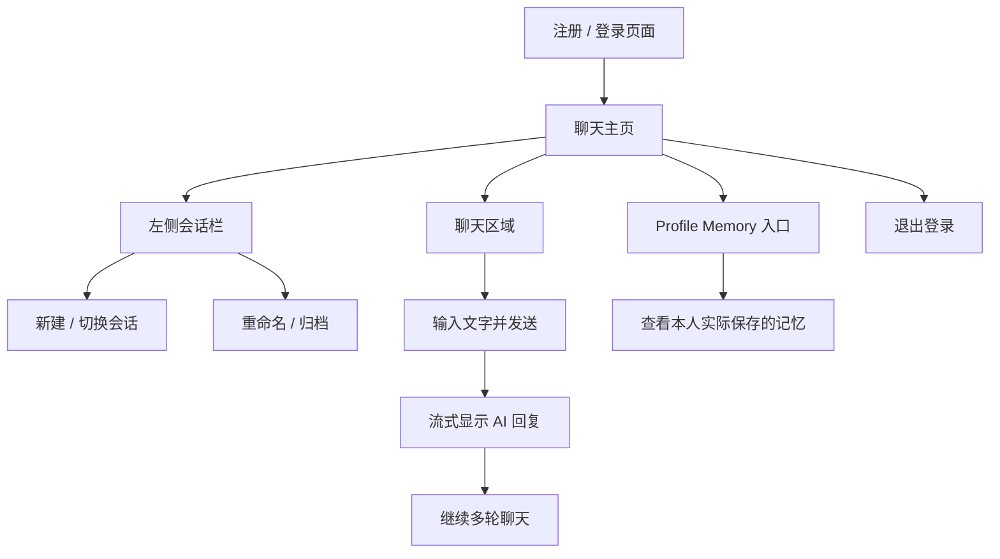
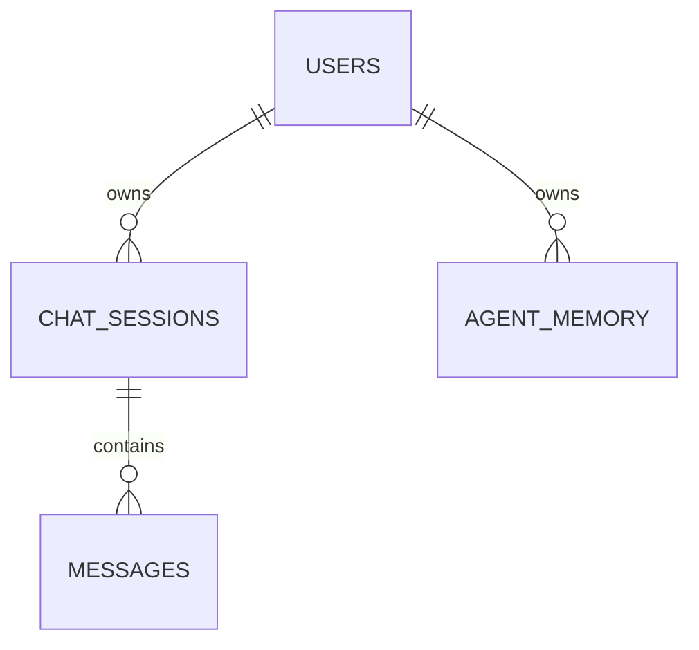
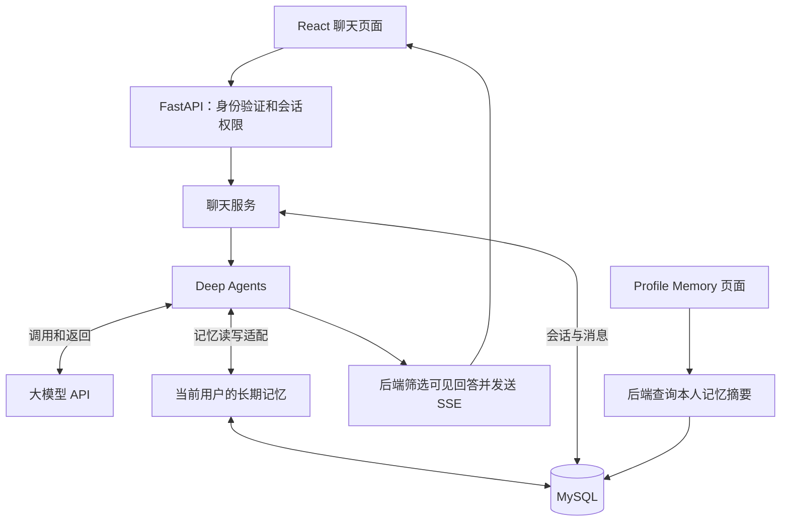

# AI 聊天 Demo：功能范围与设计决策备忘录

**日期：** 2026-09-20

**状态：** 当前讨论结论，作为后续 API 设计和实现的范围依据

**用途：** 记录这次 Demo 要做什么、暂时不做什么，以及它与完整 Coding Lab 数据库设计的区别，避免后续讨论混淆。

## 1. 本次交付目标

做一个可以通过浏览器访问的 AI 聊天网站，交互形式参考豆包或 DeepSeek 网页版。

用户可以注册登录、新建和切换会话、发送文字、查看流式回复及历史记录，并通过 Profile Memory 页面查看 Agent 对自己的长期记忆。

**Deep Agents 是硬性技术要求。所有 AI 对话必须实际经过 Deep Agents 执行，不能用后端直接调用模型的方式替代。**

本次交付是聊天 Demo，不是完整 Coding Lab。使用 React + TypeScript 前端、FastAPI 后端和 MySQL；模型凭据只由后端管理。

## 2. 第一版功能清单

| 模块 | 功能 | 具体行为 |
|---|---|---|
| 账号 | 注册 | 使用邮箱和密码创建账号；密码保存为哈希 |
| 账号 | 登录、退出 | 登录后进入聊天页面，退出后可以切换账号 |
| 会话 | 新建对话 | 开始一个具有独立聊天上下文的会话 |
| 会话 | 历史会话侧栏 | 展示当前用户的会话，最近活跃的排在前面 |
| 会话 | 切换并继续对话 | 点击会话后加载历史消息，并可继续发送消息 |
| 会话 | 默认标题 | 截取首条用户消息作为简单标题，不要求调用模型生成标题 |
| 会话 | 重命名 | 用户可以手动修改会话标题 |
| 会话 | 归档 | 从正常侧栏列表中移除会话，保留历史记录；不等同于永久删除 |
| 聊天 | 输入和发送 | 支持多行文字，禁止发送空消息 |
| 聊天 | Deep Agents 处理 | 后端通过 Deep Agents 组织模型调用和记忆使用 |
| 聊天 | 流式回复 | 第一版即支持逐步显示回答，不等完整回答生成后才显示 |
| 聊天 | 多轮上下文 | Agent 能结合当前会话之前的消息回答 |
| 聊天 | Markdown 展示 | 正确展示段落、列表和代码块 |
| 聊天 | 生成状态 | 显示正在回复、已完成或失败；同一会话生成期间禁止继续发送 |
| 聊天 | 失败与重试 | 请求失败时给出提示并允许重试，避免重复保存消息 |
| 历史 | 持久化保存 | 用户消息和 AI 回复在刷新、重新登录及后端重启后仍然存在 |
| 历史 | 分页加载 | 历史消息按需分页读取，不一次加载所有记录 |
| memory | 提取和更新 | Agent 保存用户明确表达且值得长期保留的学习目标、编程水平和回答偏好 |
| memory | 跨会话使用 | 同一用户新建会话后仍能使用已保存的个人记忆 |
| memory | Profile Memory 页面 | 点击侧栏入口，查看实际保存的个人记忆摘要 |
| 权限 | 用户隔离 | 用户只能访问自己的会话、消息和记忆，包括直接调用接口的情况 |

Profile Memory 第一版只提供查看，不做用户手动编辑、删除和开关。Agent 仍可以在聊天过程中更新记忆。

## 3. 页面范围

## 4. 明确不采用：预置课程、Lab、题目和 Enrollment

讨论中曾提出过一个方案：

> 后端预置 Demo 课程、Lab 和演示题，为用户建立 Enrollment，让聊天沿用完整数据库中的课程与题目关联。

**该方案已不采用。本次 Demo 不创建、不预置，也不要求用户加入这些教学实体。**

原因是本次只验证通用网页聊天、用户隔离、历史记录和长期记忆，不需要课程或作业背景。为了套用完整项目的外键而引入这些数据，会增加本次实现的复杂度。

因此，注册后进入聊天不需要 Course、Course Instance、Enrollment、Lab、Question 或 Lab Question。

## 5. 数据库的临时简化方案

原数据库文档继续描述完整 Coding Lab 的目标设计。本备忘录明确记录 Demo 的差异，不表示两套表结构完全相同，也不直接覆盖原文档。

| 数据 | 完整 Coding Lab 设计 | 本次 Demo |
|---|---|---|
| `users` | 全局用户身份与登录账号 | 保留账号概念 |
| `chat_sessions` | 关联 `enrollment_id + lab_question_id` | 直接关联 `user_id`，不要求课程和题目 |
| `messages` | 关联 `chat_session_id` | 保留此关系，保存用户消息与最终 AI 回复 |
| `agent_memory` | 按 `enrollment_id` 隔离 | 直接关联 `user_id`，供该用户的不同会话使用 |
| Memory 可见性 | 不向学生提供原始记录接口 | 本人可以查看适合展示的记忆摘要，不展示内部运行状态或推理 |

下面仅表示 Demo 的业务归属关系，不是完整建表 SQL：

当前不新增另一套 `user_memories` 业务表。长期记忆沿用 `agent_memory` 的概念；已确认的内部设计补充 `memory_profiles` 管理版本、`memory_evidence` 管理来源去重，它们不是第二份 Profile 内容。具体逻辑结构见[内部实现设计第 2 节](2026-09-20-ai-chat-demo-implementation-design-zh.md#2-demo-的数据库逻辑设计)，建表迁移尚未实现。

这些差异需要在后续 Demo API 文档和数据库迁移中保持一致，不能直接套用完整项目的 Enrollment 外键。

未来加入课程功能时，需要单独设计迁移：哪些聊天关联到哪门课程、哪些记忆可以迁入课程范围，以及如何处理原有通用聊天。不能直接假定所有历史记录都属于某个 Enrollment。

## 6. MySQL 与文件存储的职责

### 6.1 MySQL 保存什么

本次 Demo 的业务数据保存在 MySQL：

- 用户账号、邮箱、密码哈希等。
- 会话所属用户、标题、状态和时间。
- 用户消息、最终 AI 回复及必要的生成状态。
- 按用户隔离的长期记忆摘要。

一条用户消息或一条 AI 回复对应一条消息记录。流式输出中的每个小片段不单独成为一条聊天消息，最终回复需要合并保存。流中断时部分内容的保存方式和重试语义，在 API 文档中明确。

数据库保存历史，不代表每次把全部历史发给模型。页面使用分页；Agent 上下文与长期记忆分别管理。

### 6.2 文件存储暂时不用

本次不支持上传文件，因此不需要为了 Demo 引入单独的对象存储或课程文件存储。

完整项目中，文件存储仍负责保存原始 PDF、PPT 等课程文件，MySQL 保存其元数据和解析文本块。该设计保留，只是本次不启用。

Deep Agents 使用的 `/memories/profile.md` 等路径可以是虚拟文件。采用文件形式的记忆接口时，需要适配到选定的持久化存储；它不意味着必须额外保存一份真实 Markdown 文件，也不能形成与 Profile Memory 页面不同步的第二份记忆。

## 7. Deep Agents 在 Demo 中负责什么

Deep Agents 运行在 FastAPI 后端内部，负责实际的 Agent 对话执行、模型调用与配置后的记忆读写。前端不直接调用模型。

需要区分三个概念：

| 概念 | 用途 | 范围 |
|---|---|---|
| 聊天历史 | 展示和追溯用户与 AI 的消息 | 一个会话 |
| Agent 临时执行状态 | 支撑本次执行；每次从持久化聊天历史重建上下文 | 一个生成尝试，按 `attempt_id` 隔离 |
| Profile Memory | 保存提炼后的稳定偏好和学习目标 | 一个用户的多个会话 |

使用 Deep Agents 不会自动完成用户认证、MySQL 持久化或 Profile Memory 页面。我们需要实现这些连接，并确保页面展示与 Agent 使用的是同一份记忆。

Agent 是否写入记忆以实际存储结果为准，不能只根据回复中的“我记住了”判断。记忆只保存有依据的摘要，不把模型猜测当作事实，不复制全部聊天。

第一版不要求实现完整架构中的 Private Debug、Retrieval 或 Teaching Analytics 子 Agent。

已确认的持久化边界：聊天历史和 Profile Memory 保存到 MySQL，每次生成最多加载最近 20 轮成功问答，并受模型预算限制；不持久化中途执行 checkpoint。记忆通过虚拟 `/memories/profile.md` 读取，经自定义受控工具写回 MySQL，不额外保存一份磁盘 Profile。

## 8. 本次不做的功能

- 课程、Enrollment、Lab 和题目的管理或预置。
- 代码编辑器、正式 Run、自动评分与学习进度。
- Grading Sandbox 和 Diagnostic Sandbox。
- 课程 RAG、Milvus 和文件上传。
- 联网搜索。
- 教师 Dashboard。
- 用户手动编辑、删除或关闭 Profile Memory。

## 9. 演示验收流程

1. 用户 A 注册登录，直接进入聊天页面，无需选择课程或题目。
2. 新建对话，发送消息，网页逐步显示 AI 回复。
3. 连续追问，确认 Agent 能理解当前会话上下文。
4. 告诉 Agent：“我是 Python 初学者，喜欢中文解释，请记住。”
5. 打开 Profile Memory，检查实际保存的相关摘要。
6. 新建另一个会话，验证 Agent 能使用之前保存的偏好。
7. 切换侧栏会话，查看并继续历史对话，测试重命名和归档。
8. 刷新、退出后重新登录，确认历史记录和记忆仍在；后端重启后也应保留。
9. 用用户 B 登录，确认会话、消息和记忆与 A 隔离。
10. 模拟模型请求失败，检查错误提示和重试，确认不产生重复消息。

## 10. 后续文档衔接

- [Demo API 设计文档](2026-09-20-ai-chat-demo-api-design-zh.md)：围绕账号、会话、消息流和 Profile Memory 定义接口。
- [Demo 内部实现设计](2026-09-20-ai-chat-demo-implementation-design-zh.md)：已确认登录、8 张逻辑业务表、Deep Agents 适配、单进程任务执行和七项验收设计；尚未实现。
- [完整数据库设计](2026-09-18-ai-coding-assistant-database-design-zh.md)：保留为 Coding Lab 的目标设计；Demo 的差异以本备忘录第 5 节为准。
- [完整架构设计](2026-09-13-ai-coding-assistant-architecture-design-zh.md)：保留课程、评分、沙箱、RAG 和教师分析等后续系统范围。

API 已定义 11 个接口及分页、流式事件、失败重试和消息幂等；内部方案已确认采用同站点 Cookie + Session、7 天登录有效期、单进程执行器和默认 180 秒任务预算。浏览器断线后恢复最终结果，不补播片段；服务重启后未完成的 RUNNING 任务标记失败，由用户重试。下一步是按已确认设计落实代码、迁移、模型配置及测试，不表示这些功能已经实现或验收通过。
