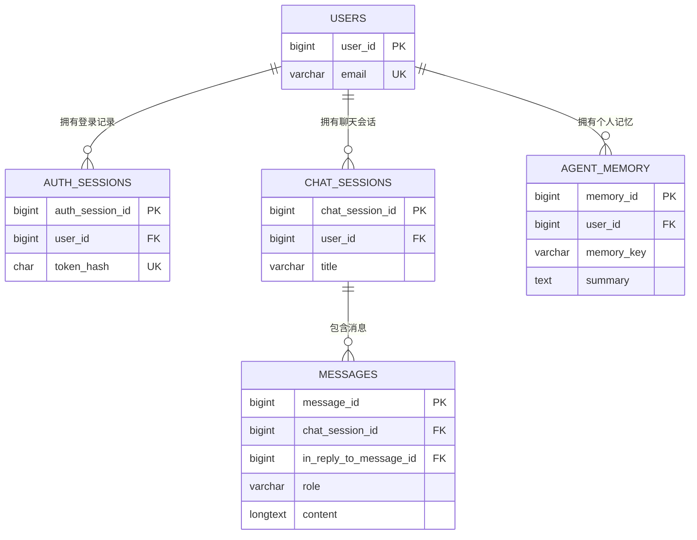

# AI 聊天 Demo：第一版数据库表设计

**日期：** 2026-09-24

**状态：** 待共同确认的设计草案；没有创建业务表，没有编写 ORM 或执行 Migration。

**适用范围：** 第一版网页聊天 Demo，5 张业务表、11 个业务接口。

## 1. 这份设计从哪里来

已阅读[原数据库总设计](2026-09-18-ai-coding-assistant-database-design-zh.md)，主要继承第 4 节通用原则、第 6.1 节 users、第 10.1 节对话与消息、第 10.3 节记忆，以及事务、权限、迁移规则。原文中的课程、题目、代码运行、评分、RAG 和审计模型仍作为完整教学系统的设计，不在本次建表中实现。

同时对照了[第一版功能范围](2026-09-20-ai-chat-demo-scope-and-decisions-zh.md)、[API 设计](2026-09-20-ai-chat-demo-api-design-zh.md)和[内部实现设计](2026-09-20-ai-chat-demo-implementation-design-zh.md)。这些已确定的 Demo 功能不变；本文补齐物理字段、类型、约束和未来衔接方式。新增细节等待确认后，才成为 Schema 和 Migration 的输入。

这里有三个层次，不要混淆：

| 层次 | 作用 | 当前情况 |
|---|---|---|
| 数据库 | 装这些表的容器：`ai_teaching_assistant` | 环境阶段已创建 |
| 表设计 | 决定账号、对话、消息等各保存哪些字段 | 本文要共同确认 |
| 真实表结构 | MySQL 中实际存在的表、外键、索引和约束 | 后续用 Alembic Migration 创建 |

### 1.1 原设计如何缩成当前 Demo

| 原总设计 | Demo 的处理 | 理由 |
|---|---|---|
| users：全局用户身份、邮箱密码登录 | 复用，保留主要字段和数字主键 | 以后课程仍引用同一个 user_id |
| 登录 Session 只描述了行为，未定义专门表 | 补充 auth_sessions | 登录要持久化、可退出、后端重启后仍有效 |
| chat_sessions 属于 Enrollment 和 Lab Question | 改为直接属于 users | 本 Demo 没有课程与题目，不造假的 Enrollment |
| chat_sessions.chat_session_id | 保留这个物理列名；API 仍用 session_id | 衔接原设计，同时不改公开接口 |
| chat_sessions.status 支持归档 | 本版不创建此列 | 已约定暂不做归档 |
| 对话没有标题字段，updated_at 表示最后活动 | 增加标题、手动命名标记、独立 last_activity_at | 侧栏要有标题，改名不能把旧对话顶到最前 |
| messages 保存正文、幂等键、回复关联、模型配置标识 | 保留；增加最新生成状态和运行编号 | 支持刷新恢复状态、原问题失败重试 |
| messages 支持 SYSTEM、hint_level | 暂不创建 SYSTEM 记录，不建 hint_level | 当前只展示 USER 和 ASSISTANT，未做题目提示等级 |
| 原消息重复提交可以恢复处理 | 同键重发只返回当前结果；失败另走 retry 接口 | 不因网络重发再次调用模型，遵循当前 API 第 8 节 |
| agent_memory 按 Enrollment 隔离 | 改为按 user_id + memory_key 隔离 | 个人 Profile 需要在本人不同聊天会话中共用 |
| 记忆有证据数量、置信度、归档状态 | 暂不建这些字段 | 只保存用户明确陈述且适合长期保留的背景、目标和偏好，包括非教育类个人信息 |
| 原权限表不提供个人记忆原始记录接口 | Demo 提供本人摘要只读页面 | 已确定的 Profile Memory 功能；不开放他人记忆 |
| 课程、评分、诊断、RAG、文件存储、Milvus 等 | 暂不建对应表或存储 | 不在 Demo 功能范围；原总设计不删除 |

这不是宣称两份设计完全相同。最大的语义变化是“课程范围的学习记录”与“用户自己的通用聊天和 Profile”，扩展回教学系统时必须显式区分范围，见第 10 节。

## 2. 五张表如何联系

| 表 | 每一行代表什么 | 举例 |
|---|---|---|
| users | 一个人的账号 | 用户 123，邮箱 roey@example.com |
| auth_sessions | 一次有效期固定的登录 | 用户 123 在某个浏览器登录后得到的凭据记录 |
| chat_sessions | 一段可以多轮继续的对话 | 用户 123 的“Python 学习”会话 |
| messages | 一条用户问题或一条完整 AI 回复 | “什么是列表？”；“列表是……”分别各一行 |
| agent_memory | 一名用户的一个主题的个人记忆 | 用户 123 的 preference.language = 喜欢中文解释 |

`||--o{` 表示“一对零到多”：一个用户可以暂时没有会话，也可以有多个会话；每个会话必须属于一个用户。图中字段是关系摘要，不是完整字段列表。

messages 还有一条指回本表的外键：ASSISTANT 的 `in_reply_to_message_id` 指向它回答的 USER。每条 USER 最多有一条成功回复，失败时可以没有。这个角色条件靠后端校验，外键本身只保证被引用消息存在。

登录与聊天分开：退出登录撤销 auth_sessions，不删除 chat_sessions、messages 或 agent_memory。新建聊天也不会创建新账号或新的登录记录。

## 3. 所有表共同采用的规则

### 3.1 把学过的概念对应起来

| 概念 | 在这里的具体作用 |
|---|---|
| 主键 PK | 唯一识别一行，例如 user_id；不能拿可修改的邮箱代替它 |
| 外键 FK | 关联另一行，例如 chat_sessions.user_id 指向 users.user_id |
| 唯一约束 UNIQUE | 不允许同样的事实重复出现，例如同一个规范化邮箱不能注册两次 |
| 非空 NOT NULL | 写入时必须有值；NULL 表示缺少或不适用，不等于空字符串 |
| 检查约束 CHECK | 限制值合法，例如 role 只能是 USER 或 ASSISTANT |
| 索引 INDEX | 按常用查找路径组织数据，例如按用户查会话；不是另一份业务事实 |
| 事务 | 几次相关修改要么一起提交，要么一起撤销，例如保存回复和标记成功 |

### 3.2 类型、时间和命名

1. 继承原设计：MySQL 8.4、InnoDB、utf8mb4，表和列使用小写 snake_case。
2. 五张业务表的主键都用 `BIGINT UNSIGNED AUTO_INCREMENT`。所有引用它的外键用同样的 `BIGINT UNSIGNED`。编号稳定但不保证连续，不能通过“编号没有加一”判断数据丢失。
3. API 把数字 ID 转成字符串，例如数据库数字 1001 对外返回 `"1001"`，避免 JavaScript 大整数精度问题。UUID 则本来就是字符串。
4. 时间统一为 `DATETIME(6)`，保存 UTC，API 输出 UTC ISO 8601。该类型本身不记录时区；后端统一产生 UTC 时间再写入，读出时按 UTC 解释。updated_at 由后端显式维护，不依赖一次查询或 ORM 自动刷新就改变时间。
5. 普通文字沿用 utf8mb4；规范化邮箱用 utf8mb4_bin 比较。UUID、哈希、枚举状态、memory_key 使用 ASCII 字符集和二进制排序规则。邮箱在后端先去首尾空格并统一小写，UUID 统一标准小写带连字符格式再存，避免依赖数据库隐式大小写、重音或格式等价。
6. 普通文本保留原来的含义和格式。消息正文检查纯空白时可以使用去空白后的临时值，但存储时不能破坏代码缩进和换行。
7. 外键统一 `ON DELETE RESTRICT`、`ON UPDATE RESTRICT`。本版没有账号、聊天或记忆删除接口，也不自动级联删除用户全部数据。

时间字段没有明确列出默认值时，由后端在对应写入动作中提供。状态列有默认值时仍由后端按业务明确写入。SQLAlchemy、后台脚本和批量 SQL 都必须遵守相同规则。

### 3.3 数据库字段与接口字段不必同名

| 数据库存储 | API 名称或行为 |
|---|---|
| chat_sessions.chat_session_id | session_id |
| messages.chat_session_id | 路径中的 session_id；消息列表外层的 session_id |
| messages.generation_status | USER 的 generation.status |
| messages.attempt_id | generation.attempt_id，以及 SSE 的 attempt_id |
| messages.generation_error_code / generation_error_message | generation.error.code / message；无错误则 error 为 null |
| 按 in_reply_to_message_id 找到的回复 | generation.assistant_message_id；不在 USER 再存一份回复 ID |
| 本进程实际运行登记和清理状态 | is_generating；不创建同名数据库布尔列 |
| 最新 USER + FAILED + 没有活动运行 | can_retry；每次查询计算，重试时重新校验 |

API 路径和现有请求、响应均不改变。[《AI 聊天 Demo：第一版内部设计》第 2.1 节“逻辑结构”](2026-09-20-ai-chat-demo-implementation-design-zh.md#21-逻辑结构)的五张表概览中，chat_sessions 和 messages 的主要字段都写作 `session_id`。本草案建议：实际数据库列统一命名为 `chat_session_id`，API 继续使用 `session_id`，由后端负责名称转换。两者表示同一个聊天会话编号，不是在数据库中保存两个编号，也不同时创建这两个同义列。

## 4. users：账号表

以原总设计第 6.1 节为基础，不重新发明用户身份。负责用户自己的登录和展示信息，课程角色将来仍放在 Enrollment。

| 字段 | 类型 | 可空 | 默认/生成方式 | 用人话说 |
|---|---|---|---|---|
| user_id | BIGINT UNSIGNED AUTO_INCREMENT | 否 | 数据库生成，PK | 这个人的稳定编号 |
| email | VARCHAR(320) | 否 | 后端规范化后写入 | 登录邮箱；UNIQUE |
| password_hash | VARCHAR(255) | 否 | 后端用专用密码哈希算法生成 | 用于核对密码，不存明文密码 |
| display_name | VARCHAR(255) | 否 | 注册时提供 | 页面上的称呼，允许重名 |
| status | VARCHAR(16) | 否 | ACTIVE | ACTIVE / DISABLED |
| system_role | VARCHAR(16) | 否 | USER | 延续原设计的 USER / ADMIN，Demo 注册固定 USER |
| created_at | DATETIME(6) | 否 | 注册时间 | 账号什么时候创建 |
| updated_at | DATETIME(6) | 否 | 初始等于 created_at | 账号资料、状态等最近修改时间 |
| last_login_at | DATETIME(6) | 是 | NULL；成功登录时写入 | 最近一次成功登录；刚注册未登录时为空 |

沿用原列宽，display_name 的 API 校验仍是去首尾空格后 1～100 字符；数据库容量 255 不意味着接口接受 255。邮箱长度与 API 的 320 上限一致。密码长度约束由接口检查，password_hash 的长度是哈希编码后的长度，不是用户原密码长度。

数据库约束：PK(user_id)、UNIQUE(email)、status 和 system_role 固定枚举值；邮箱、显示名、密码哈希不能为空字符串。业务层另外校验邮箱格式及规范化、显示名空白和长度、密码规则。完整邮箱唯一索引即可，不用只截前几个字符的前缀唯一索引。

**与原设计相比：** 保留 updated_at、last_login_at、system_role；暂不创建 institution_user_id，原设计也允许在不需要学校编号时省略。保留 system_role 只是保持已有用户结构，不增加管理员页面、管理员接口或教师权限，公开注册不能传入该字段。

登录成功时更新 last_login_at 和 updated_at。账号禁用后，后端每次认证还要检查 users.status，不能只因为 auth_sessions 没到期就放行。

## 5. auth_sessions：登录状态表

这是原总设计未细化、当前 Cookie 登录方式需要补齐的表。它与聊天会话完全不同，也不是 SQLAlchemy 管理数据库事务时的 Session 对象。

| 字段 | 类型 | 可空 | 默认/生成方式 | 用人话说 |
|---|---|---|---|---|
| auth_session_id | BIGINT UNSIGNED AUTO_INCREMENT | 否 | 数据库生成，PK | 一条登录记录的内部编号 |
| user_id | BIGINT UNSIGNED | 否 | 后端确定，FK → users.user_id | 谁登录了 |
| token_hash | CHAR(64) | 否 | 随机登录凭据的 SHA-256 十六进制哈希 | 用它查找登录记录；UNIQUE |
| created_at | DATETIME(6) | 否 | 登录成功的时间 | 本次登录开始时间 |
| expires_at | DATETIME(6) | 否 | created_at + 7 天 | 何时失效，不因访问自动延长 |
| revoked_at | DATETIME(6) | 是 | 初始 NULL；退出或轮换时填时间 | 是否提前撤销 |

凭据建议用安全随机数生成 32 字节，再编码成适合 Cookie 的字符串。浏览器的 `chat_session` Cookie 保存原始随机凭据，数据库只保存它的哈希。收到请求后，后端计算 Cookie 凭据的哈希并查表，不通过 auth_session_id 数字当作登录凭据。

这里 SHA-256 处理的是足够随机的登录凭据；用户自己设的密码仍需专用密码哈希算法，不能照搬成普通 SHA-256。

数据库约束：PK、user_id 外键、UNIQUE(token_hash)；expires_at > created_at；revoked_at 为空或不早于 created_at。后端检查“未撤销、未到期、账号 ACTIVE”才能认证成功。token_hash 长度和编码格式由生成逻辑保证。

新增普通索引 `(user_id, expires_at)`，支持按用户查登录及其有效期；token_hash 已有唯一索引，不再重复建普通索引。暂不增加设备、IP、浏览器名称或 last_seen_at 等本版不需要的字段。

退出时只更新本条 revoked_at，并清 Cookie。重复退出不更改原撤销时间。重新登录始终生成新凭据；若当前请求带有有效旧凭据，在同一事务中撤销它并创建新记录，其他浏览器的登录保留。注册成功只创建 users，不自动创建 auth_sessions。

Cookie 名字沿用既定 API 的 chat_session，虽然容易和聊天会话混淆，它实际承载的是 auth_sessions 的登录凭据。数据库里的 chat_sessions 不保存该 Cookie。

## 6. chat_sessions：左侧栏的聊天会话

继承原 chat_sessions 表及 chat_session_id 主键；移除当前不成立的 Enrollment、Lab Question 依赖，直接用 user_id 表示归属。

| 字段 | 类型 | 可空 | 默认/生成方式 | 用人话说 |
|---|---|---|---|---|
| chat_session_id | BIGINT UNSIGNED AUTO_INCREMENT | 否 | 数据库生成，PK | 这段对话的编号，对外叫 session_id |
| user_id | BIGINT UNSIGNED | 否 | 从登录状态确定，FK → users.user_id | 这段对话是谁的 |
| title | VARCHAR(100) | 否 | 新对话 | 左侧栏显示的名称 |
| title_is_manual | BOOLEAN | 否 | false | 用户是否手动改过名 |
| last_activity_at | DATETIME(6) | 否 | 初始等于 created_at | 侧栏排序使用的最近聊天活动时间 |
| created_at | DATETIME(6) | 否 | 新建会话时间 | 什么时候开始这段对话 |
| updated_at | DATETIME(6) | 否 | 初始等于 created_at | 这行标题或活动信息最近何时更新 |

title_is_manual 延用已确认的 Demo 字段名；虽与总设计推荐的 is_* 命名略有差异，本版不额外重命名为第二套字段。数据库限制布尔值为 0 或 1，title 长度 1～100；后端还要拒绝纯空白标题。

外键：user_id → users.user_id。普通索引：`(user_id, last_activity_at, chat_session_id)`；查询按后两列 DESC 排序。一个用户可以拥有任意多个同名会话，不给 title 或 user_id 单独加唯一约束。

| 动作 | title / 标记 | last_activity_at | updated_at |
|---|---|---|---|
| 新建空会话 | 新对话 / false | 创建时间 | 创建时间 |
| 接受首条 USER | 若未手动命名，按首条问题生成前 30 字符标题 | 更新 | 更新 |
| 接受后续新消息或失败重试 | 保持标题 | 更新 | 更新 |
| 保存成功回复 | 保持标题 | 更新 | 更新 |
| 手动重命名 | 新标题 / true | 不变 | 更新 |
| 查看会话 | 不变 | 不变 | 不变 |
| 生成失败结算 | 不变 | 不变 | 不变；失败状态更新在 messages |

自动标题只在“第一条问题被接受”的事务里初始化：去首尾空白、换行转空格后截前 30 字符。不能仅凭 title_is_manual=false 就在每条新消息时重写标题，也不能凭 title 仍等于“新对话”判断是否第一条。

生成中允许改名，自动初始化和手动改名通过短事务协调，不能用旧 ORM 对象的全行更新覆盖新标题。当前不建 status、active_attempt_id、deadline_at、is_generating 等列。

## 7. messages：消息正文和最近一次生成状态

### 7.1 正文与关联字段

一条 USER 问题占一行，一条生成成功并保存的 ASSISTANT 回复另占一行。SSE 的几十个文字片段不是几十行消息。

| 字段 | 类型 | 可空 | 默认/生成方式 | 用人话说 |
|---|---|---|---|---|
| message_id | BIGINT UNSIGNED AUTO_INCREMENT | 否 | 数据库生成，PK | 一条消息的编号 |
| chat_session_id | BIGINT UNSIGNED | 否 | FK → chat_sessions.chat_session_id | 这条消息属于哪段对话 |
| role | VARCHAR(16) | 否 | 后端指定 USER / ASSISTANT | 谁说的话 |
| content | LONGTEXT | 否 | 用户原文或完整可见回复 | 实际显示的正文，不包含内部推理和工具日志 |
| in_reply_to_message_id | BIGINT UNSIGNED | 是 | ASSISTANT 必填，FK → messages.message_id | 这条回答对应哪个 USER 问题 |
| client_message_key | VARCHAR(64) | 是 | USER 必填，前端生成 UUID | 同一次发送的防重复编号 |
| model_key | VARCHAR(128) | 是 | ASSISTANT 可填，后端记录 | 非敏感的模型配置标识，例如 deepseek:deepseek-flash |
| created_at | DATETIME(6) | 否 | 本消息首次保存时间 | 正文的历史时间，重试不改变原问题的时间 |
| updated_at | DATETIME(6) | 否 | 初始等于 created_at | USER 最新生成状态最近改变时间 |

沿用原总设计 content 的 LONGTEXT，避免英文、中文、代码和完整回复受 TEXT 字节上限影响；这不代表模型可以无限生成。用户输入仍按 API 限制为最多 20,000 字符，并另做模型 token 预算检查；USER 长度限制也落到 CHECK，ASSISTANT 由模型输出预算限制。

model_key 是原设计已有的辅助排查字段，本草案建议保留。它不包含 API Key、完整配置或带凭据的 URL，USER 必须为空，当前回复建议写入实际模型配置标识。现有 API 不要求返回它；本版不增加 token 用量、费用、LangSmith trace 或工具事件字段。LangSmith 按约定等完整 Demo 跑通后再接。

### 7.2 USER 专用的生成字段

以下字段仍属于同一张 messages 表；为了讲解分开列，**不是第二张表**。

| 字段 | 类型 | 可空条件 | 含义 |
|---|---|---|---|
| attempt_id | CHAR(36) | USER 不可空；ASSISTANT 必须为空 | 后端生成 UUID，标记这一次 Agent 执行；重试换新编号 |
| retry_of_attempt_id | CHAR(36) | 首次执行和 ASSISTANT 为空 | 最近一次重试所针对的失败编号 |
| generation_status | VARCHAR(16) | USER 不可空；ASSISTANT 必须为空 | RUNNING / SUCCEEDED / FAILED |
| generation_error_code | VARCHAR(64) | FAILED 必填；其余为空 | 稳定的错误分类，例如 GENERATION_TIMEOUT |
| generation_error_message | VARCHAR(500) | FAILED 必填；其余为空 | 可展示给用户的简短错误，不保存原始异常和密钥 |

这些列在 SQL 类型层面允许 NULL，然后用角色相关 CHECK 限制何时可空。attempt_id 是执行编号，不是 messages 主键，不是模型的一次内部调用编号，也不是必须和 LangSmith trace_id 相同的东西。一次 Agent 执行未来可以包含多次模型和工具调用。

retry_of_attempt_id 不建外键：我们没有保存全部尝试的表，原 attempt_id 在重试时会被替换，历史编号未必对应任何当前行。禁止“为了建立这个外键”再引入已暂缓的 generation_attempts。

### 7.3 哪些规则由数据库保证

| 约束 | 作用 |
|---|---|
| PK(message_id) | 消息编号唯一 |
| FK(chat_session_id) | 消息必须属于真实存在的会话 |
| FK(in_reply_to_message_id) | 回答引用的问题必须存在 |
| UNIQUE(chat_session_id, client_message_key) | 一个会话中，同一个发送键最多保存一条 USER |
| UNIQUE(in_reply_to_message_id) | 一个问题最多有一条成功 ASSISTANT |
| UNIQUE(attempt_id) | 当前保存的非空执行编号不重复；不构成完整尝试历史 |
| CHECK(role 为 USER / ASSISTANT) | 不写入 SYSTEM、TOOL、内部推理消息 |
| CHECK(content 长度大于 0；USER 不超过 20,000 字符) | 基础正文长度约束；完整 Unicode 空白判断另由后端做 |

普通索引：`(chat_session_id, created_at, message_id)` 支持历史顺序读取；`(generation_status, message_id)` 支持单进程启动时查残留 RUNNING。其他主键、唯一约束已经产生索引，不重复创建。

角色相关 CHECK 要明确表达如下两条互斥分支：

- USER：client_message_key、attempt_id、generation_status 都非空；in_reply_to_message_id、model_key 为空；status 必须在三个值中。FAILED 时两个错误字段都非空且非空字符串；RUNNING/SUCCEEDED 时两个错误字段都为空。retry_of_attempt_id 为空或不同于当前 attempt_id。
- ASSISTANT：in_reply_to_message_id 非空；client_message_key 以及第 7.2 节的五个生成字段全部为空；model_key 可空。

注意 MySQL 的 CHECK 在表达式为 UNKNOWN（通常由 NULL 引起）时也允许通过，因此不能只写 `generation_status IN (...)` 就当作 USER 已必填；必须显式写 IS NOT NULL。唯一索引允许多行 NULL，因此多条 USER 的 in_reply_to_message_id 为空、多条 ASSISTANT 的 client_message_key 和 attempt_id 为空，不会互相冲突。

### 7.4 哪些规则必须由后端保证

1. 当前登录用户拥有 chat_sessions；不能直接相信前端传来的 user_id。messages 不重复保存 user_id，而是沿 chat_session_id 找到归属。
2. in_reply_to_message_id 指向同会话的 USER，不能指向其他会话、ASSISTANT 或自己。单列外键只保证存在，不自动保证这些业务条件；在同一短事务中验证。
3. USER 的正文、发送键、created_at，以及成功 ASSISTANT 的正文与关联，保存后不被重试覆盖。CHECK 无法比较修改前后的整行来保证不可变性，由服务和测试保证。
4. 同一会话只有一个实际生成。由单进程运行登记协调；UNIQUE(attempt_id) 或 UNIQUE(in_reply_to_message_id) 都不能替代它。
5. 仅会话最后一条 USER、最新状态 FAILED 且无运行时能重试；按 `(created_at, message_id)` 确定顺序，与历史接口一致。
6. 只有完整回答保存成功时才能把 USER 标成 SUCCEEDED，二者同事务提交。不能只更新状态却忘记保存答案。
7. 保存成功或失败都要求消息当前 attempt_id 与本次一致且状态仍为 RUNNING；不匹配则拒绝旧执行写入。事务、运行登记和取消清理共同保护记忆写入，不能用一个普通 SELECT 代替整个协调流程。

### 7.5 用一条问题说明“重试不新建问题”

假设用户发送：“什么是 API？”，数据库分配 message_id=2001；下面 A、B 代表两个不同 UUID，K 代表前端发送键。

| 时刻 | message_id | role | attempt_id | retry_of_attempt_id | generation_status | in_reply_to_message_id |
|---|---|---|---|---|---|---|
| 首次接受 | 2001 | USER | A | NULL | RUNNING | NULL |
| 首次失败 | 2001 | USER | A | NULL | FAILED | NULL |
| 接受重试 | 2001 | USER | B | A | RUNNING | NULL |
| 成功提交后 | 2001 | USER | B | A | SUCCEEDED | NULL |
| 同一成功事务新增回复 | 2002 | ASSISTANT | NULL | NULL | NULL | 2001 |

前四行是同一个 USER 在不同时间的样子，不是四条记录。它的 content、client_message_key=K、created_at 一直不变；错误字段在失败时填写，接受重试时清空。最终只有问题 2001 和答案 2002 两行。

若旧尝试 A 迟到，它发现当前 attempt_id 已经是 B，就不能再保存回答或更改状态。

## 8. agent_memory：个人长期记忆

保留原表名、memory_id、memory_type、summary 和时间字段；将归属从 enrollment_id 改为 user_id，并增加稳定的主题键 memory_key。

| 字段 | 类型 | 可空 | 默认/生成方式 | 用人话说 |
|---|---|---|---|---|
| memory_id | BIGINT UNSIGNED AUTO_INCREMENT | 否 | 数据库生成，PK | 一条主题记忆的稳定编号 |
| user_id | BIGINT UNSIGNED | 否 | 后端绑定，FK → users.user_id | 这是谁的记忆 |
| memory_key | VARCHAR(64) | 否 | 从下表的固定主题中选择 | 这条记忆在讲哪个主题 |
| memory_type | VARCHAR(32) | 否 | 由后端根据主题确定 | 页面展示的记忆分类 |
| summary | TEXT | 否 | 用户明确陈述的简短总结 | 例如“喜欢对专业术语的解释” |
| created_at | DATETIME(6) | 否 | 这个主题首次创建的时间 | 首次记住此主题的时间 |
| updated_at | DATETIME(6) | 否 | 初始等于 created_at | 这个主题的内容最近一次变化时间 |

第一版候选主题扩充为以下 25 个，作为本表设计草案中的允许列表：保留原来的 15 个学习与编程相关主题，新增 10 个个人背景与日常偏好主题，不局限于教育背景。它们是本项目选择的业务主题，不是 Deep Agents 强制规定的标准；不要求每个用户都有全部主题，没有明确依据的主题不创建记录。

这里的 Profile 主要属于 Semantic Memory（语义记忆，即关于用户的事实）。memory_type 中的五种值是更具体的业务分类，不是 Semantic / Episodic / Procedural 三种记忆机制；本次不增加情景记忆或自动学习系统提示的功能。

| memory_key | memory_type | 示例 summary |
|---|---|---|
| preference.language | LEARNING_PREFERENCE | 喜欢用中文解释 |
| preference.explanation_style | LEARNING_PREFERENCE | 喜欢先讲用途，再逐行解释代码 |
| preference.detail_level | LEARNING_PREFERENCE | 希望详细讲解，不要跳过基础步骤 |
| preference.example_style | LEARNING_PREFERENCE | 喜欢生活类比和可以运行的小例子 |
| preference.code_style | LEARNING_PREFERENCE | 希望示例代码带中文注释 |
| preference.hint_style | LEARNING_PREFERENCE | 做练习时先给提示，不直接给完整答案 |
| preference.pacing | LEARNING_PREFERENCE | 每次讲一个知识点，理解后再继续 |
| preference.knowledge_connections | LEARNING_PREFERENCE | 讲新知识时联系已经学过的原理 |
| learning.goal | LEARNING_GOAL | 想做出一个可以部署的教学聊天网站 |
| learning.current_topic | LEARNING_GOAL | 当前正在学习 Python 异步编程 |
| programming.level | PROGRAMMING_BACKGROUND | 自述是 Python 初学者，但有 Java 基础 |
| programming.languages | PROGRAMMING_BACKGROUND | 学过 Java，正在学习 Python |
| programming.known_concepts | PROGRAMMING_BACKGROUND | 自述学过主键、外键，以及 LangGraph 的节点和状态 |
| programming.tools | PROGRAMMING_BACKGROUND | 使用 VS Code、Docker 和 Git |
| programming.environment | PROGRAMMING_BACKGROUND | 使用 macOS，终端是 zsh |
| personal.preferred_name | PERSONAL_BACKGROUND | 希望聊天时称呼自己“小雨” |
| personal.occupation | PERSONAL_BACKGROUND | 从事产品设计工作 |
| personal.interests | PERSONAL_BACKGROUND | 长期喜欢摄影、科幻小说和烘焙 |
| personal.long_term_goal | PERSONAL_BACKGROUND | 希望未来完成一本自己的小说 |
| personal.timezone | PERSONAL_BACKGROUND | 日常使用 Pacific/Auckland 时区 |
| personal.general_location | PERSONAL_BACKGROUND | 长期居住在奥克兰；只记录城市或更粗范围 |
| personal.daily_routine | DAILY_PREFERENCE | 通常晚上有空，希望把较长的讨论安排在晚上 |
| preference.conversation_tone | DAILY_PREFERENCE | 喜欢自然随和的聊天语气，不喜欢过度客套 |
| lifestyle.food_preferences | DAILY_PREFERENCE | 喜欢清淡口味，不喜欢太甜的食物 |
| lifestyle.activity_preferences | DAILY_PREFERENCE | 休闲时偏爱散步和逛博物馆 |

其中回答偏好 8 个、学习目标 2 个、编程背景 5 个、个人背景 6 个、日常偏好 4 个。新增业务类型为 PERSONAL_BACKGROUND 和 DAILY_PREFERENCE。原有学习类主题划分参考了 [LangMem 的 Profile 与长期记忆说明](https://langchain-ai.github.io/langmem/concepts/conceptual_guide/)以及[学习者偏好与知识画像研究](https://www.frontiersin.org/journals/computer-science/articles/10.3389/fcomp.2024.1359770/full)；包括新增个人主题在内的具体 key 名称及范围都是本项目的设计选择，不要求安装 LangMem。

数据库约束：PK(memory_id)、user_id 外键、UNIQUE(user_id, memory_key)、summary 字符数 1～500，以及上述 key/type 配对 CHECK。memory_type 可以由 key 推导，但为保留原总设计字段和当前 API 展示分类仍保存此列，后端统一生成并用 CHECK 防止两者矛盾。模型不能任意添加允许列表以外的主题或指定别人的 user_id。实现时后端校验、工具参数允许列表和数据库 CHECK 必须使用同一套 25 个主题及其类型对应关系。

普通索引：`(user_id, updated_at, memory_id)`；页面按后两列 DESC 排序。唯一键限制的是“一名用户的同一主题最多一行”，不是“一名用户只能有一条记忆”。按这份 25 个主题的草案，每名用户最多 25 行；每个主题保存一段摘要，不是无限追加的事实列表。增加主题不增加数据库列、业务表或公开接口，但实现时需要使用扩充后的类型允许列表及 key/type CHECK。

保存使用按主题更新或插入（upsert）：已有主题更新原行，保留 memory_id 和 created_at；新主题才插入。同一主题 summary 完全相同则不更新 updated_at，避免重试把没有变化的记忆反复置顶。不同主题互不覆盖，同主题不同内容并发仍按数据库提交顺序后写生效，不额外引入版本、证据或自动矛盾裁决。

提取与更新时还需区分：

- 临时要求与长期偏好：“这次用英文回答”只约束当前回答；明确表达“以后都用英文”才作为长期偏好保存。含义不清楚时不更新 Profile。
- 用户自述与已验证的掌握程度：“我学过主键”可以保存为用户自述；仅仅问过主键或回答了一次问题，不能自动写成“已经掌握”。
- 内容补充与明确纠正：对 languages、known_concepts、tools、interests 等可能包含多项事实的摘要，顺序更新时先读取该主题已有内容，加入明确的新事实并去重；不能因为用户补充“也用 Docker”就删掉之前明确说过的 Git。若用户明确纠正或表示不再使用，则修改对应事实。这个规则不额外承诺同主题并发时自动合并，仍遵循前述提交顺序。
- 有时效的信息：current_topic 和 environment 等在用户明确提供新情况时更新，不能将旧环境或旧学习主题当作永远不变的事实。项目专属配置与进度暂不扩充为全局记忆主题，避免不同项目混在一起。
- 摘要与上下文预算：合并摘要仍需控制在 500 字符内，超长不能由数据库静默截断；无法形成可靠摘要时保留原值。25 个主题也不是每次强制塞满模型上下文，仍按第 9.2 节的 token 预算组织输入。

新增个人主题的边界：

- 只记录用户主动明确表达、对后续交流有用且具有持续性的个人事实；不从姓名、IP、语言或聊天话题猜测住址、职业、身份或兴趣。一次旅游不代表长期居住地，一次熬夜不代表日常作息。
- preferred_name 只是 Agent 如何称呼用户，不会自动修改 users.display_name，也不充当登录名或身份验证依据。账号昵称仍由账号功能管理。
- timezone 只用于理解时间表达；general_location 最细到城市，不存详细住址、实时位置或精确活动轨迹。daily_routine 只存粗略交流习惯，不保存可追踪的完整日程；本次不增加提醒、日历或主动发送消息功能。
- 本版个人记忆不收录密码、API Key、证件号、银行卡资料、健康诊断、宗教信仰、政治倾向、性生活等敏感信息，也不保存他人的可识别私人信息。即使用户提及，也不能借 occupation、interests、food_preferences 等通用主题绕过限制；例如可以记录“喜欢清淡”，但不将疾病、过敏或宗教原因写进饮食偏好摘要。
- 兴趣、职业、居住城市和目标也可能变化，用户明确纠正时更新；只在与问题相关时使用，不在无关回答中反复提及个人信息。
- 上述限制针对提取到 agent_memory 的长期记忆，不代表聊天原文已被脱敏或删除：messages 仍按聊天历史规则保存。本次也未增加记忆删除或管理接口；面向真实用户开放前，需要另行确认记忆告知、控制与删除方案。

写入必须经过受控的 save_profile_facts 工具和后端服务。用户、当前问题、attempt_id 从可信运行上下文取得，但本版不另存来源证据台账。只保存符合上述边界的明确目标、背景和偏好，不保存聊天原文、源码、密码、具体题目答案或其他人的内容。

Agent 读取的 `/memories/profile.md` 由这些行临时组织成文字；它是虚拟路径，不是在磁盘额外维护一份 Markdown。Profile Memory 页面读取同一份 MySQL 数据，不产生 memory_profiles 表。

## 9. 从功能走一遍写入与读取

### 9.1 需要放进同一事务的操作

| 操作 | 同一短事务中的数据库变化 |
|---|---|
| 注册 | 插入 users；数据库唯一约束处理并发注册相同邮箱 |
| 登录 | 更新 users 的登录时间，必要时撤销当前旧登录，创建 auth_sessions |
| 退出 | 撤销当前 auth_sessions；不改聊天和记忆 |
| 新建聊天 | 插入 chat_sessions，初始化标题和两个时间 |
| 接受新问题 | 创建 USER + 当前编号/RUNNING，必要时初始化标题，更新会话活动时间 |
| 接受失败重试 | 条件更新原 USER 的编号、前驱编号和 RUNNING、清空错误，更新会话活动时间 |
| 生成成功 | 核对当前执行，插入 ASSISTANT，更新 USER 为 SUCCEEDED，更新会话活动时间 |
| 已确认生成失败 | 核对当前执行，更新 USER 为 FAILED 和过滤后的错误摘要 |
| 保存记忆 | 一次工具调用提交的合法主题在一个短事务中按唯一键更新或插入 |

密码哈希计算、模型调用、SSE 网络发送都不放在数据库长事务里等待。登录 Cookie 在登录事务提交成功后设置；SSE 的 message_done 在最终回复事务提交成功后发送。若数据库提交结果未知，先核对，不把它直接当失败再执行一次。

新发送先检查用户归属和消息键。同键同正文返回已有问题的当前结果；同键不同正文返回冲突。不能在命中防重复后自动重新生成。重试的最近一次重复回执由 retry_of_attempt_id 判断，完整规则沿用 API 第 6.4、8 节。

记忆事务独立于最终回答事务。某条记忆已提交后，即使稍后生成回答失败，记忆仍保留。工具写失败不能宣称已保存，可以让 Agent 继续正常回答。取消后不发起新写入；已进入提交阶段的短事务先确定结果，清理完成后再放开新的生成。

### 9.2 查询需要哪些表

| 用户看到的功能 | 查询方式 |
|---|---|
| 刷新后仍登录 | Cookie 哈希 → auth_sessions → users，校验有效期和状态 |
| 左侧栏 | chat_sessions 按当前 user_id 过滤，活动时间倒序；不同时读取所有聊天正文 |
| 打开一个会话 | 检查会话归属，读取该 chat_session_id 的全部 messages，时间、ID 正序 |
| 每条问题的生成状态 | USER 自身字段；通过回复关联找到 assistant_message_id |
| 判断是否正在生成 | 当前进程运行登记与持久化状态协调，不只看一列 RUNNING |
| 给模型多轮上下文 | 当前会话最近最多 20 轮成功 USER/ASSISTANT，加当前问题和当前用户记忆；按 token 预算缩减 |
| Profile Memory 页面 | agent_memory 按当前 user_id 过滤，更新时间、ID 倒序 |

页面读取全部历史和模型读取最多 20 轮是两个用途。没有选入模型上下文的消息仍在数据库里，不被删除。ASSISTANT 与 USER 通过 in_reply_to_message_id 配对，不靠“相邻两行”猜测。

### 9.3 重启、保留和删除边界

服务只运行一个进程。启动接收新请求前，核对残留 RUNNING：存在已提交回复则确认成功，否则标记 FAILED / GENERATION_INTERRUPTED。这个动作不重新调用模型，也不是恢复 checkpoint。旧进程必须已经彻底退出，不能把别的存活进程的任务误判成中断。

第一版不提供历史、账号、记忆删除，也不新增自动删除任务。过期登录由认证逻辑拒绝，记录暂时保留，后续增加按到期/撤销时间清理的维护流程。真实用户数据需要长期运行时，再明确保留期限，不能把“Demo 暂不自动清理”当作无限期保存承诺。

将来维护性删除必须明确目标和关联顺序：先删 ASSISTANT 再删被回复 USER，删空会话后才可能删用户；用户还关联 auth_sessions 和 agent_memory 时会被 RESTRICT 阻止。这里仅说明约束影响，不执行删除操作。

## 10. 怎样继续扩展回完整教学系统

### 10.1 用户可以直接沿用

保留 users.user_id 和已有账号，未来 courses、course_instances、enrollments 等表按原设计新增。system_role 不等于课程角色；即使未来某用户为 ADMIN，也不能自动获得所有课程或他人记忆的访问权。

### 10.2 普通聊天与课程聊天不能混为一谈

未来可在 chat_sessions 增加可空的 enrollment_id 和 lab_question_id，旧聊天保持二者为空，继续表示个人通用聊天。课程聊天才填写两者，并由后端验证 Enrollment 的 user_id 与会话 user_id 一致，题目与 Enrollment 属于同一开课。

这会使未来结构成为支持两类聊天的扩展，而不是把原总设计的“必填 Enrollment/题目”直接套在所有旧行上。到时需要更新完整设计、增加两者同时为空或同时非空的规则，以及课程权限检查。不能给所有旧聊天随意补一门 Demo 课程，或者强行改成 NOT NULL。

保留 chat_session_id 及 messages 的原有关联，可以让未来 diagnostic_runs、retrieval_events 等继续引用稳定的会话/消息编号。hint_level、归档状态等在功能真的接入时迁移增加。

### 10.3 个人 Profile 与课程学习画像应分开决定

当前 agent_memory 是“用户级 Profile”；原总设计是“Enrollment 级课程记忆”。后者不会因为本 Demo 存在，就自动变成全用户跨课程共享。

本草案建议未来保留个人 Profile，另建 Enrollment 范围的课程记忆表（名称和证据模型到时确认），课程 Agent 根据明确权限读取两种不同来源。不要把个人 Profile 批量复制到每个课程中，也不要把不同课程的误区、诊断信息自动汇总到全局 Profile。

如果以后决定合并到同一张表，需要正式设计 scope 和唯一约束，不能简单增加 nullable enrollment_id 后就假设所有唯一键仍正确。这是未来设计选择，不在本次创建任何课程记忆表。

## 11. 确认重点与实现验收

这份草案建议一起确认三处：

1. **users 延用原设计的主要字段**，保留 system_role、updated_at、last_login_at；暂不建学号字段，不增加管理员功能。
2. **数据库保留 chat_session_id，API 保留 session_id**，通过响应/请求映射衔接，不把同一含义存成两列。
3. **messages 保留原来的 model_key，新增 USER 最近生成状态；记忆候选主题扩充为第 8 节的 25 个，分五个业务类型**，包括非教育类个人背景与日常偏好，不加独立任务、证据或 Profile 表。

确认后实施顺序：先 SQLAlchemy 表模型和 Pydantic Schema，再 Alembic 初始迁移，在空的项目数据库中创建五张业务表。Alembic 自己还会创建 alembic_version 来记录迁移版本；它是工具的管理表，不算第六张业务表。

迁移阶段必须用真实 MySQL 验证，不能只靠 SQLite 或 ORM 导入成功：

- 可以插入一名用户、多个登录、多个聊天、问题与回复、多个主题记忆。
- 同邮箱、同会话发送键、同问题第二条回复、同用户同主题重复插入会被唯一约束拒绝；多行合法 NULL 不会冲突。
- 非法角色、状态、缺少 USER 编号、ASSISTANT 携带生成字段、FAILED 缺错误、超长 USER/记忆、错误的记忆 key/type 配对会被 CHECK 拒绝。
- 无效外键与被引用父记录的删除会被拒绝；SHOW CREATE TABLE 核对字段、排序规则、约束及索引。
- 同会话、原问题角色、权限、不可变正文、条件更新及事务回滚另由后续服务测试验证，不能把 CHECK 当作跨表权限控制。
- 实际验收失败 → 重试 → 成功仅有一条原问题和一条答案；旧执行迟到不能更改新状态；记忆重复保存不新增主题记录。

**本次完成的是可供讨论的设计文档。上述表、约束、迁移和验收均未执行。**

## 12. 参考依据

- [原数据库总设计](2026-09-18-ai-coding-assistant-database-design-zh.md)：用户身份、表命名、数字主键、消息关联、记忆边界及迁移原则。
- [Demo API 设计](2026-09-20-ai-chat-demo-api-design-zh.md)：字段上限、11 个接口、重试回执与 SSE；本文不更改其公开契约。
- [MySQL 8.4 CHECK](https://dev.mysql.com/doc/refman/8.4/en/create-table-check-constraints.html)：检查约束对 NULL/UNKNOWN 的处理及表达式限制。
- [MySQL 8.4 索引](https://dev.mysql.com/doc/refman/8.4/en/create-index.html)：唯一索引与多个 NULL。
- [MySQL 8.4 外键](https://dev.mysql.com/doc/refman/8.4/en/create-table-foreign-keys.html)：外键类型、索引、RESTRICT 与自引用规则。
- [OWASP Session 管理](https://cheatsheetseries.owasp.org/cheatsheets/Session_Management_Cheat_Sheet.html)：不可预测的登录凭据、服务端状态与有效期管理。
